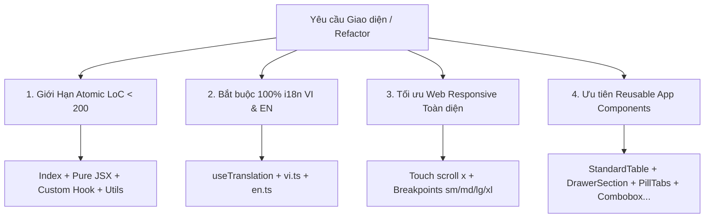

# ⚛️ ERP Atomic Component Refactoring Standards (`/erp-atomic-refactor`)

> ⚡ **Mục tiêu cốt lõi**: Đảm bảo mã nguồn giao diện trong `erp-web` luôn tinh gọn, dễ đọc, dễ kiểm thử và có tính mở rộng cao. Tuyệt đối không để xảy ra tình trạng các file Component phình to thành hàng ngàn dòng code (God Components / Monolithic Files).

---

## 🎯 4 Trụ Cột Bắt Buộc Khi Refactor Hoặc Tạo Mới Component



---

## 1. 📏 Giới Hạn Kích Thước Atomic File (< 200 LoC Threshold)

- **Ngưỡng cảnh báo**: Bất kỳ file React Component nào vượt quá **~200 dòng code** (hoặc chứa quá nhiều logic nghiệp vụ lộn xộn với JSX markup) **BẮT BUỘC** phải được phân tách theo kiến trúc Atomic.
- **Phân rã 4 lớp chuẩn mực**:
  1. **Entry Point (`index.ts` / `index.tsx`)**: Xuất khẩu gọn gàng component chính và các kiểu dữ liệu public.
  2. **Presentational Component (`<FeatureName>.tsx`)**: Chỉ phụ trách render giao diện (JSX), nhận props hoặc dữ liệu từ Custom Hook. File này nên `< 150 LoC`.
  3. **Custom Hook (`use<FeatureName>Logic.ts` hoặc `hooks/...`)**: Chứa toàn bộ State, TanStack Query (`useQuery`, `useMutation`), URL Search Params, Form handlers và sự kiện tương tác.
  4. **Pure Helpers & Types (`utils.ts`, `types.ts`)**: Chứa hàm tính toán thuần túy (formatting tiền tệ, xử lý mảng, validate logic) không phụ thuộc trực tiếp vào React Lifecycle.

### 📂 Cấu trúc thư mục Atomic chuẩn mẫu:

```
src/modules/<module-name>/components/<FeatureFolder>/
├── index.ts                         # Entry point re-export
├── <FeatureName>.tsx                # Presentational Component chính (< 150 LoC)
├── <FeatureName>SubTab.tsx          # Sub-tab hoặc phân đoạn độc lập (< 150 LoC)
├── hooks/
│   ├── use<FeatureName>Logic.ts     # Toàn bộ logic & data fetching (< 200 LoC)
│   └── use<FeatureName>Filters.ts   # Quản lý filter & pagination
├── components/                      # Các sub-components nhỏ tách rời
│   ├── <FeatureName>Header.tsx
│   ├── <FeatureName>KpiCards.tsx
│   └── <FeatureName>EmptyState.tsx
├── utils/
│   └── <featureName>Helper.ts       # Formatters, calculators thuần túy
└── __tests__/
    └── <FeatureName>.spec.tsx       # Unit tests độc lập
```

---

## 2. 🌐 Bắt Buộc 100% Đa Ngôn Ngữ (i18n Translation Mandate)

> [!CAUTION]
> **TUYỆT ĐỐI KHÔNG HARDCODE CHUỖI VĂN BẢN (Text Strings)** trực tiếp trong mã nguồn TSX/JSX (kể cả tiếng Việt lẫn tiếng Anh).

### Quy tắc triển khai i18n:
1. **Luôn sử dụng `useTranslation`**:
   ```tsx
   import { useTranslation } from "react-i18next";
   
   export function MyComponent() {
     const { t } = useTranslation("erpInvoices"); // Sử dụng namespace tương ứng của module
     return <span>{t("tabDetails", "1. Chi tiết")}</span>;
   }
   ```
2. **Đồng bộ song ngữ 1-1**: Khi thêm hoặc sửa bất kỳ khóa (key) nào, **BẮT BUỘC cập nhật đồng thời cả 2 file từ điển**:
   - **Tiếng Việt**: `src/modules/<module-name>/locales/vi.ts` (hoặc `src/core/locale/.../vi.ts`)
   - **Tiếng Anh**: `src/core/locale/.../en.ts` (hoặc `src/modules/<module-name>/locales/en.ts`)
3. **Fallback mặc định**: Luôn cung cấp fallback tiếng Việt rõ ràng ở tham số thứ 2 của hàm `t("key", "Fallback tiếng Việt")`.

---

## 3. 📱 Tối Ưu Web Responsive Toàn Diện (Web Responsive Excellence)

Mọi component và phân hệ con khi chia tách bắt buộc phải thích ứng mượt mà trên mọi độ phân giải:
- **Mobile (< 640px)**
- **Tablet (< 1024px)**
- **Desktop Laptop (1280px - 1440px)**
- **FHD & Ultrawide ($\ge 1920px$)**

### Các quy tắc kỹ thuật Responsive cốt lõi:
1. **Thanh Tabs & Toolbars (Cuộn ngang cảm ứng)**:
   - Khi có nhiều tabs hoặc thanh nút điều khiển ngang, bọc trong container có:
     ```tsx
     <div className="flex items-center overflow-x-auto scrollbar-none max-w-full pb-1 -mb-1 shrink-0">
       <PillTabs ... />
     </div>
     ```
   - Thanh Header tổng hợp kết hợp toolbar phải dùng layout co giãn:
     ```tsx
     <div className="flex flex-col sm:flex-row sm:items-center justify-between gap-2.5 pt-0.5 w-full">
     ```
2. **Lưới Thẻ Chỉ Số & KPI (Responsive Grid)**:
   - Tuyệt đối không hardcode số cột cứng (`grid-cols-4`). Bắt buộc áp dụng responsive breakpoints:
     ```tsx
     <div className="grid grid-cols-1 sm:grid-cols-2 xl:grid-cols-4 gap-2.5 w-full">
     ```
3. **Tránh Tràn Chiều Rộng (No Horizontal Overflow)**:
   - Không đặt `width` cố định dạng pixel lớn (`w-[800px]`) vào các container cấp trang hoặc section.
   - Luôn sử dụng `w-full min-w-0 max-w-full`.
   - Với bảng dữ liệu `<StandardTable>`, truyền prop `containerClassName="flex-1 min-h-0 w-full"` và quản lý cuộn bên trong bảng qua `minWidth`.

---

## 4. 🧩 Ưu Tiên Tái Sử Dụng Reusable Components Có Sẵn Trong App (App Reusables First)

> [!IMPORTANT]
> Tuyệt đối không tự tạo lại các thẻ HTML thô (`<button>`, `<input>`, `<select>`, `<dialog>`, thẻ div viền tự chế) khi hệ thống đã có sẵn các Reusable Components chuẩn mực.

### Danh mục Reusable Components chuẩn của dự án:

| Phân loại | Component chuẩn trong App | Đường dẫn Import (`@/...`) | Mục đích sử dụng |
| :--- | :--- | :--- | :--- |
| **Drawer Container** | `<StandardFormDrawer>` | `@/shared/components/StandardFormDrawer` | Khung Drawer chuẩn 1 cột / 2 cột / Top-tabs |
| **Drawer Section** | `<DrawerSection>` | `@/shared/components/DrawerModal` | Bao bọc các nhóm form, bảng hoặc attachments có header uppercase & collapse |
| **Drawer Rows / Fields** | `<DrawerRow>`, `<DrawerField>` | `@/shared/components/DrawerModal` | Hàng dữ liệu nhãn/giá trị hoặc ô nhập liệu chuẩn |
| **Bảng dữ liệu** | `<StandardTable variant="spreadsheet">` | `@/shared/components/StandardTable` | Bảng ô tính kế toán, phân trang, resize cột, context menu |
| **Bảng Data Table** | `<DataTable>` | `@/shared/components/DataTable` | Bảng quản lý lớn với bộ lọc header filter đa chiều |
| **Điều hướng Tab** | `<PillTabs>` | `@/shared/components/PillTabs` | Thanh chuyển tab mềm, badge count, variant button-group |
| **Dropdown / Chọn lựa** | `<Combobox>` | `@/shared/components/Combobox` | Dropdown tìm kiếm, chọn đối tác, chi nhánh, phân loại |
| **Nhập văn bản có Buffer**| `<BufferedTextarea>` | `@/shared/components/BufferedTextarea` | Textarea phản hồi tức thì 0ms, debounce 500ms, nút xóa nhanh |
| **Hộp thoại xác nhận** | `<ConfirmModal>` | `@/shared/components/ConfirmModal` | Modal popup xác nhận thao tác xóa, cập nhật, cảnh báo |
| **Nút bấm / Badge** | `<Button>`, `<Badge>` | `@/shared/components/ui/Button`, `@/shared/components/ui/badge` | Nút bấm, nhãn trạng thái đồng bộ |
| **Sao chép nhanh** | `<CopyButton>` | `@/shared/components/CopyButton` | Nút copy clipboard mã chứng từ, MST, địa chỉ |
| **Biểu đồ** | `<BarChart>`, `<LineChart>` | `@/shared/components/charts/...` | Biểu đồ cột, biểu đồ đường thích ứng |

---

## 5. 🎨 Quy Tắc Bảng Màu & Tuyệt Đối Cấm Màu Xanh Dương (No Blue Mandate)

- **TUYỆT ĐỐI KHÔNG SỬ DỤNG MÀU XANH DƯƠNG (`blue-*`, `bg-blue-*`, `text-blue-*`, `border-blue-*`)** trong toàn bộ giao diện Component, Cards, Badges, Tabs, Icons.
- **Thay thế bằng:**
  - **Neutral**: `slate-*`, `zinc-*`, `muted`, `border` (Thông tin chung, metadata, mã hiệu).
  - **Brand Primary**: `primary`, `text-primary`, `bg-primary` (Nút bấm chính, tab active).
  - **Success / Positive**: `emerald-*` (Hoàn thành, số tiền dương, trạng thái hợp lệ).
  - **Warning / Negative / Progress**: `amber-*` (Chờ xử lý, số tiền âm, chênh lệch giảm).
  - **Destructive**: `red-*` / `destructive` (Lỗi, hủy bỏ, xóa).

---

## 6. 📝 Mẫu Triển Khai Minh Họa (Complete Implementation Pattern)

### 🔹 1. Custom Hook (`hooks/useInvoiceSummaryLogic.ts`):
```typescript
import { useState, useMemo } from "react";
import { useQuery } from "@tanstack/react-query";
import { erpInvoicesCoreApi } from "../../api/erpInvoicesCoreApi";

export function useInvoiceSummaryLogic(partnerTaxCode?: string) {
  const [selectedPeriod, setSelectedPeriod] = useState<string>("ALL");

  const { data: stats, isLoading } = useQuery({
    queryKey: ["partner-stats", partnerTaxCode, selectedPeriod],
    queryFn: () => erpInvoicesCoreApi.getStats(partnerTaxCode, selectedPeriod),
    enabled: Boolean(partnerTaxCode),
    staleTime: 60000,
  });

  const netBalance = useMemo(() => {
    return (stats?.totalOut || 0) - (stats?.totalIn || 0);
  }, [stats]);

  return {
    selectedPeriod,
    setSelectedPeriod,
    stats,
    isLoading,
    netBalance,
  };
}
```

### 🔹 2. Sub-Tab Component (`InvoiceSummarySubTab.tsx`):
```tsx
import React from "react";
import { useTranslation } from "react-i18next";
import { TrendingUp, Scale, FileText } from "lucide-react";
import { DrawerSection } from "@/shared/components/DrawerModal";
import { money } from "@/shared/utils/format";
import { cn } from "@/shared/utils";
import { useInvoiceSummaryLogic } from "./hooks/useInvoiceSummaryLogic";

export interface InvoiceSummarySubTabProps {
  partnerTaxCode?: string;
}

export const InvoiceSummarySubTab = React.memo(function InvoiceSummarySubTab({
  partnerTaxCode,
}: InvoiceSummarySubTabProps) {
  const { t } = useTranslation("erpInvoices");
  const { stats, isLoading, netBalance } = useInvoiceSummaryLogic(partnerTaxCode);

  return (
    <div className="space-y-3 flex-1 min-h-0 overflow-y-auto pr-1 w-full">
      <DrawerSection
        title={
          <div className="flex items-center gap-2 text-xs font-bold uppercase tracking-wider text-slate-800 dark:text-slate-200">
            <TrendingUp className="w-4 h-4 text-primary" />
            <span>{t("tabSummaryTitle", "Tổng quan biến động")}</span>
          </div>
        }
        collapsible={true}
        defaultCollapsed={false}
        className="p-3 border border-slate-200/80 dark:border-slate-800"
      >
        <div className="grid grid-cols-1 sm:grid-cols-2 xl:grid-cols-3 gap-2.5 w-full">
          {/* Card 1: Doanh số mua vào */}
          <div className="p-3 rounded-xl bg-orange-500/10 border border-orange-500/20">
            <div className="text-xs text-orange-600 dark:text-orange-400 font-semibold">
              {t("totalIn", "Tổng mua vào")}
            </div>
            <div className="mt-2 text-lg font-bold text-foreground tabular-nums">
              {money(stats?.totalIn || 0)}
            </div>
          </div>

          {/* Card 2: Doanh số bán ra */}
          <div className="p-3 rounded-xl bg-emerald-500/10 border border-emerald-500/20">
            <div className="text-xs text-emerald-600 dark:text-emerald-400 font-semibold">
              {t("totalOut", "Tổng bán ra")}
            </div>
            <div className="mt-2 text-lg font-bold text-foreground tabular-nums">
              {money(stats?.totalOut || 0)}
            </div>
          </div>

          {/* Card 3: Chênh lệch ròng (No Blue Mandate) */}
          <div
            className={cn(
              "p-3 rounded-xl border",
              netBalance >= 0
                ? "bg-emerald-500/10 border-emerald-500/20"
                : "bg-amber-500/10 border-amber-500/20",
            )}
          >
            <div className="flex items-center gap-1 text-xs font-semibold">
              <Scale className="w-3.5 h-3.5" />
              <span>{t("netDifference", "Chênh lệch ròng")}</span>
            </div>
            <div
              className={cn(
                "mt-2 text-lg font-bold tabular-nums",
                netBalance >= 0
                  ? "text-emerald-600 dark:text-emerald-400"
                  : "text-amber-600 dark:text-amber-400",
              )}
            >
              {netBalance >= 0 ? "+" : ""}
              {money(netBalance)}
            </div>
          </div>
        </div>
      </DrawerSection>
    </div>
  );
});
```

---

## 📋 Checklist Kiểm Tra Trước Khi Hoàn Thành (Atomic DoD)

- [ ] **Kích thước file**: File Component chính và các sub-components đều $< 200\text{ LoC}$?
- [ ] **Phân tách Logic**: Toàn bộ TanStack Query, mutations, và form state đã được đưa vào custom hook riêng (`use...Logic.ts`) chưa?
- [ ] **Đa ngôn ngữ (i18n)**:
  - [ ] Đã dùng `useTranslation("namespace")` cho toàn bộ văn bản giao diện?
  - [ ] Đã thêm đầy đủ key và fallback vào cả `locales/vi.ts` và `locales/en.ts` (hoặc `core/locale/...`)?
- [ ] **Web Responsive**:
  - [ ] Thanh tab / thanh công cụ có hỗ trợ cuộn ngang `overflow-x-auto scrollbar-none max-w-full` trên mobile/tablet chưa?
  - [ ] Lưới layout đã dùng `grid-cols-1 sm:grid-cols-2 lg:grid-cols-4` thay vì cột cứng?
  - [ ] Không có class `w-[px]` cố định gây tràn màn hình?
- [ ] **Tái sử dụng App Components**:
  - [ ] Sử dụng `<DrawerSection>`, `<PillTabs>`, `<StandardTable>`, `<Combobox>`, `<Button>`, `<Badge>` thay vì thẻ HTML thô?
- [ ] **No Blue Mandate**: Đã kiểm tra không còn class màu xanh dương (`blue-*`) nào trong component chưa?
- [ ] **Type Check & Tests**: Đã chạy `bun run type:check` và unit tests pass 100% chưa?
