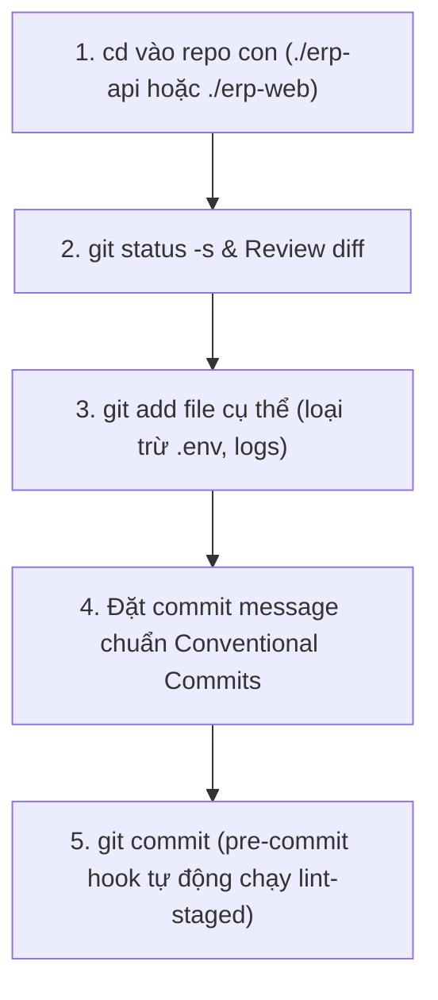
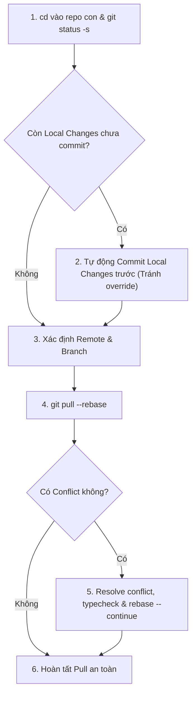
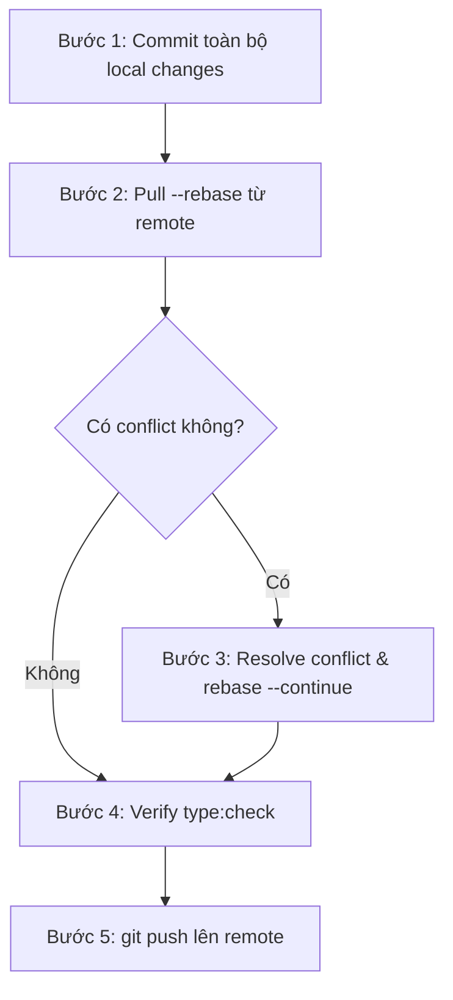

# Liouni ERP Git Workflow (Commit, Pull, Push & Conflict Resolution)

Skill này định nghĩa quy trình chuẩn chỉnh và an toàn tuyệt đối cho mọi thao tác Git trong các workspace Liouni ERP (dùng được linh hoạt trên mọi thư mục workspace như `repos/erp`, `repos-dev/erp`, `repos-dev-1/erp`...).

---

## 1. Nguyên tắc cốt lõi & Guardrails

1. **Sử dụng đường dẫn tương đối (Relative Paths) — Tuyệt đối KHÔNG chạy Git ở root workspace**:
   - KHÔNG chạy `git add`, `git commit`, `git pull`, `git push` từ thư mục root của workspace.
   - Luôn `cd` vào repo con tương ứng theo đường dẫn tương đối:
     - Backend API: `./erp-api`
     - Frontend Web: `./erp-web`
2. **Không bao giờ làm mất / ghi đè code (No Override)**:
   - Khi có local changes (chưa commit), **BẮT BUỘC commit trước khi pull**. Tuyệt đối không pull khi working tree chưa commit để tránh rủi ro override hoặc mất code.
3. **Không commit file nhạy cảm**:
   - Tuyệt đối không commit các file `.env`, `.env.*`, file logs, dump DB, credentials.
4. **Remote & Branch chuẩn**:
   - Remote mặc định: `github-industries` (fallback về `origin` nếu repo không có `github-industries`).
   - Branch chính: `erp-master` (hoặc branch hiện tại đang checkout).
5. **Luôn Rebase First**:
   - Khi kéo code về phải luôn dùng `git pull --rebase` để lịch sử commit tuyến tính, rõ ràng.

---

## 2. Quy trình Commit Code

Khi người dùng yêu cầu **"commit code"** hoặc khi cần lưu lại thay đổi trước khi pull/push:



### Các bước thực hiện:
1. **Xác định repo**: `cd ./erp-api` hoặc `cd ./erp-web`.
2. **Kiểm tra trạng thái**:
   ```bash
   git status -s
   ```
3. **Review thay đổi**: `git diff` để đảm bảo chỉ sửa đúng phạm vi task, không sót code rác/debug.
4. **Stage files**:
   ```bash
   git add <danh_sach_file_cu_the>
   ```
5. **Commit với format chuẩn (Conventional Commits)**:
   ```bash
   git commit -m "<type>(<scope>): <mô tả ngắn gọn>"
   ```
   * `type`: `feat`, `fix`, `refactor`, `chore`, `docs`, `test`, `style`.
   * *Ví dụ*: `git commit -m "feat(invoice): thêm chức năng xuất hóa đơn PDF"`

---

## 3. Quy trình Pull Code (Ưu tiên Commit trước -> Pull `--rebase`)

Khi người dùng yêu cầu **"pull code"**:



### Các bước thực hiện chi tiết:
1. **Xác định repo**: `cd ./erp-api` hoặc `cd ./erp-web`.
2. **Kiểm tra và BẢO VỆ Local Changes**:
   ```bash
   # Nếu có thay đổi chưa commit, BẮT BUỘC commit trước để không bị mất/override code
   if [ -n "$(git status -s)" ]; then
     git add <cac_file_thay_doi>
     git commit -m "chore: save local changes before pull rebase"
   fi
   ```
3. **Xác định Remote & Branch**:
   ```bash
   CURRENT_BRANCH=$(git branch --show-current)
   REMOTE_NAME=$(git remote | grep -w github-industries || echo "origin")
   ```
4. **Thực hiện Pull Rebase**:
   ```bash
   git pull --rebase $REMOTE_NAME $CURRENT_BRANCH
   ```
5. **Xử lý xung đột (Conflict Resolution nếu có)**:
   * Nếu có conflict (`CONFLICT (content): Merge conflict in ...`):
     1. Kiểm tra danh sách file bị conflict: `git status`
     2. Đọc và chỉnh sửa thủ công từng file bị conflict, giữ lại logic đúng nhất.
     3. Kiểm tra typecheck sau khi sửa: `bun run type:check`
     4. Đánh dấu đã giải quyết: `git add <file-da-resolve>`
     5. Tiếp tục rebase:
        ```bash
        git rebase --continue
        ```
     6. Lặp lại bước 5 nếu còn commit tiếp theo bị conflict.
   * **Phương án cứu nguy nếu rebase quá phức tạp**:
     ```bash
     git rebase --abort
     git pull $REMOTE_NAME $CURRENT_BRANCH # Fallback sang merge thông thường
     ```

---

## 4. Quy trình Push Code Toàn Diện

Khi người dùng yêu cầu **"push code"**, quy trình BẮT BUỘC phải thực hiện trọn gói theo chuỗi liên hoàn:



### Kịch bản thực thi chi tiết:

```bash
# 1. cd vào repo con tương đối
cd ./erp-api # hoặc cd ./erp-web

CURRENT_BRANCH=$(git branch --show-current)
REMOTE_NAME=$(git remote | grep -w github-industries || echo "origin")

# 2. Commit nếu còn dirty changes
if [ -n "$(git status -s)" ]; then
  git add <cac_file_thay_doi>
  git commit -m "<type>(<scope>): <mo_ta>"
fi

# 3. Pull rebase code mới nhất từ remote
git pull --rebase $REMOTE_NAME $CURRENT_BRANCH

# (Nếu có conflict -> tiến hành resolve như Mục 3)

# 4. Kiểm tra Typecheck local nhanh
bun run type:check

# 5. Push lên remote
git push $REMOTE_NAME $CURRENT_BRANCH
```

---

## 5. Danh sách kiểm tra (Checklist) trước khi kết thúc task Git

- [ ] Đường dẫn sử dụng là tương đối (`./erp-api` hoặc `./erp-web`), không phụ thuộc workspace root tuyệt đối.
- [ ] Không có file `.env` hay secret nào bị lọt vào staging/commit.
- [ ] Mọi local changes đều đã được commit an toàn trước khi pull rebase.
- [ ] `git pull --rebase` đã thành công, không còn trạng thái conflict dở dang.
- [ ] `bun run type:check` đã pass sạch lỗi.
- [ ] Push thành công lên đúng branch trên remote `$REMOTE_NAME`.
