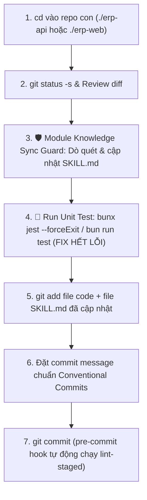
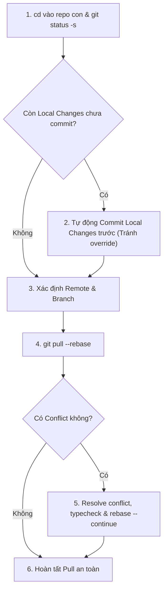
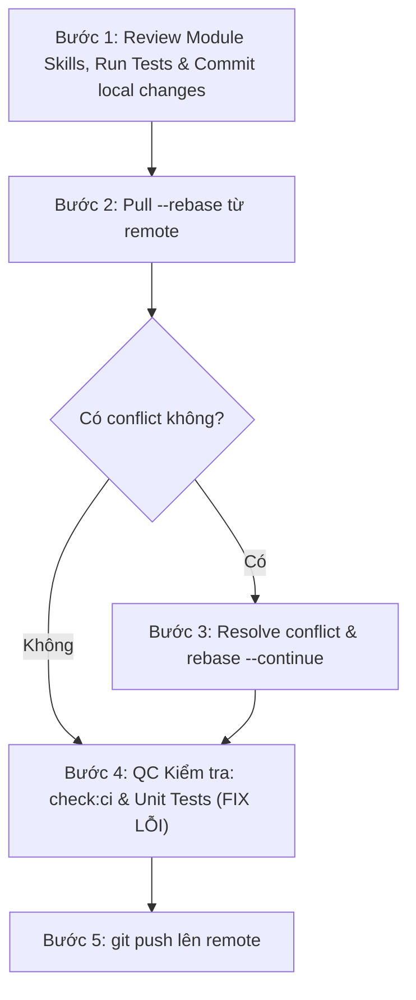

# Liouni ERP Git Workflow (Commit, Pull, Push & Conflict Resolution)

Skill này định nghĩa quy trình chuẩn chỉnh và an toàn tuyệt đối cho mọi thao tác Git trong các workspace Liouni ERP (dùng được linh hoạt trên mọi thư mục workspace như `repos/erp`, `repos-dev/erp`, `repos-dev-1/erp`...).

---

## 1. Nguyên tắc cốt lõi & Guardrails

1. **Sử dụng đường dẫn tương đối (Relative Paths) — Tuyệt đối KHÔNG chạy Git ở root workspace**:
   - KHÔNG chạy `git add`, `git commit`, `git pull`, `git push` từ thư mục root của workspace.
   - Luôn `cd` vào repo con tương ứng theo đường dẫn tương đối:
     - Backend API: `./erp-api`
     - Frontend Web: `./erp-web`
2. **🛡️ Test-First Guard (Bắt buộc chạy Unit Test & Fix trước khi Commit & Push)**:
   - **Backend (`erp-api`)**: **BẮT BUỘC** chạy `bunx jest --forceExit` và sửa triệt để 100% lỗi test trước khi thực hiện `git commit` và trước khi `git push`.
   - **Frontend (`erp-web`)**: **BẮT BUỘC** chạy `bun run test` và sửa triệt để 100% lỗi test trước khi thực hiện `git commit` và trước khi `git push`.
   - Tuyệt đối KHÔNG commit hoặc push code khi test suites còn failing.
3. **Không bao giờ làm mất / ghi đè code (No Override)**:
   - Khi có local changes (chưa commit), **BẮT BUỘC commit trước khi pull**. Tuyệt đối không pull khi working tree chưa commit để tránh rủi ro override hoặc mất code.
4. **Không commit file nhạy cảm**:
   - Tuyệt đối không commit các file `.env`, `.env.*`, file logs, dump DB, credentials.
5. **Remote & Branch chuẩn**:
   - Remote mặc định: `github-industries` (fallback về `origin` nếu repo không có `github-industries`).
   - Branch chính: `erp-master` (hoặc branch hiện tại đang checkout).
6. **Luôn Rebase First**:
   - Khi kéo code về phải luôn dùng `git pull --rebase` để lịch sử commit tuyến tính, rõ ràng.
7. **Đồng bộ Tri thức Module Bắt buộc (Module Knowledge Sync Mandatory)**:
   - Mọi lần commit code có tác động tới Database Schema, DTOs, API Endpoints, Permissions hoặc Business Logic của một module **BẮT BUỘC** phải rà soát và cập nhật/xóa bớt nội dung tương ứng trong `.agents/skills/modules/<module-name>/SKILL.md` trước khi commit.

---

## 2. Quy trình Commit Code (Có Test Guard & Module Knowledge Sync Guard)

Khi người dùng yêu cầu **"commit code"** hoặc khi cần lưu lại thay đổi trước khi pull/push:



### Các bước thực hiện chi tiết:

#### Bước 1: Xác định repo con
```bash
cd ./erp-api # hoặc cd ./erp-web
```

#### Bước 2: Kiểm tra trạng thái & Review diff
```bash
git status -s
git diff
```
Đảm bảo chỉ sửa đúng phạm vi task, không sót code rác/debug, không vô tình thêm `.env` hay file tạm.

#### Bước 3: 🛡️ Module Knowledge Sync Guard (Bắt buộc)
Trước khi stage file, Agent / Kỹ sư **BẮT BUỘC** thực hiện rà soát tri thức:
1. **Xác định Domain/Module**: Nhận diện module bị ảnh hưởng từ danh sách file thay đổi (vd: `src/inventory-core/`, `src/bom-core/`, `src/app-config/`, v.v.).
2. **Dò tìm file Skill tương ứng**: Kiểm tra file `.agents/skills/modules/<module-name>/SKILL.md` tại cả `erp-api` và `erp-web`.
3. **Đối soát 5 Trụ Cột Tri Thức**:
   - **Database Schema & Entities**: Có thêm/sửa/xóa bảng, cột, kiểu dữ liệu, index, quan hệ quan trọng nào không?
   - **DTOs & Validation Rules**: Có cập nhật DTO create/update/query, trường bắt buộc hoặc decorator validate không?
   - **API Endpoints & RBAC**: Có thêm/bớt endpoint, đổi method HTTP, thay đổi Resource/Action trong `@RequirePermissions` không?
   - **Business Logic & Flows**: Có sửa thuật toán tính toán, quy trình xử lý transaction, khóa bi quan (`pessimistic_write`), luồng duyệt chứng từ không?
   - **Deprecated / Xóa bớt Tri thức Cũ**: Có trường/hàm/logic cũ nào đã bị loại bỏ cần **xóa bớt khỏi file SKILL.md** để tránh gây nhầm lẫn cho Agent các phiên sau không?
4. **Cập nhật / Khởi tạo**:
   - Nếu có thay đổi $\to$ Cập nhật trực tiếp vào file `SKILL.md` của module đó.
   - Nếu là module mới hoàn toàn chưa có skill $\to$ Sử dụng skill `scan-module-knowledge` để tạo mới và đăng ký vào Current-Truth.

#### Bước 4: 🧪 Run Unit Test & Fix lỗi (Bắt buộc trước khi Commit)
Chạy test suite và sửa toàn bộ lỗi phát sinh:
- **Trong `erp-api`**:
  ```bash
  bunx jest --forceExit
  ```
- **Trong `erp-web`**:
  ```bash
  bun run test
  ```
Nếu có test failed $\to$ Điều chỉnh code hoặc cập nhật test assertion tương ứng để 100% tests passed.

#### Bước 5: Stage files
```bash
# Stage cả file mã nguồn và file SKILL.md liên quan đã cập nhật
git add <danh_sach_file_code> <danh_sach_file_skill_md>
```

#### Bước 6: Commit với format chuẩn (Conventional Commits)
```bash
git commit -m "<type>(<scope>): <mô tả ngắn gọn>"
```
* `type`: `feat`, `fix`, `refactor`, `chore`, `docs`, `test`, `style`.
* *Ví dụ*: `git commit -m "feat(app-config): hỗ trợ public app config dynamic APP_ENV và lưu trữ user preferences"`

---

## 3. Quy trình Pull Code (Ưu tiên Commit trước -> Pull `--rebase`)

Khi người dùng yêu cầu **"pull code"**:



### Các bước thực hiện chi tiết:
1. **Xác định repo**: `cd ./erp-api` hoặc `cd ./erp-web`.
2. **Kiểm tra và BẢO VỆ Local Changes**:
   ```bash
   # Nếu có thay đổi chưa commit, BẮT BUỘC commit trước để không bị mất/override code
   if [ -n "$(git status -s)" ]; then
     git add <cac_file_thay_doi>
     git commit -m "chore: save local changes before pull rebase"
   fi
   ```
3. **Xác định Remote & Branch**:
   ```bash
   CURRENT_BRANCH=$(git branch --show-current)
   REMOTE_NAME=$(git remote | grep -w github-industries || echo "origin")
   ```
4. **Thực hiện Pull Rebase**:
   ```bash
   git pull --rebase $REMOTE_NAME $CURRENT_BRANCH
   ```
5. **Xử lý xung đột (Conflict Resolution nếu có)**:
   * Nếu có conflict (`CONFLICT (content): Merge conflict in ...`):
     1. Kiểm tra danh sách file bị conflict: `git status`
     2. Đọc và chỉnh sửa thủ công từng file bị conflict, giữ lại logic đúng nhất.
     3. Kiểm tra typecheck sau khi sửa: `bun run check:ci`
     4. Đánh dấu đã giải quyết: `git add <file-da-resolve>`
     5. Tiếp tục rebase:
        ```bash
        git rebase --continue
        ```
     6. Lặp lại bước 5 nếu còn commit tiếp theo bị conflict.
   * **Phương án cứu nguy nếu rebase quá phức tạp**:
     ```bash
     git rebase --abort
     git pull $REMOTE_NAME $CURRENT_BRANCH # Fallback sang merge thông thường
     ```

---

## 4. Quy trình Push Code Toàn Diện

Khi người dùng yêu cầu **"push code"**, quy trình BẮT BUỘC phải thực hiện trọn gói theo chuỗi liên hoàn:



### Kịch bản thực thi chi tiết:

```bash
# 1. cd vào repo con tương đối
cd ./erp-api # hoặc cd ./erp-web

CURRENT_BRANCH=$(git branch --show-current)
REMOTE_NAME=$(git remote | grep -w github-industries || echo "origin")

# 2. Rà soát Module Skills, Chạy Unit Tests và Commit nếu còn dirty changes
if [ -n "$(git status -s)" ]; then
  # Chạy test trước khi commit
  if [ -f "jest.config.ts" ] || [ -f "jest.config.js" ]; then
    bunx jest --forceExit
  else
    bun run test
  fi
  
  git add <cac_file_thay_doi>
  git commit -m "<type>(<scope>): <mo_ta>"
fi

# 3. Pull rebase code mới nhất từ remote
git pull --rebase $REMOTE_NAME $CURRENT_BRANCH

# (Nếu có conflict -> tiến hành resolve như Mục 3)

# 4. Kiểm tra QC nghiêm ngặt trước khi push (Typecheck, Lint, Prettier, Unit Test)
bun run check:ci

# Chạy Unit test tương ứng từng repo:
# - Trong erp-api: bunx jest --forceExit
# - Trong erp-web: bun run test
if [ -f "jest.config.ts" ] || [ -f "jest.config.js" ]; then
  bunx jest --forceExit
else
  bun run test
fi

# 5. Push lên remote
git push $REMOTE_NAME $CURRENT_BRANCH
```

---

## 5. Danh sách kiểm tra (Checklist) trước khi kết thúc task Git

- [ ] Đường dẫn sử dụng là tương đối (`./erp-api` hoặc `./erp-web`), không phụ thuộc workspace root tuyệt đối.
- [ ] Không có file `.env` hay secret nào bị lọt vào staging/commit.
- [ ] **Module Knowledge Sync Guard**: Đã rà soát và cập nhật/xóa bớt nội dung trong `SKILL.md` của các module bị ảnh hưởng.
- [ ] **Unit Tests Guard**:
  - `erp-api`: Đã chạy `bunx jest --forceExit` và pass 100% tất cả test suites (đã fix toàn bộ lỗi phát sinh) **trước khi commit và trước khi push**.
  - `erp-web`: Đã chạy `bun run test` và pass 100% tất cả test suites **trước khi commit và trước khi push**.
- [ ] Mọi local changes đều đã được commit an toàn trước khi pull rebase.
- [ ] `git pull --rebase` đã thành công, không còn trạng thái conflict dở dang.
- [ ] `bun run check:ci` đã pass sạch lỗi (TypeScript + ESLint + Prettier).
- [ ] Push thành công lên đúng branch trên remote `$REMOTE_NAME`.
