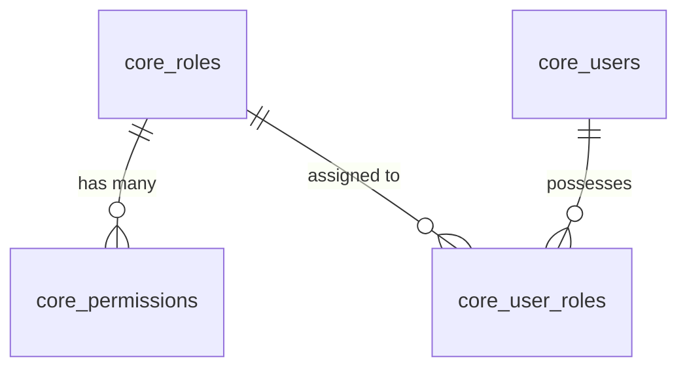

# 📦 Module Tri Thức: Quản Lý Phân Quyền & Vai Trò (RBAC Core) - Backend & Frontend

## 1. Tổng quan Nghiệp vụ

Module Phân quyền & Vai trò Core (`rbac-core`) là hạt nhân an ninh và ủy quyền (Authorization) của Liouni ERP, quản lý toàn bộ cơ chế phân quyền dựa trên vai trò (Role-Based Access Control - RBAC) lưu trữ trực tiếp trên Core DB (PostgreSQL):
- **Vai trò (Roles - `core_roles`)**: Nhóm các quyền hạn nghiệp vụ cụ thể (vd: Kế toán, Thủ kho, Giám đốc, Nhân viên kinh doanh). Hỗ trợ kích hoạt / ngưng hoạt động (`is_active`).
- **Phân quyền Tài nguyên (Permissions - `core_permissions`)**: Ánh xạ cặp `(resource, action)` vào từng vai trò, kèm điều kiện tùy chọn `conditions (JSONB)`.
- **Gán người dùng vào vai trò (User Role Assignments - `core_user_roles`)**: Cho phép một người dùng (CoreUser) sở hữu một hoặc nhiều vai trò trong hệ thống.
- **Hệ thống Kiểm tra Quyền Zero-Trust**:
  - `CoreRbacGuard`: Guard toàn cục bảo vệ các Controller NestJS thông qua decorator `@RequirePermissions({ resource, action })`.
  - Hỗ trợ wildcard: `resource = '*'` (Super Admin) hoặc `action = '*'` (toàn quyền trên resource đó).
- **Phân nhóm Tài nguyên Trực quan (Resource Groups)**:
  - Trên Frontend, các resources (tài nguyên) được gom nhóm theo logic cây Menu Sidebar (Bán hàng, Mua hàng, Kho, Sản xuất, Garage, VinFast, Kế toán, Quản trị hệ thống) giúp người quản trị dễ dàng theo dõi và tích chọn.

---

## 2. Database Schema & Quan hệ Dữ liệu



### 2.1. Bảng `core_roles` (Vai trò)

| Cột | Kiểu | Nullable | Mặc định | Ghi chú |
| :--- | :--- | :--- | :--- | :--- |
| `id` | `uuid` | NO | `gen_random_uuid()` | Khóa chính (PK) |
| `name` | `varchar(255)` | NO | — | Tên vai trò (Unique) |
| `description` | `text` | YES | `NULL` | Mô tả chi tiết vai trò |
| `is_active` | `boolean` | NO | `true` | Trạng thái hoạt động |
| `created_at` | `timestamptz` | NO | `now()` | Thời gian tạo |
| `updated_at` | `timestamptz` | NO | `now()` | Thời gian cập nhật |

### 2.2. Bảng `core_permissions` (Quyền truy cập tài nguyên)

| Cột | Kiểu | Nullable | Mặc định | Ghi chú |
| :--- | :--- | :--- | :--- | :--- |
| `id` | `uuid` | NO | `gen_random_uuid()` | Khóa chính (PK) |
| `role_id` | `uuid` | NO | — | FK tham chiếu `core_roles.id` (ON DELETE CASCADE) |
| `resource` | `varchar(128)` | NO | — | Tên tài nguyên (vd: `purchase_orders`, `invoices`, `*`) |
| `action` | `varchar(64)` | NO | — | Thao tác (`read`, `create`, `update`, `delete`, `manage`, `*`) |
| `conditions` | `jsonb` | YES | `NULL` | Điều kiện bổ sung / lọc dữ liệu theo ngữ cảnh |
| `created_at` | `timestamptz` | NO | `now()` | Thời gian tạo |
| `updated_at` | `timestamptz` | NO | `now()` | Thời gian cập nhật |

> **Ràng buộc duy nhất**: Composite Index `(role_id, resource, action)` là unique để chống trùng lặp quyền.

### 2.3. Bảng `core_user_roles` (Gán người dùng vào vai trò)

| Cột | Kiểu | Nullable | Mặc định | Ghi chú |
| :--- | :--- | :--- | :--- | :--- |
| `id` | `uuid` | NO | `gen_random_uuid()` | Khóa chính (PK) |
| `user_id` | `uuid` | NO | — | FK tham chiếu `core_users.id` (ON DELETE CASCADE) |
| `role_id` | `uuid` | NO | — | FK tham chiếu `core_roles.id` (ON DELETE CASCADE) |
| `created_at` | `timestamptz` | NO | `now()` | Thời gian gán |

> **Ràng buộc duy nhất**: Composite Index `(user_id, role_id)` là unique.

---

## 3. Cấu trúc Source Code

### 3.1. Backend (`erp-api/src/rbac-core/`)
```text
erp-api/src/rbac-core/
├── dto/
│   └── rbac-core.dto.ts               # ListCoreRolesDto, CreateCoreRoleDto, UpdateCoreRoleDto, UpdateCoreRolePermissionsDto, UpdateCoreRoleUsersDto
├── entities/
│   ├── core-role.entity.ts           # Entity bảng core_roles
│   ├── core-permission.entity.ts     # Entity bảng core_permissions
│   └── core-user-role.entity.ts      # Entity bảng core_user_roles
├── enums/
│   ├── erp-resource.enum.ts          # Enum các tài nguyên ErpResource (*, purchase_orders, sales_orders, invoices, etc.)
│   ├── erp-action.enum.ts            # Enum các hành động ErpAction (read, create, update, delete, manage, *)
│   └── index.ts
├── rbac-core.controller.ts           # REST API endpoints (/api/v1/rbac-core/roles...)
├── rbac-core.service.ts              # Business logic tra cứu quyền, gán quyền, phân trang vai trò
├── rbac-core.module.ts               # NestJS Module đăng ký TypeORM và exports
└── index.ts
```

### 3.2. Guards & Decorators Tích hợp (`erp-api/src/auth/`)
```text
erp-api/src/auth/
├── guards/
│   └── core-rbac.guard.ts            # CoreRbacGuard kiểm tra @RequirePermissions qua RbacCoreService
└── decorators/
    └── require-permissions.decorator.ts # Decorator khai báo { resource, action } trên endpoint
```

### 3.3. Frontend Web (`erp-web/src/modules/system/`)
```text
erp-web/src/
├── modules/system/
│   ├── api/
│   │   └── rbacCoreApi.ts            # API client: getCoreRolesApi, getCoreRolePermissionsApi, saveCoreRolePermissionsApi, etc.
│   ├── components/
│   │   └── CoreRoleDrawer.tsx        # StandardFormDrawer quản lý vai trò với View mode, Edit mode, Grouped Permission Matrix
│   ├── hooks/
│   │   ├── useCoreRoles.ts           # Hook danh sách vai trò, phân trang, lọc theo cột
│   │   ├── useCorePermissionsEditor.ts # Hook quản lý matrix quyền (toggle, toggleRow, toggleColumn, toggleAll, save)
│   │   └── useCoreRoleUsers.ts       # Hook gán và đồng bộ người dùng vào vai trò
│   └── types/
│       └── rbac.ts                   # Types Role, PermissionMap, PERMISSION_RESOURCE_GROUPS
└── pages/
    └── ErpPermissionsCorePage.tsx    # Trang Quản lý Phân quyền & Vai trò chuẩn SpreadsheetPageTemplate
```

---

## 4. Danh sách API Endpoints & RBAC Contract

Tất cả các endpoint dưới đây đều được bảo vệ bởi `JwtAuthGuard` và yêu cầu quyền `resource: ErpResource.ADMIN_USERS, action: ErpAction.MANAGE`:

| Phương thức | Endpoint | Mô tả |
| :--- | :--- | :--- |
| `GET` | `/api/v1/rbac-core/roles` | Lấy danh sách vai trò có phân trang, tìm kiếm, lọc theo cột và ngày |
| `GET` | `/api/v1/rbac-core/roles/column-options` | Lấy danh sách options lọc động cho cột trên bảng |
| `POST` | `/api/v1/rbac-core/roles` | Tạo mới vai trò (`name`, `description`) |
| `PATCH` | `/api/v1/rbac-core/roles/:id` | Cập nhật tên, mô tả, trạng thái hoạt động của vai trò |
| `DELETE` | `/api/v1/rbac-core/roles/:id` | Xóa vai trò (tự động xóa cascade permissions và gán người dùng) |
| `GET` | `/api/v1/rbac-core/roles/:roleId/permissions` | Lấy danh sách quyền chi tiết của vai trò |
| `PATCH` | `/api/v1/rbac-core/roles/:roleId/permissions` | Lưu ma trận quyền của vai trò (`permissions: [{ resource, action, conditions }]`) |
| `GET` | `/api/v1/rbac-core/roles/:roleId/users` | Lấy danh sách người dùng được gán vào vai trò |
| `PATCH` | `/api/v1/rbac-core/roles/:roleId/users` | Cập nhật danh sách người dùng gán vào vai trò (`userIds: string[]`) |
| `GET` | `/api/v1/rbac-core/collections` | Lấy danh sách toàn bộ tài nguyên (resources) khả dụng trong hệ thống |

---

## 5. Logic Nghiệp vụ Trọng tâm

### 5.1. Thuật toán Đối soát Khớp Quyền (Permission Matching)
Khi một request đi qua `CoreRbacGuard`, hệ thống gọi hàm `checkPermissionMatch`:
1. Kiểm tra tài nguyên `resource`: Khớp chính xác `resource` HOẶC người dùng có quyền trên `*` (Super Admin).
2. Kiểm tra hành động `action`:
   - Nếu yêu cầu `READ`: Khớp `read`, `manage`, hoặc `*`.
   - Nếu yêu cầu `CREATE` / `UPDATE` / `DELETE`: Khớp hành động tương ứng, hoặc `manage`, hoặc `*`.
   - Nếu yêu cầu `MANAGE`: Khớp `manage` hoặc `*`.

### 5.2. Tối ưu Lưu trữ Phân quyền (Batch Compression)
Trong `useCorePermissionsEditor.ts`:
- Khi một resource có đủ cả 4 quyền (`create`, `read`, `update`, `delete`), hệ thống tự động nén thành 1 record với `action: "*"` để tối ưu số lượng dòng trong cơ sở dữ liệu.
- Ngược lại, khi đọc `action: "*"`, hệ thống tự động bung ra 4 dấu tích cho cả 4 thao tác.

### 5.3. Phân nhóm Tài nguyên Giao diện (Permission Resource Groups)
Các tài nguyên được gom thành 8 nhóm nghiệp vụ chính:
- **Bán hàng (`sales`)**: `sales_orders`, `sales_reports`.
- **Mua hàng (`purchasing`)**: `purchase_orders`, `purchase_requests`, `purchasing_reports`.
- **Kho & Tồn kho (`inventory`)**: `inventory_items`, `inventory_vouchers`, `goods_receipts`, `goods_issues`, `inventory_adjustments`.
- **Sản xuất & BOM (`manufacturing`)**: `bom`, `production`.
- **Garage & Dịch vụ (`garage`)**: `garage`.
- **VinFast & Xe cộ (`vinfast`)**: `vinfast`, `vehicles`.
- **Kế toán & Dòng tiền (`accounting`)**: `invoices`, `bank_statements`, `cash_statements`, `journal_entries`, `accounting_configs`, `payment_vouchers`, `erp_cashflow_vouchers`.
- **Quản trị & Hệ thống (`system`)**: `admin_users`, `employees`, `business_partners`, `activity_logs`, `email_ingest`, `sys_tags`.

---

## 6. Tích hợp Liên Module

- **Mọi Controller khác trong `erp-api`**:
  ```typescript
  @UseGuards(JwtAuthGuard, CoreRbacGuard)
  @RequirePermissions({ resource: ErpResource.INVOICES, action: ErpAction.READ })
  @Get()
  findAll() { ... }
  ```
- **Frontend Permission Guard**:
  ```typescript
  const canRead = useHasPermission(ErpResource.ADMIN_USERS, ErpAction.READ);
  if (!canRead) return <Forbidden />;
  ```

---

## 7. Quy tắc Kiểm thử & Báo cáo Chất lượng

- **Unit Test Backend**:
  ```bash
  cd /home/dev/repos/erp/erp-api
  bunx jest src/rbac-core/rbac-core.service.spec.ts
  ```
- **CI / Type Check Frontend**:
  ```bash
  cd /home/dev/repos/erp/erp-web
  bun run check:ci
  ```
