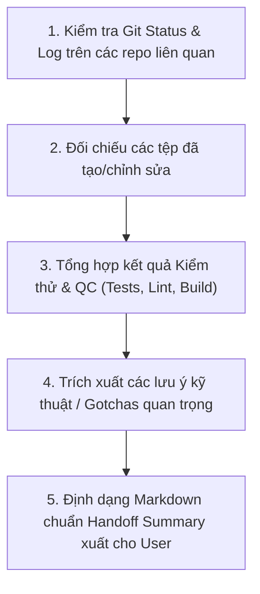

# Session Summary & Handoff Skill (Kỹ năng Tóm tắt Phiên làm việc)

Skill này hướng dẫn Agent tự động thu thập thông tin, đối chiếu trạng thái Git thực tế và định dạng bản **Tóm tắt Phiên làm việc (Session Handoff Summary)** chuẩn chỉnh, giúp người dùng dễ dàng chuyển ngữ cảnh sang một phiên chat mới hoặc lưu lại nhật ký bàn giao công việc mà không bị sót ngữ cảnh.

---

## 1. Khi nào kích hoạt Skill này?

Kích hoạt khi người dùng đưa ra các yêu cầu tương tự như:
* *"Tóm tắt session"* / *"Tóm tắt phiên làm việc"*
* *"Cho anh tóm tắt để bắt đầu đoạn chat mới"*
* *"Tạo handoff summary"* / *"Bàn giao ca làm việc"*
* *"Tổng kết lại những việc đã làm trong phiên này"*

---

## 2. Quy trình thực hiện tự động của Agent

Khi được yêu cầu tóm tắt, Agent **BẮT BUỘC** thực hiện các bước sau trước khi xuất bản tóm tắt:



### Bước 1: Thu thập bằng chứng Git thực tế
Chạy lệnh kiểm tra trên các repo con trong workspace (ví dụ: `./erp-api`, `./erp-web`):
```bash
git status -s
git log -n 2 --oneline
```
*Ghi nhận chính xác commit hash gần nhất, commit message và branch hiện tại.*

### Bước 2: Tổng hợp phạm vi công việc & Tệp thay đổi
* Liệt kê rõ ràng tính năng/lỗi đã xử lý.
* Tạo clickable markdown link (`file:///...`) cho các file quan trọng vừa tạo/sửa.

### Bước 3: Rà soát kết quả QC
* Ghi lại số lượng unit test đã pass, trạng thái typecheck, lintcheck và build.

### Bước 4: Đúc kết lưu ý kỹ thuật & Gotchas
* Nêu rõ các phát hiện kỹ thuật quan trọng (lỗi đã gặp, cấu hình `.env`, DB migration, cơ chế bảo vệ dữ liệu).

---

## 3. Cấu trúc mẫu chuẩn của Bản Tóm tắt (Handoff Template)

Agent xuất bản tóm tắt theo định dạng Markdown 5 phần dưới đây:

```markdown
# 📋 Tóm tắt phiên làm việc: [Tên chủ đề / Tính năng / Task chính]

### 1. Mục tiêu & Yêu cầu đã hoàn thành
- **[Tên tính năng / Nghiệp vụ 1]**: Mô tả ngắn gọn cách giải quyết, kiến trúc hoặc thuật toán cốt lõi.
- **[Tên tính năng / Nghiệp vụ 2]**: Mô tả giao diện, luồng người dùng hoặc tích hợp API.

---

### 2. Trạng thái Git & Tệp thay đổi (Commits & Files)

* **[Tên Repo 1 (e.g. Backend `erp-api`)]** — Commit: `<commit-hash>` (Branch: `<branch-name>`)
  * *Commit message*: `<message>`
  * *Tệp chính*:
    * `[NEW/MODIFY] [TênFile](file:///đường_dẫn_tuyệt_đối)`: Vai trò ngắn gọn.
  * *QC*: `<Số lượng test pass>`, typecheck & lint status, build status.

* **[Tên Repo 2 (e.g. Frontend `erp-web`)]** — Commit: `<commit-hash>` (Branch: `<branch-name>`)
  * *Commit message*: `<message>`
  * *Tệp chính*:
    * `[NEW/MODIFY] [TênFile](file:///đường_dẫn_tuyệt_đối)`: Vai trò ngắn gọn.
  * *QC*: `<Số lượng test pass>`, typecheck & lint status, build status.

---

### 3. Lưu ý kỹ thuật & Vận hành (Gotchas & Key Decisions)
* **[Lưu ý 1]**: (Ví dụ: Cấu hình biến môi trường, cơ chế an toàn, tài khoản cổng thuế, v.v.)
* **[Lưu ý 2]**: (Ví dụ: Lưu ý khi chạy migration, database seed, quyền hạn RBAC, v.v.)

---

### 4. Các bước tiếp theo cho Phiên mới (Next Steps)
1. [Hành động ưu tiên 1 cần làm ngay khi mở chat mới]
2. [Hành động tiếp theo 2]
3. [Hành động tiếp theo 3]
```

---

## 4. Nguyên tắc chất lượng (Checklist)

- [ ] **Chính xác tuyệt đối**: Commit hash và tên file phải lấy từ `git log` / `git status` thực tế, không bịa đặt.
- [ ] **Cô đọng & Đủ ý**: Tập trung vào những gì người lập trình ở phiên mới cần biết để tiếp tục code ngay lập tức.
- [ ] **Clickable Links**: Mọi đường dẫn tệp quan trọng đều dùng định dạng link markdown `[File](file:///path/to/file)`.
- [ ] **Sẵn sàng chuyển giao**: Bản tóm tắt phải được thiết kế để copy-paste trực tiếp làm prompt mở đầu cho phiên chat mới.
