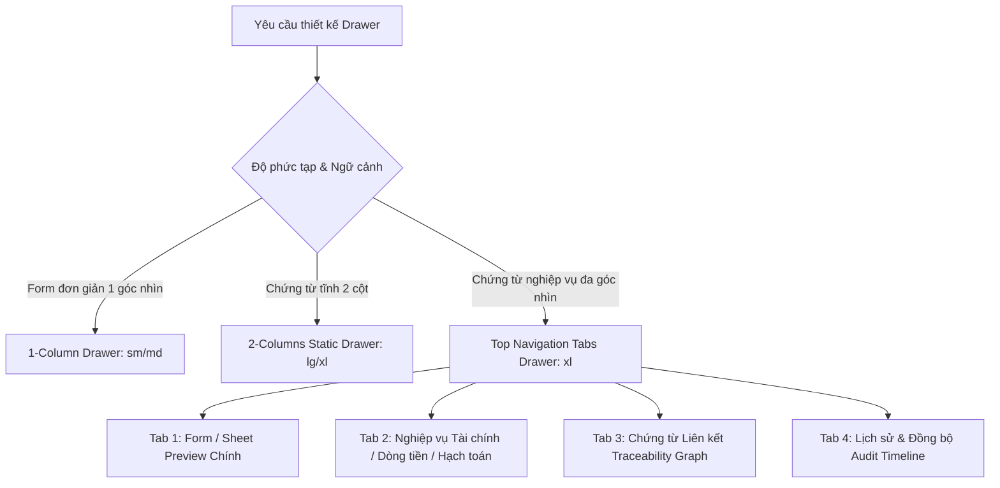

# 📋 Drawer Standards

> ⚡ **FAST-TRACK (PlopJS Generator)**: Để sinh nhanh component Drawer chuẩn (`1-column`, `2-columns`, hoặc `multi-tab`), chạy:
> ```bash
> bun plop drawer <moduleName> <componentName> <drawerType> <drawerSize> <hasStatus>
> ```
> *(Chi tiết tại skill `plop-generate`)*

Khi tạo mới hoặc chỉnh sửa Drawer trong hệ thống, bạn **BẮT BUỘC** phải sử dụng component `<StandardFormDrawer>` từ `@/shared/components/StandardFormDrawer` kết hợp với các UI elements chuẩn như `<DrawerSection>`, `<DrawerRow>`, `<DrawerField>`, `<DrawerTopTabItem>`.

## 1. Các thuộc tính bắt buộc của StandardFormDrawer

- `open`: boolean để mở/đóng.
- `mode`: `"view"` hoặc `"edit"`.
- `onClose`: Hàm đóng drawer.
- **`onToggleEdit`**: **Bắt buộc** nếu Drawer hỗ trợ cập nhật dữ liệu. Phải truyền hàm chuyển sang chế độ edit (ví dụ: `() => setMode("edit")`) để hiển thị icon Edit góc trên bên phải.
- `title`, `subtitle`: Tiêu đề chính và phụ.
- **`titleExtra`**: Nếu dữ liệu có trạng thái (status/state), **bắt buộc** dùng `titleExtra` truyền vào component `<Badge>` (từ `@/shared/components/ui/badge` hoặc module status badge) để hiển thị kế bên tiêu đề.
- `actions`: Mảng các nút bấm (Save, Cancel, Close...).
- `confirmOnClose`: Bật `true` nếu đang ở mode `edit` để tránh user vô tình đóng mất data đang nhập.
- `leftPanel`: Nội dung chính của Drawer (hoặc dùng `tabs` cho các Drawer đa góc nhìn).
- **Đa ngôn ngữ (i18n)**: Tất cả text (title, label, placeholder, button...) **bắt buộc** dùng `t(...)` từ `useTranslation("namespace")`.

## 2. Quy chuẩn Kích thước Responsive theo Viewport (`vw`) & Min/Max Width trên Desktop ($\ge 1280px$)

Toàn bộ kích thước Drawer trên Desktop được thiết kế co giãn linh hoạt theo tỷ lệ khung nhìn (**`vw`**) kết hợp với **`min-width`** và **`max-width`** chặt chẽ, tối ưu trải nghiệm cho mọi độ phân giải màn hình từ **1280px (Laptop), 1440px (Desktop), 1920px (FHD), 2K đến 4K Ultrawide**:

| Size Preset | Độ rộng Responsive theo `vw` (Desktop $\ge 1280px$) | Min Width | Max Width | Mục đích sử dụng thực tế |
| :--- | :--- | :--- | :--- | :--- |
| **`sm`** *(Default 1-col)* | `lg:w-[42vw] xl:w-[38vw] 2xl:w-[32vw]` | `420px` | `660px` | Form đơn giản 1 cột: Profile, Đổi mật khẩu, Gán nhãn tags. |
| **`md`** | `lg:w-[60vw] xl:w-[54vw] 2xl:w-[48vw]` | `620px` | `980px` | Form 1 cột trung bình: Master data, Cấu hình danh mục kho, Đơn vị tính. |
| **`lg`** | `lg:w-[78vw] xl:w-[74vw] 2xl:w-[68vw]` | `840px` | `1380px` | Form 2 cột vừa phải: Đối tác, Khách hàng Garage, Chi nhánh. |
| **`xl`** *(Default 2-col)* | `lg:w-[93vw] xl:w-[90vw] 2xl:w-[88vw]` | `1020px` | `1780px` | Chứng từ lớn & Multi-Facet Tabs (~90vw): Hóa đơn ERP, Phiếu kho (PNK/PXK), PO, Sales Orders, Lệnh SX, Sổ báo giá. |
| **`full`** | `w-[calc(100vw-208px)]` | `1020px` | `calc(100vw-208px)` | Báo cáo chi tiết, Canvas Graph Traceability toàn màn hình. |

> **Nguyên tắc an toàn**: 
> 1. Bề rộng tối đa của Drawer trên Desktop luôn được giới hạn bởi `max-width: calc(100vw - 208px)` để **không bao giờ che khuất Sidebar** bên trái hệ thống.
> 2. Trên Mobile & Tablet (`md:w-[95vw]`), Drawer tự động mở rộng `w-full` hoặc `95vw` để tối ưu diện tích thao tác.

---

## 3. Phân loại Kiến trúc Drawer trong Toàn hệ thống ERP

Trong hệ thống Liouni ERP, Drawer được chuẩn hóa thành 3 mô hình kiến trúc rõ ràng:



1. **1-Column Drawer (`layout="1-column"`, `size="sm"` hoặc `"md"`)**: Dành cho form ngắn, cập nhật 1 đối tượng đơn lẻ (User Profile, Company Settings, Danh mục, Đơn vị tính).
2. **2-Columns Static Drawer (`layout="2-columns"`, `size="lg"` hoặc `"xl"`)**: Dành cho form chứng từ tĩnh không có nhiều phân hệ con (Partner Info, Simple Voucher).
3. **Multi-Facet Document Drawer với Top Navigation Tabs (`tabs: DrawerTopTabItem[]`, `size="xl"`)**: **QUY CHUẨN BẮT BUỘC** cho tất cả các chứng từ và đối tượng nghiệp vụ lớn có nhiều góc nhìn (Hóa đơn ERP, Sổ báo giá Garage, Phiếu kho, Đơn mua hàng PO, Đơn bán hàng SO, Lệnh sản xuất, Sao kê ngân hàng, Hồ sơ khách hàng nợ).

---

## 4. Quy chuẩn Bắt buộc: Multi-Facet Drawer với Top Navigation Tabs (`tabs`)

Đối với tất cả các màn hình chứng từ có $\ge 2$ góc nhìn hoặc có dữ liệu liên quan (Dòng tiền, Hóa đơn, Traceability Graph, Lịch sử, Serial), **BẮT BUỘC sử dụng prop `tabs`** để đưa dải tab điều hướng lên **phía trên (ngay dưới Header)**:

### 🌟 Ưu điểm & Nguyên tắc kiến trúc:
1. **Không nested scroll**: Các tab nghiệp vụ con (*Tài chính*, *Traceability Graph*, *Audit Logs*) chiếm 100% chiều cao Drawer Viewport (`calc(100vh - header - footer)`), loại bỏ hoàn toàn tình trạng tab bị ép ở đáy form hay bị cuộn lồng nhau.
2. **Tab số 1 luôn là Form / Sheet Preview chính** (ví dụ: *Chi tiết hóa đơn*, *Sổ báo giá*, *Chi tiết phiếu kho*, *Chi tiết đơn PO*).
3. **Cột phải (Right Panel) cố định thông tin chung & Phân loại**: Hiển thị metadata, trạng thái, phân loại nghiệp vụ và hiệu quả tài chính tóm tắt xuyên suốt các tab.
4. **Hỗ trợ `hideRightPanel: true`**: Cho các tab cần không gian đồ họa 100% full width như Mạng lưới chứng từ liên kết Canvas Graph (`@xyflow/react`).
5. **Hỗ trợ `badgeCount` & Icons**: Hiển thị số lượng giao dịch, hóa đơn hoặc logs trên từng tab.

### Mẫu cấu trúc Tab chuẩn cho các phân hệ ERP:

| Phân hệ / Module | Tab 1 (Main Content) | Tab 2 (Transactions / Execution) | Tab 3 (Financials / NetOff) | Tab 4 (Network Graph) | Tab 5+ (Attachments / Accounting / History) |
| :--- | :--- | :--- | :--- | :--- | :--- |
| **Hóa đơn ERP** (`ErpInvoiceInternalDrawer`) | **Chi tiết** (XML/PDF + Form) | **Giao dịch** (Hồ sơ đối tác & Hóa đơn liên quan 2 cột) | **Tài chính** (Cấn trừ sao kê) | **Chứng từ liên kết** (Traceability Graph - full width) | **Đính kèm** $\to$ **Hạch toán** $\to$ **Lịch sử** |
| **Sổ báo giá Garage** (`GarageCaseStandaloneDrawer`) | Chi tiết báo giá (Preview Sheet) | Dịch vụ & Phụ tùng thi công | Tài chính & Công nợ (Settlements) | Chứng từ liên kết (Traceability Graph - full width) | Lịch sử & Đồng bộ (Audit Timeline) |
| **Đơn mua hàng PO** (`PurchaseOrderDrawer`) | Chi tiết đơn PO (Items & Pricing) | Tiến độ nhập & Thanh toán (GR Timeline) | Công nợ & Hóa đơn VAT | Chuỗi chứng từ PO (Traceability Graph - full width) | Lịch sử đơn hàng (Audit Timeline) |
| **Phiếu kho NK/XK/KK** (`InventoryVoucherFormDrawer`) | Chi tiết phiếu kho (Lines & Quantities) | Định danh Serial / Lots (Lifecycles) | Định giá vốn & Phí phát sinh | Chứng từ gốc liên kết (Traceability Graph - full width) | Lịch sử xuất nhập (Audit Timeline) |
| **Đơn bán hàng SO** (`SoFormDrawer`) | Chi tiết đơn bán (SO Lines) | Bàn giao Serial & Thu tiền | Hạch toán doanh thu | Mạng lưới phân phối (Traceability Graph - full width) | Lịch sử đơn SO (Audit Timeline) |
| **Lệnh sản xuất** (`ProductionOrderDrawer`) | Lệnh SX & Định mức BOM | As-Built BOM & Xuất nhập NVL | Nhật ký công đoạn | Luồng chuỗi cung ứng (Traceability Graph - full width) | Lịch sử sản xuất (Audit Timeline) |
| **Sao kê ngân hàng** (`BankTransactionDetailDrawer`) | Chi tiết giao dịch (Txn Meta) | Đối soát & Cấn trừ hóa đơn | Định khoản kế toán sổ quỹ | Mạng lưới dòng tiền (Traceability Graph - full width) | Lịch sử đối soát (Audit Timeline) |

---

### Mẫu Code Chuẩn Multi-Facet Drawer với Top Tabs:

```tsx
import React, { useState } from "react";
import {
  StandardFormDrawer,
  DrawerAuditTimeline,
  type DrawerTopTabItem,
} from "@/shared/components/StandardFormDrawer";
import { DrawerSection, DrawerRow, DrawerField, inputCls } from "@/shared/components/DrawerModal";
import { DrawerDocumentTraceability } from "@/shared/components/drawer/DrawerDocumentTraceability";
import { Badge } from "@/shared/components/ui/badge";
import { FileText, Wallet, Link2, History } from "lucide-react";
import { useTranslation } from "react-i18next";

export function StandardDocumentDrawer({ open, onClose, mode, setMode, documentData, auditLogs, settlements, linkedInvoices }) {
  const { t } = useTranslation("documents");
  const [activeTab, setActiveTab] = useState<string>("details");

  const drawerTabs: DrawerTopTabItem[] = [
    // Tab 1: Nội dung chi tiết chính (Main Content được phân chia thành các DrawerSection chuẩn mực)
    {
      key: "details",
      label: t("Chi tiết chứng từ"),
      icon: <FileText className="w-3.5 h-3.5" />,
      content: (
        <div className="space-y-4 pb-4">
          {/* Section 1 (Main Content): Thông tin phiếu & Form nhập liệu */}
          <DrawerSection title={t("Thông tin phiếu")} collapsible defaultCollapsed={false}>
            <div className="grid grid-cols-1 md:grid-cols-2 gap-3">
              <DrawerField label={t("Mã chứng từ")}>
                <Input value={documentData.code} readOnly className={inputCls} />
              </DrawerField>
              <DrawerField label={t("Ngày hạch toán")}>
                <Input value={documentData.date} readOnly className={inputCls} />
              </DrawerField>
            </div>
          </DrawerSection>

          {/* Section 2 (Main Content): Bảng dữ liệu nhúng (DataTable / StandardTable) */}
          <DrawerSection
            title={`${t("Danh sách mặt hàng")} (${documentData.lines?.length || 0})`}
            titleExtra={
              <div className="flex items-center gap-2 text-xs text-muted-foreground">
                {/* Nút hành động, thêm dòng hoặc bộ lọc */}
              </div>
            }
            collapsible
            defaultCollapsed={false}
          >
            <StandardTable
              tableId="drawer-detail-lines"
              enableFullscreen
              tableTitle={t("Danh sách mặt hàng")}
              columns={itemColumns}
              items={documentData.lines || []}
              getRowKey={(r) => r.id}
            />
          </DrawerSection>

          {/* Section 3 (Main Content): Ghi chú & Điều khoản */}
          <DrawerSection title={t("Ghi chú & Điều khoản")} collapsible defaultCollapsed={true}>
            <DrawerField label={t("Nội dung ghi chú")}>
              <Textarea value={documentData.notes || ""} readOnly className={inputCls} />
            </DrawerField>
          </DrawerSection>
        </div>
      ),
    },

    // Tab 2: Tài chính, Dòng tiền & Cấn trừ
    {
      key: "financials",
      label: t("Tài chính & Dòng tiền"),
      icon: <Wallet className="w-3.5 h-3.5" />,
      badgeCount: (settlements?.length || 0) + (linkedInvoices?.length || 0),
      content: (
        <DocumentFinancialSection
          documentId={documentData.id}
          settlements={settlements}
          linkedInvoices={linkedInvoices}
        />
      ),
    },

    // Tab 3: Mạng lưới chứng từ liên kết (Traceability Graph)
    {
      key: "linked_docs",
      label: t("Chứng từ liên kết"),
      icon: <Link2 className="w-3.5 h-3.5" />,
      badgeCount: linkedInvoices?.length || 0,
      hideRightPanel: true, // Bung 100% full width khi xem Graph
      content: (
        <DrawerDocumentTraceability
          rootId={documentData.id}
          rootType="INVOICE" // hoặc GARAGE_CASE, PURCHASE_ORDER, etc.
          fetchGraph={(id) => fetchTraceabilityGraph(id)}
        />
      ),
    },

    // Tab 4: Lịch sử & Đồng bộ (Audit Timeline)
    {
      key: "history",
      label: t("Lịch sử thao tác"),
      icon: <History className="w-3.5 h-3.5" />,
      badgeCount: auditLogs?.length || 0,
      content: (
        <div className="p-3 bg-surface/50 rounded-xl border border-border/70">
          <DrawerAuditTimeline items={auditLogs} />
        </div>
      ),
    },
  ];

  return (
    <StandardFormDrawer
      open={open}
      mode={mode}
      onClose={onClose}
      onToggleEdit={() => setMode("edit")}
      title={`${t("Chứng từ:")} ${documentData.code}`}
      titleExtra={<Badge variant="default">{documentData.statusName}</Badge>}
      layout="2-columns"
      size="xl"
      collapsibleRightPanel={true}
      tabs={drawerTabs}
      defaultTabKey="details"
      rightPanel={
        <div className="space-y-3 pb-3">
          <DrawerSection title={t("Thông tin chung")} collapsible defaultCollapsed={false}>
            <DrawerRow label={t("Số chứng từ")} value={documentData.code} />
            <DrawerRow label={t("Ngày phát sinh")} value={documentData.date} />
            <DrawerRow label={t("Đối tác")} value={documentData.partnerName} />
          </DrawerSection>

          <DrawerSection title={t("Phân loại & Ghi chú ERP")} collapsible defaultCollapsed={false}>
            <DrawerRow label={t("Phân loại")} value={<ClassificationBadge value={documentData.classification} />} />
            <DrawerRow label={t("Ghi chú")} value={documentData.notes || "—"} />
          </DrawerSection>
        </div>
      }
    />
  );
}
```

---

## 5. Quy tắc cho 1-Column Drawer (Profile, Changelog, Cấu hình đơn giản)

Dành cho các form đơn giản không có nhiều phân hệ (như Company Profile, User Profile, Changelog Timeline, Cấu hình danh mục):

- Bắt buộc set `layout="1-column"`.
- Bắt buộc set `size="sm"` (hoặc `"md"` nếu form hiển thị Timeline / nội dung chi tiết).
- Toàn bộ nội dung được truyền vào prop `leftPanel`.
- Không sử dụng `rightPanel`.

---

## 6. Quy chuẩn Bắt buộc về `<DrawerSection>` & 2-Column Right Panel luôn có Expand/Collapse Mặc định

1. **Mặc định BẬT Expand/Collapse cho Cột Phải (`layout="2-columns"`)**:
   - Trong mọi Drawer 2 cột (`layout="2-columns"`), hệ thống **tự động kích hoạt nút Thu gọn / Mở rộng cột phải (`ChevronRight`/`ChevronLeft`)** trên thanh Header (`collapsibleRightPanel` mặc định là `true`).
   - Người dùng có thể nhấn nút mũi tên trên Header để thu gọn cột phải về cạnh phải màn hình bất cứ lúc nào để mở rộng 100% diện tích cho cột trái (như bảng dữ liệu hoặc form chính).
   - Với các tab con tự chia 2 cột nội bộ (như tab Chi tiết theo đối tượng), **BẮT BUỘC** bổ sung nút toggle Thu gọn/Mở rộng cột phải trên thanh toolbar/titleExtra, và khi đóng lại cột trái bung rộng 100% `w-full`.

2. **Mặc định BẬT Expand/Collapse cho `<DrawerSection>` & Co giãn chiều cao tự nhiên**:
   - Mọi vùng nội dung trong Drawer (cả 1-column lẫn 2-columns) **BẮT BUỘC** phải được bọc trong `<DrawerSection title="...">`.
   - Thuộc tính `collapsible` **mặc định là `true`** (`defaultCollapsed={false}`), tự động kích hoạt icon mũi tên Expand/Collapse xoay mượt mà.
   - **Xử lý Chiều cao khi Collapsed**: Khi `collapsed={true}`, thẻ `<DrawerSection>` **BẮT BUỘC tự động co về `h-auto`**, không giữ các class ép chiều cao như `h-full` hoặc `h-[calc(100vh-210px)]` để tránh tạo ra khoảng trắng lớn vô nghĩa. Khi bọc bảng với `fitViewportHeight`, luôn truyền `fitViewportHeight={!isCollapsed}` và container ngoài `className={cn("flex flex-col", !isCollapsed ? "h-[calc(100vh-210px)]" : "h-auto")}`.

3. **Quy chuẩn `<DrawerSection>` cho Cột Trái / Main Content (Left Panel & Tabs Content)**:
   - **BẮT BUỘC phân nhóm nội dung chính bằng `<DrawerSection>`**: Tuyệt đối không thả các trường input, textarea hay bảng dữ liệu trôi nổi không tiêu đề trong Main Content (`leftPanel` hoặc nội dung các tab).
   - **Cấu trúc 3 phân vùng chuẩn trong Main Content**:
     1. **Phân vùng 1 — Thông tin phiếu / Master Data**: Bọc các `<DrawerField>` / `<DrawerRow>` trong layout grid (`grid grid-cols-1 md:grid-cols-2 gap-3`).
     2. **Phân vùng 2 — Bảng dữ liệu nghiệp vụ chính (Embedded DataTable)**: Bọc `<DataTable>` hoặc `<StandardTable>` bên trong `<DrawerSection title="..." titleExtra={...}>`. Tiêu đề bắt buộc hiển thị số lượng dòng `(N)`, `titleExtra` chứa các nút hành động theo ngữ cảnh (Thêm dòng mới, Nút xóa bộ lọc nếu bảng có filter active, hoặc Fullscreen toggle).
     3. **Phân vùng 3 — Ghi chú, Điều khoản & Custom Fields**: Bọc các trường bổ sung ở cuối, mặc định có thể để `defaultCollapsed={true}` để tiết kiệm diện tích cuộn dọc.

4. **Quy tắc Giảm thiểu Border & Chuẩn hóa Timeline (No Nested Borders Overload)**:
   - **Tuyệt đối tránh** lồng quá nhiều border card (`border border-border`) bên trong DrawerSection khiến giao diện bị nặng nề, rối mắt.
   - Khi hiển thị Dòng thời gian (Timeline / History / Changelog / Audit Logs):
     - **BẮT BUỘC** sử dụng cấu trúc trục dọc thanh thoát:
       - Trục dọc (`spine`): `w-[2px] bg-slate-300 dark:bg-slate-700` liên tục.
       - Node tròn (`w-7 h-7 rounded-full`): Hiển thị icon hành động nổi bật.
       - Dotted horizontal connector: `border-t-2 border-dotted border-slate-300 dark:border-slate-700` nối từ trục vào nội dung.
       - Dòng tiêu đề: Tên sự kiện/phiên bản + Badge/Actor ở bên trái, Ngày giờ/Timestamp căn phải thẳng hàng.
       - Nội dung chi tiết: Danh sách bullet không viền khung cứng, sử dụng soft pill/dot phân loại để giao diện thoáng, tinh tế và cao cấp.

---

## 7. Quy tắc cho Thông tin Phụ trợ đính kèm dưới đáy (`relatedTabs`)

Đối với các form 1 cột hoặc 2 cột **đơn giản** không chia thành nhiều tab nghiệp vụ ngang hàng, nếu chỉ cần đính kèm tệp tóm tắt (`<DrawerAttachmentsDeck>`) hoặc khung ghi chú thảo luận (`<DrawerInternalNotes>`), có thể sử dụng prop `relatedTabs` dưới đáy.
- **Lưu ý**: Đối với tất cả chứng từ có *Traceability Graph*, *Hạch toán*, *Sao kê cấn trừ*, **BẮT BUỘC sử dụng Top Navigation Tabs (`tabs`)** thay vì nhồi vào `relatedTabs` dưới đáy.

---

## 8. Quy chuẩn Tối ưu Hiệu năng & Trải nghiệm Nhập liệu trong Drawer

1. **Memoize mảng `tabs` với `useMemo`**:
   - Khi truyền prop `tabs` vào `<StandardFormDrawer>`, **bắt buộc** bọc mảng tabs trong `useMemo`.
   - **Tuyệt đối tránh** truyền cả object form tổng vào dependency array của `tabs`. Chỉ liệt kê các trường cụ thể mà các tab thực sự phụ thuộc (như `form.accountingEnabled`, `form.pendingChanges`), tránh việc người dùng gõ ghi chú hay custom fields làm re-render toàn bộ 6 tabs.

2. **Cơ chế Local Buffered Input cho Text / Textarea**:
   - Khi tạo input text hoặc textarea trong Drawer hoặc Custom Config, sử dụng local state với debounce (500ms) kết hợp flush đồng bộ khi `onBlur`.
   - Người dùng gõ phím/xóa phím phản hồi tức thì 0ms (60fps) mà không làm lag main thread.

3. **Nút Xóa nhanh (Clear Button) chuẩn UI/UX**:
   - Trên nút `X` clear value, **bắt buộc sử dụng `onMouseDown={(e) => { e.preventDefault(); handleClear(e); }}`** thay vì chỉ dùng `onClick`.
   - `e.preventDefault()` trong `onMouseDown` ngăn trình duyệt kích hoạt sự kiện `blur` trước khi click, giúp xóa trắng ô input tức thì 0ms và giữ nguyên con trỏ focus cho người dùng.

---

## 9. Summary Checklist trước khi hoàn thành:

- [ ] Drawer đã sử dụng `<StandardFormDrawer>` chưa?
- [ ] **Cả Cột trái (Main Content / Tab 1) lẫn Cột phải (Right Panel) đều đã phân chia các khối nội dung thành `<DrawerSection>` có bật `collapsible={true}` chưa?**
- [ ] Size Drawer đã áp dụng chuẩn responsive `vw` kết hợp `min-width` / `max-width` (tối ưu cho desktop $\ge 1280px$, $\ge 1440px$, $\ge 1920px$ và không vượt quá `calc(100vw-208px)`) chưa?
- [ ] Giao diện đã loại bỏ các border lồng nhau không cần thiết, Timeline đã áp dụng đúng trục dọc spine + dotted connector chưa?
- [ ] Nếu Drawer cho phép cập nhật, đã truyền `onToggleEdit` chưa?
- [ ] Nếu record có trạng thái (status), đã dùng `<Badge>` truyền vào `titleExtra` chưa?
- [ ] Tất cả text tĩnh đã được dùng hook `useTranslation` (i18n) để wrap bằng `t(...)` chưa?
- [ ] **Mọi chứng từ có nhiều góc nhìn (Hóa đơn, Sổ báo giá, PO, SO, Lệnh SX, Kho, Sao kê) đã chuyển sang dùng Top Navigation Tabs (`tabs`) với Tab 1 là Form / Sheet Preview chính chưa?**
- [ ] **Mảng `tabs` đã được bọc `useMemo` với dependencies tường minh chưa?**
- [ ] Các trường text input / textarea đã có local buffer (0ms latency, debounce 500ms, nút `X` onMouseDown) chưa?
- [ ] Tab Mạng lưới chứng từ liên kết (Traceability Graph) đã được cấu hình `hideRightPanel: true` để bung 100% full width chưa?
- [ ] Cột bên phải (Right Panel) đã bao bọc các trường theo `<DrawerSection>`, `<DrawerRow>`, `<DrawerField>` chuẩn chưa?
- [ ] Icon hành động và icon menu context menu đã được dùng màu neutral, không hardcode màu mè chưa?
- [ ] Chức năng cảnh báo đóng Drawer khi đang Edit (`confirmOnClose={mode === 'edit'}`) đã được cấu hình đúng chưa?

