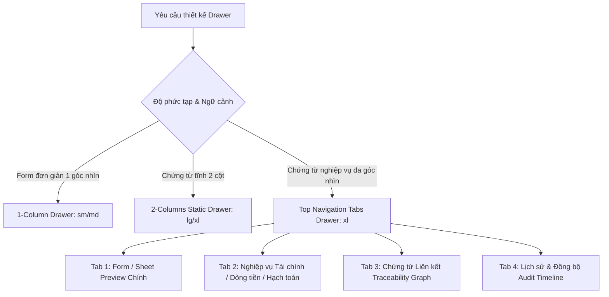

# 📋 Drawer Standards

Khi tạo mới hoặc chỉnh sửa Drawer trong hệ thống, bạn **BẮT BUỘC** phải sử dụng component `<StandardFormDrawer>` từ `@/shared/components/StandardFormDrawer` kết hợp với các UI elements chuẩn như `<DrawerSection>`, `<DrawerRow>`, `<DrawerField>`, `<DrawerTopTabItem>`.

## 1. Các thuộc tính bắt buộc của StandardFormDrawer

- `open`: boolean để mở/đóng.
- `mode`: `"view"` hoặc `"edit"`.
- `onClose`: Hàm đóng drawer.
- **`onToggleEdit`**: **Bắt buộc** nếu Drawer hỗ trợ cập nhật dữ liệu. Phải truyền hàm chuyển sang chế độ edit (ví dụ: `() => setMode("edit")`) để hiển thị icon Edit góc trên bên phải.
- `title`, `subtitle`: Tiêu đề chính và phụ.
- **`titleExtra`**: Nếu dữ liệu có trạng thái (status/state), **bắt buộc** dùng `titleExtra` truyền vào component `<Badge>` (từ `@/shared/components/ui/badge` hoặc module status badge) để hiển thị kế bên tiêu đề.
- `actions`: Mảng các nút bấm (Save, Cancel, Close...).
- `confirmOnClose`: Bật `true` nếu đang ở mode `edit` để tránh user vô tình đóng mất data đang nhập.
- `leftPanel`: Nội dung chính của Drawer (hoặc dùng `tabs` cho các Drawer đa góc nhìn).
- **Đa ngôn ngữ (i18n)**: Tất cả text (title, label, placeholder, button...) **bắt buộc** dùng `t(...)` từ `useTranslation("namespace")`.

## 2. Quy chuẩn Kích thước Responsive theo Viewport (`vw`) & Min/Max Width trên Desktop ($\ge 1280px$)

Toàn bộ kích thước Drawer trên Desktop được thiết kế co giãn linh hoạt theo tỷ lệ khung nhìn (**`vw`**) kết hợp với **`min-width`** và **`max-width`** chặt chẽ, tối ưu trải nghiệm cho mọi độ phân giải màn hình từ **1280px (Laptop), 1440px (Desktop), 1920px (FHD), 2K đến 4K Ultrawide**:

| Size Preset | Độ rộng Responsive theo `vw` (Desktop $\ge 1280px$) | Min Width | Max Width | Mục đích sử dụng thực tế |
| :--- | :--- | :--- | :--- | :--- |
| **`sm`** *(Default 1-col)* | `lg:w-[35vw] xl:w-[32vw] 2xl:w-[28vw]` | `380px` | `560px` | Form đơn giản 1 cột: Profile, Đổi mật khẩu, Gán nhãn tags. |
| **`md`** | `lg:w-[52vw] xl:w-[46vw] 2xl:w-[40vw]` | `560px` | `820px` | Form 1 cột trung bình: Master data, Cấu hình danh mục kho, Đơn vị tính. |
| **`lg`** | `lg:w-[70vw] xl:w-[65vw] 2xl:w-[58vw]` | `780px` | `1150px` | Form 2 cột vừa phải: Đối tác, Khách hàng Garage, Chi nhánh. |
| **`xl`** *(Default 2-col)* | `lg:w-[86vw] xl:w-[80vw] 2xl:w-[75vw]` | `960px` | `1550px` | Chứng từ lớn: Hóa đơn ERP, Phiếu kho (PNK/PXK), PO, Sales Orders, Lệnh SX, Sổ báo giá. |
| **`full`** | `w-[calc(100vw-208px)]` | `1000px` | `calc(100vw-208px)` | Báo cáo chi tiết, Canvas Graph Traceability toàn màn hình. |

> **Nguyên tắc an toàn**: 
> 1. Bề rộng tối đa của Drawer trên Desktop luôn được giới hạn bởi `max-width: calc(100vw - 208px)` để **không bao giờ che khuất Sidebar** bên trái hệ thống.
> 2. Trên Mobile & Tablet (`md:w-[95vw]`), Drawer tự động mở rộng `w-full` hoặc `95vw` để tối ưu diện tích thao tác.

---

## 3. Phân loại Kiến trúc Drawer trong Toàn hệ thống ERP

Trong hệ thống Liouni ERP, Drawer được chuẩn hóa thành 3 mô hình kiến trúc rõ ràng:



1. **1-Column Drawer (`layout="1-column"`, `size="sm"` hoặc `"md"`)**: Dành cho form ngắn, cập nhật 1 đối tượng đơn lẻ (User Profile, Company Settings, Danh mục, Đơn vị tính).
2. **2-Columns Static Drawer (`layout="2-columns"`, `size="lg"` hoặc `"xl"`)**: Dành cho form chứng từ tĩnh không có nhiều phân hệ con (Partner Info, Simple Voucher).
3. **Multi-Facet Document Drawer với Top Navigation Tabs (`tabs: DrawerTopTabItem[]`, `size="xl"`)**: **QUY CHUẨN BẮT BUỘC** cho tất cả các chứng từ và đối tượng nghiệp vụ lớn có nhiều góc nhìn (Hóa đơn ERP, Sổ báo giá Garage, Phiếu kho, Đơn mua hàng PO, Đơn bán hàng SO, Lệnh sản xuất, Sao kê ngân hàng, Hồ sơ khách hàng nợ).

---

## 4. Quy chuẩn Bắt buộc: Multi-Facet Drawer với Top Navigation Tabs (`tabs`)

Đối với tất cả các màn hình chứng từ có $\ge 2$ góc nhìn hoặc có dữ liệu liên quan (Dòng tiền, Hóa đơn, Traceability Graph, Lịch sử, Serial), **BẮT BUỘC sử dụng prop `tabs`** để đưa dải tab điều hướng lên **phía trên (ngay dưới Header)**:

### 🌟 Ưu điểm & Nguyên tắc kiến trúc:
1. **Không nested scroll**: Các tab nghiệp vụ con (*Tài chính*, *Traceability Graph*, *Audit Logs*) chiếm 100% chiều cao Drawer Viewport (`calc(100vh - header - footer)`), loại bỏ hoàn toàn tình trạng tab bị ép ở đáy form hay bị cuộn lồng nhau.
2. **Tab số 1 luôn là Form / Sheet Preview chính** (ví dụ: *Chi tiết hóa đơn*, *Sổ báo giá*, *Chi tiết phiếu kho*, *Chi tiết đơn PO*).
3. **Cột phải (Right Panel) cố định thông tin chung & Phân loại**: Hiển thị metadata, trạng thái, phân loại nghiệp vụ và hiệu quả tài chính tóm tắt xuyên suốt các tab.
4. **Hỗ trợ `hideRightPanel: true`**: Cho các tab cần không gian đồ họa 100% full width như Mạng lưới chứng từ liên kết Canvas Graph (`@xyflow/react`).
5. **Hỗ trợ `badgeCount` & Icons**: Hiển thị số lượng giao dịch, hóa đơn hoặc logs trên từng tab.

### Mẫu cấu trúc Tab chuẩn cho các phân hệ ERP:

| Phân hệ / Module | Tab 1 (Main Content) | Tab 2 (Financials / Execution) | Tab 3 (Network Graph) | Tab 4 (Audit & Sync) |
| :--- | :--- | :--- | :--- | :--- |
| **Sổ báo giá Garage** (`GarageCaseStandaloneDrawer`) | Chi tiết báo giá (Preview Sheet) | Tài chính & Công nợ (Settlements + Invoices) | Chứng từ liên kết (Traceability Graph - full width) | Lịch sử & Đồng bộ (Audit Timeline) |
| **Hóa đơn ERP** (`ErpInvoiceInternalDrawer`) | Chi tiết hóa đơn (XML/PDF + Lines) | Hạch toán & Cấn trừ (Posting + Settlements) | Mạng lưới chứng từ (Traceability Graph - full width) | Lịch sử & Thuế GDT (Audit Timeline) |
| **Đơn mua hàng PO** (`PurchaseOrderDrawer`) | Chi tiết đơn PO (Items & Pricing) | Tiến độ nhập & Thanh toán (GR Timeline + Payments) | Chuỗi chứng từ PO (Traceability Graph - full width) | Lịch sử đơn hàng (Audit Timeline) |
| **Phiếu kho NK/XK/KK** (`InventoryVoucherFormDrawer`) | Chi tiết phiếu kho (Lines & Quantities) | Định danh Serial / Lots (Serials Lifecycle) | Chứng từ gốc liên kết (Traceability Graph - full width) | Lịch sử xuất nhập (Audit Timeline) |
| **Đơn bán hàng SO** (`SoFormDrawer`) | Chi tiết đơn bán (SO Lines) | Bàn giao Serial & Thu tiền (Serials + Receipts) | Mạng lưới phân phối (Traceability Graph - full width) | Lịch sử đơn SO (Audit Timeline) |
| **Lệnh sản xuất** (`ProductionOrderDrawer`) | Lệnh SX & Định mức BOM | As-Built BOM & Xuất nhập NVL | Luồng chuỗi cung ứng (Traceability Graph - full width) | Nhật ký công đoạn (Audit Timeline) |
| **Sao kê ngân hàng** (`BankTransactionDetailDrawer`) | Chi tiết giao dịch (Txn Meta) | Đối soát & Cấn trừ (Matched Vouchers/Invoices) | Mạng lưới dòng tiền (Traceability Graph - full width) | Lịch sử hạch toán (Audit Timeline) |

---

### Mẫu Code Chuẩn Multi-Facet Drawer với Top Tabs:

```tsx
import React, { useState } from "react";
import {
  StandardFormDrawer,
  DrawerAuditTimeline,
  type DrawerTopTabItem,
} from "@/shared/components/StandardFormDrawer";
import { DrawerSection, DrawerRow, DrawerField, inputCls } from "@/shared/components/DrawerModal";
import { DrawerDocumentTraceability } from "@/shared/components/drawer/DrawerDocumentTraceability";
import { Badge } from "@/shared/components/ui/badge";
import { FileText, Wallet, Link2, History } from "lucide-react";
import { useTranslation } from "react-i18next";

export function StandardDocumentDrawer({ open, onClose, mode, setMode, documentData, auditLogs, settlements, linkedInvoices }) {
  const { t } = useTranslation("documents");
  const [activeTab, setActiveTab] = useState<string>("details");

  const drawerTabs: DrawerTopTabItem[] = [
    // Tab 1: Nội dung chi tiết chính
    {
      key: "details",
      label: t("Chi tiết chứng từ"),
      icon: <FileText className="w-3.5 h-3.5" />,
      content: (
        <div className="space-y-4">
          <DocumentSheetPreview data={documentData} />
        </div>
      ),
    },

    // Tab 2: Tài chính, Dòng tiền & Cấn trừ
    {
      key: "financials",
      label: t("Tài chính & Dòng tiền"),
      icon: <Wallet className="w-3.5 h-3.5" />,
      badgeCount: (settlements?.length || 0) + (linkedInvoices?.length || 0),
      content: (
        <DocumentFinancialSection
          documentId={documentData.id}
          settlements={settlements}
          linkedInvoices={linkedInvoices}
        />
      ),
    },

    // Tab 3: Mạng lưới chứng từ liên kết (Traceability Graph)
    {
      key: "linked_docs",
      label: t("Chứng từ liên kết"),
      icon: <Link2 className="w-3.5 h-3.5" />,
      badgeCount: linkedInvoices?.length || 0,
      hideRightPanel: true, // Bung 100% full width khi xem Graph
      content: (
        <DrawerDocumentTraceability
          rootId={documentData.id}
          rootType="INVOICE" // hoặc GARAGE_CASE, PURCHASE_ORDER, etc.
          fetchGraph={(id) => fetchTraceabilityGraph(id)}
        />
      ),
    },

    // Tab 4: Lịch sử & Đồng bộ (Audit Timeline)
    {
      key: "history",
      label: t("Lịch sử thao tác"),
      icon: <History className="w-3.5 h-3.5" />,
      badgeCount: auditLogs?.length || 0,
      content: (
        <div className="p-3 bg-surface/50 rounded-xl border border-border/70">
          <DrawerAuditTimeline items={auditLogs} />
        </div>
      ),
    },
  ];

  return (
    <StandardFormDrawer
      open={open}
      mode={mode}
      onClose={onClose}
      onToggleEdit={() => setMode("edit")}
      title={`${t("Chứng từ:")} ${documentData.code}`}
      titleExtra={<Badge variant="default">{documentData.statusName}</Badge>}
      layout="2-columns"
      size="xl"
      collapsibleRightPanel={true}
      tabs={drawerTabs}
      defaultTabKey="details"
      rightPanel={
        <div className="space-y-3 pb-3">
          <DrawerSection title={t("Thông tin chung")} collapsible defaultCollapsed={false}>
            <DrawerRow label={t("Số chứng từ")} value={documentData.code} />
            <DrawerRow label={t("Ngày phát sinh")} value={documentData.date} />
            <DrawerRow label={t("Đối tác")} value={documentData.partnerName} />
          </DrawerSection>

          <DrawerSection title={t("Phân loại & Ghi chú ERP")} collapsible defaultCollapsed={false}>
            <DrawerRow label={t("Phân loại")} value={<ClassificationBadge value={documentData.classification} />} />
            <DrawerRow label={t("Ghi chú")} value={documentData.notes || "—"} />
          </DrawerSection>
        </div>
      }
    />
  );
}
```

---

## 5. Quy tắc cho 1-Column Drawer (Profile, Cấu hình đơn giản)

Dành cho các form đơn giản không có nhiều phân hệ (như Company Profile, User Profile, Cấu hình danh mục):

- Bắt buộc set `layout="1-column"`.
- Bắt buộc set `size="sm"` (hoặc `"md"` nếu form hơi dài/nhiều text).
- Toàn bộ nội dung được truyền vào prop `leftPanel`.
- Không sử dụng `rightPanel`.

---

## 6. Quy tắc cho Thông tin Phụ trợ đính kèm dưới đáy (`relatedTabs`)

Đối với các form 1 cột hoặc 2 cột **đơn giản** không chia thành nhiều tab nghiệp vụ ngang hàng, nếu chỉ cần đính kèm tệp tóm tắt (`<DrawerAttachmentsDeck>`) hoặc khung ghi chú thảo luận (`<DrawerInternalNotes>`), có thể sử dụng prop `relatedTabs` dưới đáy.
- **Lưu ý**: Đối với tất cả chứng từ có *Traceability Graph*, *Hạch toán*, *Sao kê cấn trừ*, **BẮT BUỘC sử dụng Top Navigation Tabs (`tabs`)** thay vì nhồi vào `relatedTabs` dưới đáy.

---

## 7. Summary Checklist trước khi hoàn thành:

- [ ] Drawer đã sử dụng `<StandardFormDrawer>` chưa?
- [ ] Size Drawer đã áp dụng chuẩn responsive `vw` kết hợp `min-width` / `max-width` (tối ưu cho desktop $\ge 1280px$, $\ge 1440px$, $\ge 1920px$ và không vượt quá `calc(100vw-208px)`) chưa?
- [ ] Nếu Drawer cho phép cập nhật, đã truyền `onToggleEdit` chưa?
- [ ] Nếu record có trạng thái (status), đã dùng `<Badge>` truyền vào `titleExtra` chưa?
- [ ] Tất cả text tĩnh đã được dùng hook `useTranslation` (i18n) để wrap bằng `t(...)` chưa?
- [ ] **Mọi chứng từ có nhiều góc nhìn (Hóa đơn, Sổ báo giá, PO, SO, Lệnh SX, Kho, Sao kê) đã chuyển sang dùng Top Navigation Tabs (`tabs`) với Tab 1 là Form / Sheet Preview chính chưa?**
- [ ] Tab Mạng lưới chứng từ liên kết (Traceability Graph) đã được cấu hình `hideRightPanel: true` để bung 100% full width chưa?
- [ ] Cột bên phải (Right Panel) đã bao bọc các trường theo `<DrawerSection>`, `<DrawerRow>`, `<DrawerField>` chuẩn chưa?
- [ ] Icon hành động và icon menu context menu đã được dùng màu neutral, không hardcode màu mè chưa?
- [ ] Chức năng cảnh báo đóng Drawer khi đang Edit (`confirmOnClose={mode === 'edit'}`) đã được cấu hình đúng chưa?
