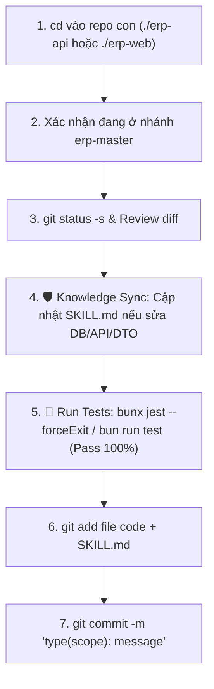
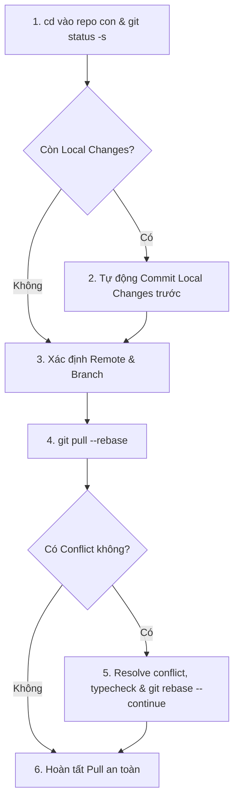
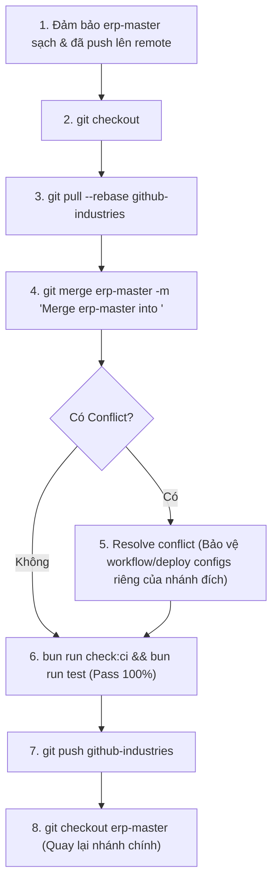

# 🐙 Liouni ERP Git Workflow (`/erp-git-workflow`)

Workflow này hướng dẫn quy trình chuẩn và an toàn tuyệt đối cho mọi thao tác Git (Commit, Pull, Rebase, Push, Master-First Modification, Conflict Resolution, và Downstream Branch Sync) trong workspace Liouni ERP (`erp-api` và `erp-web`).

---

## 🛡️ Nguyên Tắc Cốt Lõi & Guardrails Bắt Buộc

1. **🌟 Master-First Modification Mandate (BẮT BUỘC MỌI THAY ĐỔI LÀM TRÊN `erp-master` TRƯỚC)**:
   - Mọi chỉnh sửa mã nguồn (tính năng mới, sửa lỗi / bugfix, refactoring, giao diện, cấu hình) **BẮT BUỘC** phải được checkout, phát triển, kiểm thử và commit/push trên nhánh **`erp-master`** TRƯỚC TIÊN.
   - Tuyệt đối **NGHIÊM CẤM** sửa code trực tiếp hoặc commit trực tiếp trên các nhánh môi trường/khách hàng (`erp-greenway-production`, `erp-greenway-staging`, `erp-klotus-master`, `erp-klotus-production`, `erp-klotus-staging`) mà không xuất phát từ `erp-master`.
2. **Sử dụng đường dẫn tương đối — Tuyệt đối KHÔNG chạy Git ở root workspace**:
   - Luôn `cd` vào repo con: `./erp-api` (Backend) hoặc `./erp-web` (Frontend).
3. **🛡️ Test-First Guard**:
   - **`erp-api`**: **BẮT BUỘC** chạy `bunx jest --forceExit` (hoặc `bun run test`) và `bun run check:ci` pass 100% tests trước khi commit & trước khi push.
   - **`erp-web`**: **BẮT BUỘC** chạy `bun run test` và `bun run check:ci` pass 100% tests trước khi commit & trước khi push.
4. **🛡️ Module Knowledge Sync Guard**:
   - Khi có thay đổi DB Schema, DTOs, API Endpoints, Permissions hoặc Business Logic của module, **BẮT BUỘC** rà soát và cập nhật file `.agents/skills/modules/<module-name>/SKILL.md` trước khi commit.
5. **Không bao giờ ghi đè / làm mất code (No Override)**:
   - Nếu có local changes chưa commit, **BẮT BUỘC commit tạm trước khi pull/rebase**.
6. **Rebase First**:
   - Luôn dùng `git pull --rebase` trên cùng một nhánh để lịch sử commit tuyến tính, không tạo merge commit rác.
7. **Remote & Branch chuẩn**:
   - Remote: `github-industries` (fallback `origin`).
   - Main branch: `erp-master`.

---

## 🧭 Kịch Bản 1: Quy Trình Commit Code (Luôn trên `erp-master`)



### Các bước thực hiện:

```bash
# Bước 1: Di chuyển vào repo con
cd ./erp-web # hoặc cd ./erp-api

# Bước 2: Đảm bảo đang ở erp-master
git checkout erp-master

# Bước 3: Kiểm tra trạng thái
git status -s
git diff

# Bước 4: Rà soát & cập nhật SKILL.md module tương ứng (nếu có đổi DB/API/Logic)
# file: .agents/skills/modules/<module-name>/SKILL.md

# Bước 5: Chạy Unit Test (BẮT BUỘC PASS 100%)
# Frontend:
bun run test
# Backend:
# bunx jest --forceExit

# Bước 6: Stage files & Commit chuẩn Conventional Commits
git add <danh_sach_file>
git commit -m "feat(module): mô tả ngắn gọn nội dung thay đổi"
```

---

## 🧭 Kịch Bản 2: Quy Trình Pull Code Mới Nhất



### Các bước thực hiện:

```bash
cd ./erp-web # hoặc cd ./erp-api

# Bảo vệ local changes nếu có
if [ -n "$(git status -s)" ]; then
  git add -A
  git commit -m "chore: save local changes before pull rebase"
fi

CURRENT_BRANCH=$(git branch --show-current)
REMOTE_NAME=$(git remote | grep -w github-industries || echo "origin")

# Pull rebase
git pull --rebase $REMOTE_NAME $CURRENT_BRANCH

# Nếu có conflict:
# 1. Mở file conflict để sửa
# 2. bun run check:ci (kiểm tra typecheck)
# 3. git add <resolved-files>
# 4. git rebase --continue
```

---

## 🧭 Kịch Bản 3: Quy Trình Push Code Trọn Gói Lên `erp-master`

```bash
# 1. Di chuyển vào repo con
cd ./erp-web # hoặc cd ./erp-api

# Đảm bảo đang ở erp-master
git checkout erp-master

REMOTE_NAME=$(git remote | grep -w github-industries || echo "origin")

# 2. Lưu thay đổi và kiểm tra test trước commit
if [ -n "$(git status -s)" ]; then
  if [ -f "jest.config.ts" ] || [ -f "jest.config.js" ]; then
    bunx jest --forceExit
  else
    bun run test
  fi
  git add -A
  git commit -m "feat/fix/chore: mô tả thay đổi"
fi

# 3. Kéo code mới nhất về
git pull --rebase $REMOTE_NAME erp-master

# 4. QC toàn diện (Typecheck + Lint + Format + Unit Tests)
bun run check:ci

if [ -f "jest.config.ts" ] || [ -f "jest.config.js" ]; then
  bunx jest --forceExit
else
  bun run test
fi

# 5. Push lên remote erp-master
git push $REMOTE_NAME erp-master
```

---

## 🧭 Kịch Bản 4: Quy Trình Merge/Sync từ `erp-master` sang các nhánh khác

Sau khi các thay đổi trên `erp-master` đã được commit, kiểm thử và push thành công lên remote, quy trình đồng bộ sang các nhánh đích (`erp-greenway-production`, `erp-greenway-staging`, `erp-klotus-master`, `erp-klotus-production`, `erp-klotus-staging`) được thực hiện như sau:



### Các bước thực hiện:

```bash
# 1. Đảm bảo đang ở thư mục repo con
cd ./erp-web # hoặc cd ./erp-api

TARGET_BRANCH="erp-greenway-production" # Thay bằng nhánh cần đồng bộ
REMOTE_NAME=$(git remote | grep -w github-industries || echo "origin")

# 2. Đảm bảo erp-master đã sạch và được push
git checkout erp-master
git pull --rebase $REMOTE_NAME erp-master
git push $REMOTE_NAME erp-master

# 3. Chuyển sang nhánh mục tiêu và kéo mới nhất
git checkout $TARGET_BRANCH
git pull --rebase $REMOTE_NAME $TARGET_BRANCH

# 4. Merge từ erp-master sang nhánh mục tiêu
git merge erp-master -m "Merge erp-master into $TARGET_BRANCH"

# 5. Nếu có conflict:
# - Mở file sửa conflict
# - Lưu ý: Giữ nguyên các cấu hình deploy/CI/CD đặc thù của nhánh đích (ví dụ .github/workflows/, port cấu hình)
# - git add <resolved-files>
# - git commit -m "chore: resolve merge conflicts from erp-master"

# 6. Kiểm tra lại toàn bộ test suite trên nhánh đích
bun run check:ci
if [ -f "jest.config.ts" ] || [ -f "jest.config.js" ]; then
  bunx jest --forceExit
else
  bun run test
fi

# 7. Đẩy lên remote để trigger CI/CD deployment của nhánh đích
git push $REMOTE_NAME $TARGET_BRANCH

# 8. Quay lại nhánh chính erp-master
git checkout erp-master
```

---

## ✅ Checklist Hoàn Tất

- [ ] Mọi thay đổi mã nguồn ban đầu được thực hiện và kiểm thử trên **`erp-master`**.
- [ ] Chạy lệnh Git bên trong `./erp-api` hoặc `./erp-web` (Không chạy ở workspace root).
- [ ] Không có file nhạy cảm (`.env`, secret) trong commit.
- [ ] Đã cập nhật file `SKILL.md` của module bị ảnh hưởng.
- [ ] Unit Test pass 100% (Backend: `bunx jest --forceExit`, Frontend: `bun run test`).
- [ ] `bun run check:ci` pass sạch 0 lỗi.
- [ ] Đã push thành công lên `github-industries erp-master`.
- [ ] (Nếu cần deploy các môi trường khác) Đã merge từ `erp-master` sang nhánh đích và push thành công.
- [ ] Workspace được chuyển trở lại nhánh `erp-master`.
