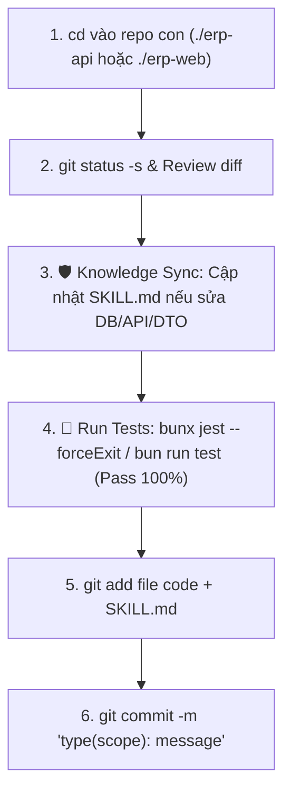
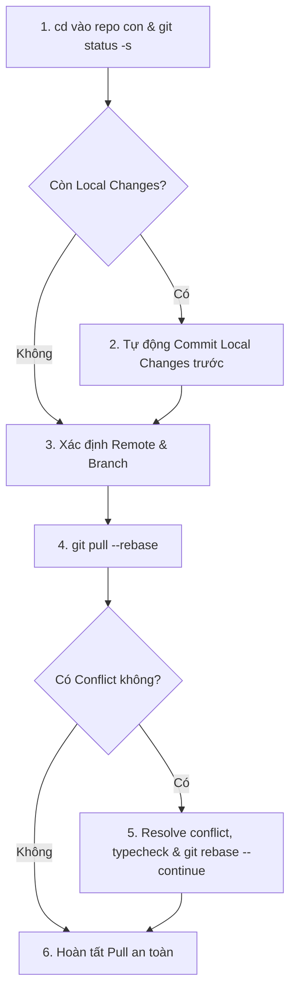

# 🐙 Liouni ERP Git Workflow (`/erp-git-workflow`)

Workflow này hướng dẫn quy trình chuẩn và an toàn tuyệt đối cho mọi thao tác Git (Commit, Pull, Rebase, Push, Conflict Resolution) trong workspace Liouni ERP (`erp-api` và `erp-web`).

---

## 🛡️ Nguyên Tắc Cốt Lõi & Guardrails Bắt Buộc

1. **Sử dụng đường dẫn tương đối — Tuyệt đối KHÔNG chạy Git ở root workspace**:
   - Luôn `cd` vào repo con: `./erp-api` (Backend) hoặc `./erp-web` (Frontend).
2. **🛡️ Test-First Guard**:
   - **`erp-api`**: **BẮT BUỘC** chạy `bunx jest --forceExit` và pass 100% tests trước khi commit & trước khi push.
   - **`erp-web`**: **BẮT BUỘC** chạy `bun run test` và pass 100% tests trước khi commit & trước khi push.
3. **🛡️ Module Knowledge Sync Guard**:
   - Khi có thay đổi DB Schema, DTOs, API Endpoints, Permissions hoặc Business Logic của module, **BẮT BUỘC** rà soát và cập nhật file `.agents/skills/modules/<module-name>/SKILL.md` trước khi commit.
4. **Không bao giờ ghi đè / làm mất code (No Override)**:
   - Nếu có local changes chưa commit, **BẮT BUỘC commit tạm trước khi pull**.
5. **Rebase First**:
   - Luôn dùng `git pull --rebase` để lịch sử commit tuyến tính, không tạo merge commit rác.
6. **Remote & Branch chuẩn**:
   - Remote: `github-industries` (fallback `origin`).
   - Main branch: `erp-master` (hoặc branch hiện tại đang checkout).

---

## 🧭 Kịch Bản 1: Quy Trình Commit Code



### Các bước thực hiện:

```bash
# Bước 1: Di chuyển vào repo con
cd ./erp-api # hoặc cd ./erp-web

# Bước 2: Kiểm tra trạng thái
git status -s
git diff

# Bước 3: Rà soát & cập nhật SKILL.md module tương ứng (nếu có đổi DB/API/Logic)
# file: .agents/skills/modules/<module-name>/SKILL.md

# Bước 4: Chạy Unit Test (BẮT BUỘC PASS 100%)
# Backend:
bunx jest --forceExit
# Frontend:
bun run test

# Bước 5: Stage files & Commit chuẩn Conventional Commits
git add <danh_sach_file>
git commit -m "feat(module): mô tả ngắn gọn nội dung thay đổi"
```

---

## 🧭 Kịch Bản 2: Quy Trình Pull Code Mới Nhất



### Các bước thực hiện:

```bash
cd ./erp-api # hoặc cd ./erp-web

# Bảo vệ local changes nếu có
if [ -n "$(git status -s)" ]; then
  git add -A
  git commit -m "chore: save local changes before pull rebase"
fi

CURRENT_BRANCH=$(git branch --show-current)
REMOTE_NAME=$(git remote | grep -w github-industries || echo "origin")

# Pull rebase
git pull --rebase $REMOTE_NAME $CURRENT_BRANCH

# Nếu có conflict:
# 1. Mở file conflict để sửa
# 2. bun run check:ci (kiểm tra typecheck)
# 3. git add <resolved-files>
# 4. git rebase --continue
```

---

## 🧭 Kịch Bản 3: Quy Trình Push Code Trọn Gói

```bash
# 1. Di chuyển vào repo con
cd ./erp-api # hoặc cd ./erp-web

CURRENT_BRANCH=$(git branch --show-current)
REMOTE_NAME=$(git remote | grep -w github-industries || echo "origin")

# 2. Lưu thay đổi và kiểm tra test trước commit
if [ -n "$(git status -s)" ]; then
  if [ -f "jest.config.ts" ] || [ -f "jest.config.js" ]; then
    bunx jest --forceExit
  else
    bun run test
  fi
  git add -A
  git commit -m "feat/fix/chore: mô tả thay đổi"
fi

# 3. Kéo code mới nhất về
git pull --rebase $REMOTE_NAME $CURRENT_BRANCH

# 4. QC toàn diện (Typecheck + Lint + Format + Unit Tests)
bun run check:ci

if [ -f "jest.config.ts" ] || [ -f "jest.config.js" ]; then
  bunx jest --forceExit
else
  bun run test
fi

# 5. Push lên remote
git push $REMOTE_NAME $CURRENT_BRANCH
```

---

## ✅ Checklist Hoàn Tất

- [ ] Chạy lệnh Git bên trong `./erp-api` hoặc `./erp-web` (Không chạy ở workspace root).
- [ ] Không có file nhạy cảm (`.env`, secret) trong commit.
- [ ] Đã cập nhật file `SKILL.md` của module bị ảnh hưởng.
- [ ] Unit Test pass 100% (Backend: `bunx jest --forceExit`, Frontend: `bun run test`).
- [ ] `bun run check:ci` pass sạch 0 lỗi.
- [ ] `git pull --rebase` không còn conflict dở dang.
- [ ] Đã push thành công lên remote `$REMOTE_NAME` branch `$CURRENT_BRANCH`.
