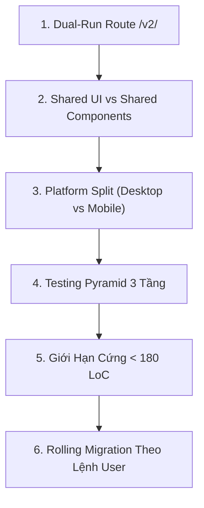

# 🚀 ERP Web v2 Architecture & Refactor Workflow (`/erp-web-v2-refactor`)

Tài liệu này là quy trình tác nghiệp tiêu chuẩn (SOP) dành cho Kỹ sư và AI Agent khi **thiết lập nền tảng v2** và **di chuyển cuốn chiếu (Rolling Migration)** các module trong `erp-web` sang kiến trúc `src/v2/`.

---

## 🎯 6 Nguyên Tắc Bất Di Bất Dịch (Core Mandates)



1. **Dual-Run Route `/v2/` Song Song Tuyệt Đối**:
   - Route `/v2/*` và `/` (V1) chạy song song trên cùng một Vite server và bundle.
   - Chia sẻ hoàn toàn Auth state (`useAuthStore`) và Axios HTTP client từ V1. Không dựng Bridge Adapter trung gian.
2. **Phân Định Rõ Ràng Thư Mục Shared**:
   - `src/v2/shared/ui/`: Thư viện primitive thuần túy từ Shadcn/UI (Button, Dialog, Popover, Select...). Giữ nguyên mã nguồn gốc, không tùy biến trực tiếp logic.
   - `src/v2/shared/components/`: Các UI components chuẩn hệ sinh thái Liouni Atomic Design (Atoms, Molecules, Organisms, Templates).
3. **Platform Split (Desktop vs Mobile) Phân Cấp Cây Giao Diện**:
   - Tách rời giao diện bằng component tree độc lập: `[Name].desktop.tsx` và `[Name].mobile.tsx`.
   - File entry `[Name].tsx` là **Switcher thuần túy (< 15 LoC)**, dùng `useViewport()` hook để render variant tương ứng.
   - **Bắt buộc áp dụng**: Layouts, Drawers (Desktop: Slide từ phải 65vw; Mobile: Bottom Sheet), Modals, Pages có trải nghiệm khác biệt.
4. **Testing Pyramid 3 Tầng Toàn Diện**:
   - **Unit Tests**: Co-located ngay cạnh source file (`[Name].test.ts` / `[Name].test.tsx`). Test pure business rules trong `domain/rules/`, test component state, test hooks.
   - **Integration Tests**: Đặt tại `src/v2/modules/<name>/tests/integration/` nhằm test tương tác Form -> Validate -> Mutation -> Table Refresh.
   - **E2E Tests**: Đặt tại `src/v2/tests/e2e/` chạy trên browser thật kiểm tra trọn vẹn luồng nghiệp vụ tại `/v2/*`.
5. **Kỷ Luật Code Cứng (< 180 LoC, No Blue Mandate, 100% i18n)**:
   - Cấm bất kỳ file nào vượt quá 180 LoC. Vượt ngưỡng phải bóc tách ngay `.hook.ts`, `.helper.ts`, sub-components.
   - Cấm dùng màu `blue-*` của Tailwind mặc định. Bắt buộc dùng bảng màu HSL ngữ cảnh (`var(--primary)`, `var(--accent)`, `var(--muted)`...).
   - Cấm hardcode text thô trong JSX. Bắt buộc 100% qua `t('...')` (i18n VI/EN).
6. **Rolling Migration Tuân Thủ Triệt Để Lệnh Của User**:
   - Agent **TUYỆT ĐỐI KHÔNG** tự ý bắt đầu migrate bất kỳ module nào nếu chưa có lệnh rõ ràng từ User.
   - Mỗi module migrate độc lập, verify 100% Quality Gate trước khi báo cáo kết quả và dừng lại chờ lệnh tiếp theo.

---

## 🧭 Cây Thư Mục Tiêu Chuẩn `src/v2/`

```
src/v2/
├── app/                                    # Root Application Shell V2
│   ├── App.tsx                             # Entry point v2 (Lazy-loaded từ src/App.tsx)
│   ├── layouts/
│   │   ├── V2AppLayout.tsx                 # Switcher (< 15 LoC)
│   │   ├── V2AppLayout.desktop.tsx         # Sidebar + Header Desktop
│   │   └── V2AppLayout.mobile.tsx          # Bottom Navigation + Header Mobile
│   ├── providers/
│   │   └── index.tsx                       # Gom bọc QueryClient, ThemeProvider, Toast
│   └── router/
│       ├── v2Routes.tsx                    # Định nghĩa toàn bộ routes con của /v2/*
│       └── guards/                         # AuthGuard, PermissionGuard
│
├── shared/                                 # Tài sản dùng chung toàn bộ V2
│   ├── ui/                                 # Shadcn/ui Primitives (Button, Dialog...)
│   │   ├── button.tsx
│   │   ├── dialog.tsx
│   │   └── popover.tsx
│   ├── components/                         # Liouni Atomic Design Components
│   │   ├── atoms/                          # L1: Button, Badge, StatusDot, TableDateCell
│   │   ├── molecules/                      # L2: PillTabs, Combobox, SubtotalSummaryCell
│   │   ├── organisms/                      # L3: StandardTable, StandardFormDrawer, FilterPanel
│   │   └── templates/                      # L4: SpreadsheetPageTemplate, DashboardTemplate
│   ├── hooks/                              # useViewport, useDebounce, usePermission
│   │   ├── useViewport.ts
│   │   └── useViewport.test.ts
│   └── utils/                              # Formatter, calculations, helpers
│
└── modules/                                # Các Module Nghiệp Vụ Kebab-case
    └── [module-name]/                      # Ví dụ: sales-orders/, erp-invoices/
        ├── domain/                         # Pure Business Logic (0% React/JSX)
        │   ├── entities/                   # Interface dữ liệu nghiệp vụ
        │   │   └── sales-order.entity.ts
        │   ├── rules/                      # Business Rules kèm Co-located Unit Tests
        │   │   ├── can-deliver-order.ts
        │   │   └── can-deliver-order.test.ts
        │   └── value-objects/              # Money, OrderStatus, VinNumber
        │
        ├── api/                            # Data Fetching & Mutations
        │   ├── queries/                    # useSalesOrdersQuery.ts
        │   ├── mutations/                  # useCreateSalesOrderMutation.ts
        │   └── dtos/                       # Request/Response DTO types
        │
        ├── components/                     # Atomic UI của riêng module
        │   ├── atoms/
        │   │   └── sales-status-badge/
        │   │       ├── SalesStatusBadge.tsx
        │   │       ├── SalesStatusBadge.type.ts
        │   │       ├── SalesStatusBadge.test.tsx
        │   │       └── index.ts
        │   ├── molecules/
        │   └── organisms/
        │       └── sales-order-table/
        │           ├── SalesOrderTable.tsx         # Switcher
        │           ├── SalesOrderTable.desktop.tsx # Bảng đầy đủ cột, pagination, filter
        │           ├── SalesOrderTable.mobile.tsx  # Card list + infinite scroll
        │           ├── SalesOrderTable.hook.ts
        │           ├── SalesOrderTable.type.ts
        │           ├── SalesOrderTable.test.tsx
        │           └── index.ts
        │
        ├── drawers/                        # Platform-split bắt buộc tại Drawers
        │   ├── SalesOrderDetailDrawer.tsx          # Switcher (< 15 LoC)
        │   ├── SalesOrderDetailDrawer.desktop.tsx  # Drawer trượt từ phải (65vw)
        │   ├── SalesOrderDetailDrawer.mobile.tsx   # Bottom Sheet trượt từ đáy
        │   └── SalesOrderDetailDrawer.hook.ts
        │
        ├── pages/                          # L5: Pages (Switcher Pattern)
        │   ├── SalesOrderListPage.tsx              # Switcher: isMobile ? Mobile : Desktop
        │   ├── SalesOrderListPage.desktop.tsx      # SpreadsheetPageTemplate + Table + Drawer
        │   └── SalesOrderListPage.mobile.tsx       # MobilePageTemplate + Card List + Bottom Sheet
        │
        └── tests/                          # Integration Tests cấp Module
            └── integration/
                └── create-sales-order.integration.test.tsx
```

---

## 🧭 Quy Trình 5 Giai Đoạn Chuẩn

### 🔹 GIAI ĐOẠN 1: Khởi Tạo Nền Tảng (Scaffolding & Routing)
1. **Thiết lập Path Alias**:
   - Thêm alias `@/v2/*` trỏ tới `src/v2/*` trong cả `tsconfig.json` và `vite.config.ts`.
2. **Khai Báo Dispatcher Route `/v2/`**:
   - Trong `src/App.tsx`, bọc kiểm tra nếu URL bắt đầu bằng `/v2` thì lazy-load mount `src/v2/app/App.tsx`.
   - Nếu không bắt đầu bằng `/v2`, toàn bộ router V1 chạy bình thường 100%.
3. **App Shell V2**:
   - Tạo `src/v2/app/App.tsx` kèm providers (TanStack Query, Toast, Theme).
   - Kiểm tra đăng nhập qua `useAuthStore` từ V1: nếu chưa đăng nhập redirect về `/login`, đã đăng nhập render `V2AppLayout`.

### 🔹 GIAI ĐOẠN 2: Xây Dựng Shared Core & Viewport Engine
1. **Cài Đặt Hook `useViewport()`**:
   - Đặt tại `src/v2/shared/hooks/useViewport.ts`.
   - Breakpoints:
     - `isMobile`: `< 768px`
     - `isTablet`: `768px - 1023px` (xem như Mobile layout nếu không có thiết kế riêng)
     - `isDesktop`: `≥ 1024px`
   - Bắt buộc có co-located unit test `useViewport.test.ts`.
2. **Scaffold `shared/ui/`**:
   - Nhúng các Shadcn primitives cần thiết (`button.tsx`, `dialog.tsx`, `sheet.tsx`, `popover.tsx`...).
3. **Scaffold `shared/components/`**:
   - Khởi tạo 4 tầng: `atoms/`, `molecules/`, `organisms/`, `templates/`.
   - Tuân thủ chiều import đơn hướng: `Templates (L4) > Organisms (L3) > Molecules (L2) > Atoms (L1)`.

### 🔹 GIAI ĐOẠN 3: Triển Khai Module Scaffolding & Pure Domain Rules
1. **Khởi tạo thư mục module `kebab-case/`**:
   - `domain/entities/`, `domain/rules/`, `domain/value-objects/`.
2. **Đưa Business Logic về Domain Rules**:
   - Viết các quy tắc nghiệp vụ dưới dạng pure TypeScript functions, 0% React/JSX/Hooks.
   - Viết Co-located Unit Tests (`*.test.ts`) kiểm tra 100% case biên (< 5ms/test).
3. **Tách riêng Data Access Layer**:
   - Đặt queries tại `api/queries/use[Module]Query.ts`.
   - Đặt mutations tại `api/mutations/use[Module]Mutation.ts`.

### 🔹 GIAI ĐOẠN 4: Platform Split & UI Assembly
1. **Áp dụng Switcher Pattern cho Layouts, Drawers, Modals, Pages**:
   - File entry `[ComponentName].tsx` làm Switcher tối giản (< 15 LoC):
   ```tsx
   import React from 'react';
   import { useViewport } from '@/v2/shared/hooks/useViewport';
   import { SalesOrderTableDesktop } from './SalesOrderTable.desktop';
   import { SalesOrderTableMobile } from './SalesOrderTable.mobile';

   export const SalesOrderTable: React.FC = () => {
     const { isMobile } = useViewport();
     return isMobile ? <SalesOrderTableMobile /> : <SalesOrderTableDesktop />;
   };
   ```
2. **Desktop Variant (`*.desktop.tsx`)**:
   - Hiển thị bảng dạng Spreadsheet/Data Table nhiều cột, sticky headers, top action bar, drawer từ phải (65vw).
3. **Mobile Variant (`*.mobile.tsx`)**:
   - Hiển thị danh sách thẻ card vuốt chạm, scroll pagination, bottom sticky action bar, bottom sheet kéo từ dưới lên.
4. **Co-located Testing**:
   - Viết unit test cho component Desktop và Mobile tương ứng.

### 🔹 GIAI ĐOẠN 5: Zero-Miss Quality Gate & Grep Audit Suite
Trước khi hoàn tất bất kỳ module nào, chạy toàn bộ bộ lệnh kiểm toán tự động:

```bash
# 1. Quét vi phạm No Blue Mandate (Phải trả về 0 kết quả)
grep -rn "blue-" src/v2/modules/[target-module]/

# 2. Quét vi phạm kích thước file (> 180 LoC)
find src/v2/modules/[target-module]/ -name "*.tsx" -o -name "*.ts" | xargs wc -l | awk '$1 > 180 {print}'

# 3. Quét vi phạm hardcode text tiếng Việt không qua i18n
grep -rn '>[A-ZÀ-Ỹa-zà-ỹ0-9 ]*<' src/v2/modules/[target-module]/

# 4. Kiểm tra Type-check toàn dự án
cd /home/dev/repos-dev/erp/erp-web && bunx tsc --noEmit

# 5. Chạy toàn bộ Unit Tests của module
cd /home/dev/repos-dev/erp/erp-web && bun test src/v2/modules/[target-module]/
```
