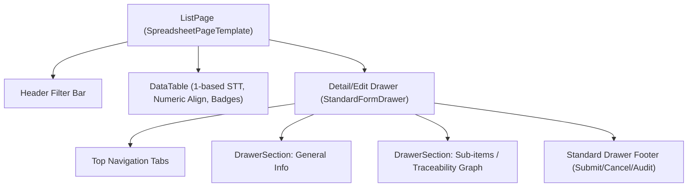

# 📋 Standard Plan & Task Engineering Workflow (`/plan-and-task`)

Workflow này định nghĩa quy chuẩn **bắt buộc** khi lập Kế hoạch Triển khai (**Implementation Plan**) và Phân rã Công việc (**Task Breakdown**) cho mọi tác vụ từ tạo màn hình mới (New Page), chuẩn hóa Bảng/Drawer (Standardize Table/Drawer), Tái cấu trúc (Atomic Refactor) đến Sửa lỗi Giao diện/State (UI Bugfix) trong **`erp-web`**.

---

## 🎯 Triết Lý & Nguyên Tắc Cốt Lõi (Core Principles)

```mermaid
graph LR
    A["1. Discovery & UI Research"] --> B["2. Component & State Plan"]
    B --> C["3. Atomic Task Breakdown"]
    C --> D["4. User Review & Approval"]
    D --> E["5. Execution & Verification"]
    
    style A fill:#3b82f6,stroke:#1d4ed8,stroke-width:2px,color:#fff
    style B fill:#8b5cf6,stroke:#6d28d9,stroke-width:2px,color:#fff
    style C fill:#ec4899,stroke:#be185d,stroke-width:2px,color:#fff
    style D fill:#f59e0b,stroke:#b45309,stroke-width:2px,color:#fff
    style E fill:#10b981,stroke:#047857,stroke-width:2px,color:#fff
```



1. **Plan-First, Code-Later (Zero-Assumption)**:
   - Tuyệt đối **KHÔNG** viết code giao diện khi chưa làm rõ API contract, Layout mockup, Component breakdown và Form validation.

2. **Atomic Component Architecture (Rule < 200 lines)**:
   - Không tạo các file React nguyên khối > 200 dòng.
   - Luôn tách thành thư mục Atomic (`index.ts`, `Component.tsx`, `hooks/use[Component].ts`, `utils/...`, `types/...`).

3. **Strict UI Standards Compliance**:
   - DataTable: STT 1-based, Header Filter (`showColumnFilter: true`), Server-side sorting & search (`applyMultiKeywordFilter`), Pagination responsive (`getDefaultPageSize()`).
   - Drawer: `StandardFormDrawer`, kích thước `vw` responsive (`45vw` / `65vw` / `85vw`), Top Navigation Tabs, Collapsible Sections.

4. **Atomic Tasks with Concrete DoD & Visual Verification**:
   - Mỗi Task **bắt buộc** đi kèm:
     - Danh sách file cụ thể (`[NEW]`, `[MODIFY]`, `[DELETE]`).
     - Tiêu chí hoàn thành (DoD) rõ ràng.
     - **Verification Command** chạy ngay để xác thực (`bun run test`, `bun run build`).

---

## 🧭 Quy Trình 5 Giai Đoạn Chuẩn (5-Phase SOP)

### 🔹 GIAI ĐOẠN 1: Discovery & UI/UX Research (Khảo sát API & UI Hiện Trạng)

1. **Kiểm tra Backend API Contract**:
   - Xác nhận Backend đã có `getList` và `getColumnOptions`.
   - Kiểm tra định dạng DTO trả về, enum, permission keys.
2. **Khảo sát Reusable UI Patterns**:
   - Sử dụng các skill `/erp-find-ui-patterns`, `/standardize-table`, `/standardize-drawer`.
   - Tìm kiếm các component dùng chung (`SpreadsheetPageTemplate`, `StandardFormDrawer`, `ConfirmModal`, `DateRangePicker`).

---

### 🔹 GIAI ĐOẠN 2: Component Architecture & State Design (Thiết Kế Kỹ Thuật)

Soạn thảo tài liệu `implementation_plan.md`:

#### 1. Sơ đồ Cấu Trúc Component (Component Hierarchy)


#### 2. Thiết kế State & Data Fetching
- TanStack Query Keys: `[moduleKey, 'list', queryParams]`, `[moduleKey, 'detail', id]`, `[moduleKey, 'column-options', columnKey]`.
- Mutations & Invalidation: Invalidate query list khi create/update/delete thành công.
- Custom Hooks: `use[Module]List`, `use[Module]Detail`, `use[Module]Mutations`.

#### 3. Thiết kế Form & Validation
- Zod Schema / React Hook Form rules.
- Trạng thái Loading, Error, Empty State, Skeleton.

---

### 🔹 GIAI ĐOẠN 3: Atomic Task Breakdown (Phân Rã Task)

```markdown
- [ ] **Task [ID]: [Tên Task Ngắn Gọn]**
  - **Phân hệ**: `Frontend Web`
  - **Files thay đổi**:
    - `[NEW]` [src/modules/example/api/exampleApi.ts](file:///home/dev/repos/erp/erp-web/src/modules/example/api/exampleApi.ts)
    - `[NEW]` [src/modules/example/hooks/useExampleList.ts](file:///home/dev/repos/erp/erp-web/src/modules/example/hooks/useExampleList.ts)
    - `[NEW]` [src/modules/example/pages/ExampleListPage.tsx](file:///home/dev/repos/erp/erp-web/src/modules/example/pages/ExampleListPage.tsx)
  - **Definition of Done (DoD)**:
    - [x] TypeScript strict pass không có lỗi `any` (`bun run build`).
    - [x] STT 1-based hiển thị chính xác qua các trang (Trang 1: 1..20, Trang 2: 21..40).
    - [x] Header Filter popup hiển thị danh sách options phân trang đúng.
  - **Verification Command**:
    ```bash
    cd /home/dev/repos/erp/erp-web && bun run test && bun run build
    ```
```

---

### 🔹 GIAI ĐOẠN 4: Review & User Approval Gate (Duyệt Kế Hoạch)

1. Trình bày UI flow, layout, các trường form và các điểm cần User quyết định.
2. Đặt `RequestFeedback: true` trên `implementation_plan.md`.
3. Chờ phản hồi / phê duyệt từ User trước khi code.

---

### 🔹 GIAI ĐOẠN 5: Execution, Test & Walkthrough (Thực Thi & Nghiệm Thu)

1. Thực thi từng task, tuân thủ Atomic Refactor (< 200 dòng/file).
2. Chạy `bun run test` và `bun run build`.
3. Soạn `walkthrough.md` với đầy đủ kết quả test, screenshot giao diện, và hướng dẫn thao tác.

---

## 📑 MẪU IMPLEMENTATION PLAN CHUẨN (`implementation_plan.md`)

```markdown
# [Tên Màn Hình / Feature]: Kế Hoạch Triển Khai Giao Diện (erp-web)

Tóm tắt mục tiêu giao diện, người dùng mục tiêu và luồng tương tác chính.

## ⚠️ User Review Required

> [!IMPORTANT]
> - **Điểm quyết định UI**: Kích thước Drawer (`45vw` vs `65vw`), các tab điều hướng trên đầu.
> - **Behavior**: Hành vi sau khi Lưu (Đóng Drawer hay giữ nguyên form).

## ❓ Open Questions

- [ ] **Câu hỏi 1**: Bảng dữ liệu có cần cột tính tổng phụ (Subtotal footer) ở dưới không?

---

## 🏛️ Thiết Kế Cấu Trúc Component & State

### 1. Phân Rã Component (Atomic Hierarchy)
- `src/modules/example/`
  - `pages/ExampleListPage.tsx` (Dùng `SpreadsheetPageTemplate`)
  - `components/ExampleDrawer/`
    - `index.ts`
    - `ExampleDetailDrawer.tsx` (Dùng `StandardFormDrawer`, size `65vw`)
    - `ExampleGeneralSection.tsx`
    - `ExampleHistorySection.tsx`
  - `hooks/`
    - `useExampleList.ts` (State: page, pageSize, filters, sorts)
    - `useExampleDetail.ts`
    - `useExampleMutations.ts`
  - `api/exampleApi.ts`

### 2. Form & Validation
- Zod schema: `code` (bắt buộc), `amount` (số dương), `status` (enum).

---

## 📋 Task Breakdown & Definition of Done (DoD)

### Phase 1: API Client & Custom Hooks
- [ ] **Task 1.1: Tạo API Client & React Query Hooks**
  - **Files**:
    - `[NEW]` [src/modules/example/api/exampleApi.ts](file:///home/dev/repos/erp/erp-web/src/modules/example/api/exampleApi.ts)
    - `[NEW]` [src/modules/example/hooks/useExampleList.ts](file:///home/dev/repos/erp/erp-web/src/modules/example/hooks/useExampleList.ts)
  - **DoD**: Fetch dữ liệu có phân trang, invalidate queries sau mutation.
  - **Verification**: `bun run build`

### Phase 2: DataTable Page
- [ ] **Task 2.1: Xây dựng ExampleListPage**
  - **Files**: `[NEW]` [src/modules/example/pages/ExampleListPage.tsx](file:///home/dev/repos/erp/erp-web/src/modules/example/pages/ExampleListPage.tsx)
  - **DoD**: STT 1-based, Header Filter đầy đủ, phân trang responsive.
  - **Verification**: `bun run build`

### Phase 3: Detail/Edit Drawer
- [ ] **Task 3.1: Xây dựng ExampleDetailDrawer**
  - **Files**: `[NEW]` [src/modules/example/components/ExampleDrawer/ExampleDetailDrawer.tsx](file:///home/dev/repos/erp/erp-web/src/modules/example/components/ExampleDrawer/ExampleDetailDrawer.tsx)
  - **DoD**: StandardFormDrawer, kích thước `65vw`, responsive, validate form chuẩn.

### Phase 4: QC & Verification
- [ ] **Task 4.1: Chạy Test & Build Kiểm tra**
  - **Verification**: `bun run test && bun run build`
```
