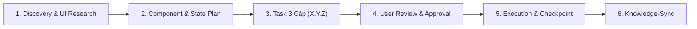
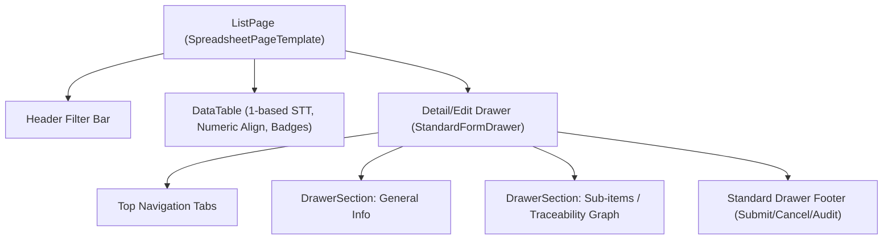

# 📋 Standard Plan & Task Engineering Workflow (`/plan-and-task`) - Frontend Web

Workflow này định nghĩa quy chuẩn **bắt buộc** khi lập Kế hoạch Triển khai (**Implementation Plan**) và Phân rã Công việc (**Task Breakdown**) 3 cấp cho mọi tác vụ từ tạo màn hình mới (New Page), chuẩn hóa Bảng/Drawer (Standardize Table/Drawer), Tái cấu trúc (Atomic Refactor) đến Sửa lỗi Giao diện/State (UI Bugfix) trong **`erp-web`**.

---

## 🎯 6 Nguyên Tắc Cốt Lõi (Core Principles)


```mermaid
graph LR
    A["1. Discovery & UI Research"] --> B["2. Component & State Plan"]
    B --> C["3. Task 3 Cấp (X.Y.Z)"]
    C --> D["4. User Review & Approval"]
    D --> E["5. Execution & Checkpoint"]
    E --> F["6. Knowledge-Sync"]
```

1. **Plan-First, Code-Later (Strict Read-Only Discovery & Zero Execution)**:
   - Không sửa code và **TUYỆT ĐỐI KHÔNG CHẠY TEST RUNNER** (`vitest`, `bun run test`, `bun run check:ci`, `bun run build`) khi chưa có Plan được duyệt.
   - Toàn bộ Phase 1 đến Phase 4 hoạt động ở **CHẾ ĐỘ READ-ONLY 100%**.
   - Tuyệt đối **KHÔNG** viết code giao diện khi chưa làm rõ API contract, Layout mockup, Component breakdown và Form validation.

2. **Atomic Component Architecture (Rule < 180–200 lines)**:
   - Không tạo các file React nguyên khối > 200 dòng.
   - Luôn tách thành thư mục Atomic (`index.ts`, `Component.tsx`, `hooks/use[Component].ts`, `utils/...`, `types/...`).

3. **Strict UI Standards Compliance**:
   - DataTable: STT 1-based, Header Filter (`showColumnFilter: true`), Server-side sorting & search (`applyMultiKeywordFilter`), Pagination responsive (`getDefaultPageSize()`).
   - Drawer: `StandardFormDrawer` (hoặc `V2StandardDrawer`), kích thước `vw` responsive (`45vw` / `65vw` / `85vw`), Top Navigation Tabs, Collapsible Sections.

4. **Task Breakdown 3 Cấp (`X.Y.Z`) & Scoped DoD Verification**:
   - Đánh số `Phase.Group.Task` (ví dụ `1.1.1`, `2.2.1`, `3.1.2`). Mỗi task nhỏ gọn (1–2 files).
   - *Quy tắc Lập Plan (Zero Execution)*: Mã lệnh trong mục `Verification` chỉ là **ĐẶC TẢ VĂN BẢN (Text Specification)** để cam kết tiêu chí hoàn thành, **TUYỆT ĐỐI KHÔNG ĐƯỢC CHẠY** trong lúc lập Plan. Lệnh này CHỈ ĐƯỢC CHẠY ở Phase 5 sau khi User đã duyệt Plan.
   - *Runner của `erp-web`*:
     - Nếu task có file spec UI/Hook (`*.spec.tsx`): Dùng `bunx vitest run <spec>` hoặc `bunx vitest related <file> --run`.
     - Nếu là component UI/page/layout thông thường không có spec: Dùng `bunx tsc --noEmit` để type check nhanh (< 3s).
     - **TUYỆT ĐỐI CẤM** chạy full test (`bun run test`) hoặc full build (`bun run build`) ở từng task nhỏ!
   - *Final Gate (Phase 4)*: Chỉ chạy full test suite và `bun run check:ci` DUY NHẤT một lần ở Task 4.1.1 trước khi nghiệm thu.

5. **Session Checkpoint Protocol (Pause & Resume)**:
   - Hỗ trợ tạm dừng và tiếp tục mượt mà. Khi tạm dừng, bắt buộc ghi log vào mục `## ⏸️ Session Checkpoint`.
   - Khi tiếp tục, Agent đọc lại Checkpoint để xác định chính xác task đang dang dở và bắt đầu làm tiếp ngay mà không phải hỏi lại từ đầu.

6. **Knowledge-Sync Guard (Cập nhật Tri thức / Skill Liền Tay)**:
   - Ngay sau khi hoàn thành task/feature/refactor có thay đổi về UI layout, Component architecture, Token styling, Store state hoặc Props interface, Agent **BẮT BUỘC cập nhật lại Module Skill** tương ứng (tại `.agents/skills/modules/<module>/SKILL.md`) hoặc tạo mới skill (ví dụ `v2-layout`) để lưu giữ tri thức.
   - Tuyệt đối không để tri thức trong skill bị lỗi thời.

---

## 🧭 Quy Trình 5 Giai Đoạn Chuẩn (5-Phase SOP)

### 🔹 GIAI ĐOẠN 1: Discovery & UI/UX Research (Khảo sát API & UI Hiện Trạng - READ-ONLY)

1. **Kiểm tra Backend API Contract (READ-ONLY)**:
   - Xác nhận Backend đã có `getList` và `getColumnOptions`.
   - Kiểm tra định dạng DTO trả về, enum, permission keys.
2. **Khảo sát Reusable UI Patterns**:
   - Sử dụng các skill `/erp-find-ui-patterns`, `/standardize-table`, `/standardize-drawer`.
   - Tìm kiếm các component dùng chung (`SpreadsheetPageTemplate`, `StandardFormDrawer`, `ConfirmModal`, `DateRangePicker`).
   - ⚠️ **Tuyệt đối KHÔNG chạy test runner, build script hay sửa file ở bước này.**

---

### 🔹 GIAI ĐOẠN 2: Component Architecture & State Design (Thiết Kế Kỹ Thuật)

Soạn thảo tài liệu `implementation_plan.md`:

#### 1. Sơ đồ Cấu Trúc Component (Component Hierarchy)

```mermaid
graph TD
    Page["ListPage (SpreadsheetPageTemplate)"] --> FilterBar["Header Filter Bar"]
    Page --> Table["DataTable (1-based STT, Numeric Align, Badges)"]
    Page --> Drawer["Detail/Edit Drawer (StandardFormDrawer)"]
    
    Drawer --> TopTabs["Top Navigation Tabs"]
    Drawer --> Sec1["DrawerSection: General Info"]
    Drawer --> Sec2["DrawerSection: Sub-items / Traceability Graph"]
    Drawer --> Footer["Standard Drawer Footer (Submit/Cancel/Audit)"]
```

#### 2. Thiết kế State & Data Fetching
- TanStack Query Keys: `[moduleKey, 'list', queryParams]`, `[moduleKey, 'detail', id]`, `[moduleKey, 'column-options', columnKey]`.
- Mutations & Invalidation: Invalidate query list khi create/update/delete thành công.
- Custom Hooks: `use[Module]List`, `use[Module]Detail`, `use[Module]Mutations`.

#### 3. Thiết kế Form & Validation
- Zod Schema / React Hook Form rules.
- Trạng thái Loading, Error, Empty State, Skeleton.

---

### 🔹 GIAI ĐOẠN 3: 3-Level Task Breakdown & Concrete DoD (Phân Rã Task 3 Cấp)

Phân chia toàn bộ công việc theo hệ thống đánh số 3 cấp **`X.Y.Z`**:
* **`X` - Phase (Tầng giao diện)**:
  - `1`: API Client, Contracts & React Query Hooks
  - `2`: Data Tables & List Pages
  - `3`: Drawers, Forms & Modal Dialogs
  - `4`: QC, CI Check & Knowledge Sync
* **`Y` - Component Group (Nhóm chức năng)**:
  - `1.1`: Type Contracts & API Client | `1.2`: TanStack Query Hooks
  - `2.1`: DataTable Columns & Filters | `2.2`: List Page Assembly
  - `3.1`: Form Sections & Validation | `3.2`: Drawer / Modal Assembly
  - `4.1`: Unit Tests & Build Check | `4.2`: Module Skill & Knowledge Sync
* **`Z` - Atomic Task (Đơn vị thực thi nguyên tử & Scoped Verification)**:
  - Mỗi task giới hạn tác động trong 1–2 files.
  - Phải có mã lệnh **Verification** chạy độc lập thu hẹp (**Scoped Verification** < 5–10 giây).
  - ⚠️ **LƯU Ý QUAN TRỌNG**: Mã lệnh trong `Verification` ở đây chỉ là **đặc tả văn bản (Text Specification)**. **TUYỆT ĐỐI KHÔNG CHẠY LỆNH NÀY KHI ĐANG LẬP KẾ HOẠCH!**

#### ⚡ Chuẩn Lệnh Verification Cho `erp-web`:
| Loại Task | Verification Command Chuẩn (Nhanh < 5s) | Ghi chú quan trọng |
| :--- | :--- | :--- |
| **API Client / Types / Hooks** | `bunx tsc --noEmit` | Nhanh, không làm phiền test suite |
| **Component có file test spec** | `bunx vitest run src/modules/.../<file>.spec.tsx` | Chỉ chạy đúng file spec |
| **Component / Hook thay đổi** | `bunx vitest related src/modules/.../<file>.tsx --run` | Scoped test |
| **Page / Drawer / Layout** | `bunx tsc --noEmit` | Kiểm tra type strict |
| **Final Gate (Task 4.1.1)** | `bun run check:ci && bun run test` | Chạy DUY NHẤT ở Phase 4 trước nghiệm thu |

#### Cấu trúc một Task chuẩn:
```markdown
- [ ] **Task X.Y.Z: [Tên Task súc tích, rõ hành động]**
  - **Phân hệ**: `Frontend Web` | **Ưu tiên**: `[P0 / P1 / P2]`
  - **Files**: `[NEW]` / `[MODIFY]` / `[DELETE]` [path/to/file](file:///absolute/path/to/file)
  - **DoD**: TypeScript strict pass, render đúng layout, validate form chuẩn.
  - **Verification**: `[Lệnh kiểm thử scoped cụ thể: bunx tsc --noEmit hoặc bunx vitest run <spec>]`
```

---

### 🔹 GIAI ĐOẠN 4: Review, Alignment & Approval Gate (Duyệt Kế Hoạch)

1. Trình bày UI flow, layout, các trường form và các điểm cần User quyết định.
2. Đặt `RequestFeedback: true` trên `implementation_plan.md`.
3. **DỪNG LẠI (STOP) HOÀN TOÀN**: Khoanh tay chờ User phê duyệt (`OK` / `Confirm`). **TUYỆT ĐỐI KHÔNG tự ý thực thi task đầu tiên, KHÔNG chạy test runner, KHÔNG sửa file trước khi có xác nhận rõ ràng từ User.**

---

### 🔹 GIAI ĐOẠN 5: Real-time Execution, Pause/Resume & Walkthrough

#### 1. Quy tắc Thực thi & Tick Done Thời Gian Thực (Real-time Tracking)
- **Single Active Task**: Khi bắt đầu làm một task, đổi ngay `[ ]` thành `[/]`. Tại một thời điểm **chỉ có 1 task duy nhất** ở trạng thái `[/]`.
- **Test-Before-Tick Guard**: 
  - Chỉ được đổi `[/]` thành `[x]` khi và chỉ khi lệnh trong mục `Verification` trả về kết quả **PASS 100%**.
  - Nếu test fail hoặc type error: giữ nguyên `[/]`, tiếp tục sửa code cho đến khi test pass.
- **Live Sync**: Ngay khi hoàn tất một task, ghi nhận trạng thái vào `implementation_plan.md` ngay lập tức, không để dồn đến cuối mới tick.

#### 2. Giao thức Tạm dừng (Pause Protocol)
Khi người dùng yêu cầu tạm dừng, đổi context hoặc phiên làm việc bị ngắt quãng:
Agent **bắt buộc cập nhật** section `## ⏸️ Session Checkpoint` ở cuối file `implementation_plan.md`:
```markdown
## ⏸️ Session Checkpoint (Tạm dừng lúc: YYYY-MM-DD HH:mm)
- **Active Task**: `Task X.Y.Z: [Tên Task]` (`[/] In Progress`)
- **Tiến độ chi tiết**: Đã hoàn thành các phần nào, đang dừng tại dòng/hàm nào.
- **Việc chưa xong**: Cụ thể điều kiện biên hoặc tương tác nào đang xử lý dở.
- **Git Status**: Danh sách file đã sửa nhưng chưa commit.
- **Hành động tiếp theo khi Resume**: Lệnh hoặc bước cụ thể cần làm ngay khi bật lại session.
```

#### 3. Giao thức Tiếp tục (Resume Protocol)
Khi bắt đầu lại phiên làm việc (User gõ `tiếp tục`, `continue`, hoặc gửi prompt mới):
1. **Đọc Checkpoint**: Agent đọc `implementation_plan.md` và kiểm tra mục `## ⏸️ Session Checkpoint`.
2. **Xác định Task Active**: Tìm task có trạng thái `[/]` (nếu có) hoặc task `[ ]` đầu tiên theo thứ tự từ trên xuống.
3. **Báo cáo User**: Thông báo ngắn gọn vị trí đang tiếp tục:
   > *"Phiên làm việc trước đang tạm dừng tại **Task X.Y.Z: [Tên Task]** ([Mô tả tiến độ dở]). Em sẽ tiếp tục hoàn thiện task này ngay bây giờ."*
4. **Thực thi liền mạch**: Bắt tay làm tiếp ngay từ đúng bước trong checkpoint mà không làm lại từ đầu.

#### 4. Nghiệm thu, Cập nhật Tri thức & Báo cáo (Walkthrough & Knowledge Sync)
- **Nghiệm thu cuối cùng (Final Gate)**: Chạy full check DUY NHẤT một lần ở cuối toàn bộ kế hoạch: `bun run check:ci && bun run test`.
- **Knowledge & Skill Sync (Bắt buộc kiểm tra & cập nhật liền sau khi xong task)**:
  - Nếu có thay đổi cấu trúc component, props, hooks, stores, hoặc semantic tokens: cập nhật ngay file Module Skill tương ứng (như `v2-layout`, `app-store`, `drawer-document-traceability`, ...) hoặc tạo skill mới.
  - Liên kết skill mới vào `liouni-erp-web-current-truth`.
  - Tuyệt đối không để tri thức chỉ nằm trong commit hoặc đầu óc mà không ghi vào skill.
- **Tạo Báo cáo Nghiệm thu**: Tạo file `walkthrough.md` đính kèm bằng chứng test pass, screenshot giao diện (nếu có) và hướng dẫn thao tác kiểm thử UI.

---

## 📑 MẪU IMPLEMENTATION PLAN CHUẨN (`implementation_plan.md`)

```markdown
# [Tên Màn Hình / Feature]: Kế Hoạch Triển Khai Giao Diện (erp-web)

Tóm tắt mục tiêu giao diện, người dùng mục tiêu và luồng tương tác chính.

## ⚠️ User Review Required
> [!IMPORTANT]
> - **Điểm quyết định UI**: Kích thước Drawer (`45vw` vs `65vw`), các tab điều hướng trên đầu.
> - **Behavior**: Hành vi sau khi Lưu (Đóng Drawer hay giữ nguyên form).

## ❓ Open Questions
- [ ] **Câu hỏi 1**: Bảng dữ liệu có cần cột tính tổng phụ (Subtotal footer) ở dưới không?

---

## 🏛️ Thiết Kế Cấu Trúc Component & State

### 1. Phân Rã Component (Atomic Hierarchy)
- `src/modules/example/`
  - `pages/ExampleListPage.tsx` (Dùng `SpreadsheetPageTemplate`)
  - `components/ExampleDrawer/`
    - `index.ts`
    - `ExampleDetailDrawer.tsx` (Dùng `StandardFormDrawer`, size `65vw`)
    - `ExampleGeneralSection.tsx`
    - `ExampleHistorySection.tsx`
  - `hooks/`
    - `useExampleList.ts` (State: page, pageSize, filters, sorts)
    - `useExampleDetail.ts`
    - `useExampleMutations.ts`
  - `api/exampleApi.ts`

### 2. Form & Validation
- Zod schema: `code` (bắt buộc), `amount` (số dương), `status` (enum).

---

## 📋 Task Breakdown 3 Cấp & Definition of Done (DoD)

### Phase 1: API Client & Custom Hooks
#### 1.1 Type Contracts & API Client
- [ ] **Task 1.1.1: Định nghĩa Interface & API Client**
  - **Phân hệ**: `Web` | **Ưu tiên**: `P1`
  - **Files**: `[NEW]` [src/modules/example/api/exampleApi.ts](file:///home/dev/repos/erp/erp-web/src/modules/example/api/exampleApi.ts)
  - **DoD**: Khớp type contract với Backend response DTO.
  - **Verification**: `bunx tsc --noEmit`

#### 1.2 TanStack Query Hooks
- [ ] **Task 1.2.1: Tạo useExampleList Hook**
  - **Phân hệ**: `Web` | **Ưu tiên**: `P1`
  - **Files**: `[NEW]` [src/modules/example/hooks/useExampleList.ts](file:///home/dev/repos/erp/erp-web/src/modules/example/hooks/useExampleList.ts)
  - **DoD**: Fetch dữ liệu có phân trang, server filter.
  - **Verification**: `bunx tsc --noEmit`

### Phase 2: Data Tables & List Pages
#### 2.1 DataTable Page
- [ ] **Task 2.1.1: Xây dựng ExampleListPage**
  - **Phân hệ**: `Web` | **Ưu tiên**: `P1`
  - **Files**: `[NEW]` [src/modules/example/pages/ExampleListPage.tsx](file:///home/dev/repos/erp/erp-web/src/modules/example/pages/ExampleListPage.tsx)
  - **DoD**: Dùng `SpreadsheetPageTemplate`, STT 1-based, Header Filter đầy đủ.
  - **Verification**: `bunx tsc --noEmit`

### Phase 3: Detail/Edit Drawer
#### 3.1 Drawer Assembly
- [ ] **Task 3.1.1: Xây dựng ExampleDetailDrawer**
  - **Phân hệ**: `Web` | **Ưu tiên**: `P1`
  - **Files**: `[NEW]` [src/modules/example/components/ExampleDrawer/ExampleDetailDrawer.tsx](file:///home/dev/repos/erp/erp-web/src/modules/example/components/ExampleDrawer/ExampleDetailDrawer.tsx)
  - **DoD**: `StandardFormDrawer`, kích thước `65vw`, responsive, validate form chuẩn.
  - **Verification**: `bunx tsc --noEmit`

### Phase 4: QC & Knowledge Sync
#### 4.1 Automated Tests & CI Check
- [ ] **Task 4.1.1: Chạy Full Build & Pre-commit Check**
  - **Phân hệ**: `QC` | **Ưu tiên**: `P0`
  - **DoD**: 100% test suites pass, không có lỗi ESLint, Prettier và TypeScript.
  - **Verification**: `bun run check:ci && bun run test`

#### 4.2 Knowledge & Skill Sync
- [ ] **Task 4.2.1: Đồng bộ Module Skill (Nếu có thay đổi UI/Layout/Store/Contract)**
  - **Phân hệ**: `Docs/Skill` | **Ưu tiên**: `P1`
  - **Files**: `[MODIFY]` / `[NEW]` [.agents/skills/modules/<module>/SKILL.md](file:///absolute/path/to/SKILL.md)
  - **DoD**: Bổ sung props, tokens, component tree mới vào Module Skill.
  - **Verification**: `view_file` kiểm tra nội dung skill chuẩn xác, không còn thông tin cũ/sai lệch.

---

## ⏸️ Session Checkpoint
*(Mục này sẽ được cập nhật khi phiên làm việc cần tạm dừng hoặc đổi ngữ cảnh)*
- **Active Task**: `None`
- **Tiến độ chi tiết**: Chưa bắt đầu
- **Git Status**: Clean
- **Hành động tiếp theo khi Resume**: Bắt đầu Task 1.1.1
```

---

## 📦 MẪU BÁO CÁO NGHIỆM THU (`walkthrough.md`)

```markdown
# 🚀 Walkthrough & Verification Report: [Tên Giao Diện]

## 📝 Tóm Tắt Thay Đổi
| Phân hệ | File | Loại | Mô tả |
| :--- | :--- | :---: | :--- |
| **Web** | `src/modules/.../ListPage.tsx` | `NEW` | Màn hình DataTable chuẩn |
| **Web** | `src/modules/.../Drawer.tsx` | `NEW` | Drawer chỉnh sửa/chi tiết |

## 🧪 Bằng Chứng Xác Thực (Test Evidence)
- **Unit Tests**: `bun run test` ➔ `PASS (100% tests)`
- **CI Check**: `bun run check:ci` ➔ `PASS (0 errors)`
- **Build Check**: `bun run build` ➔ `SUCCESS (0 errors)`

## 🧠 Tri Thức & Skill Đồng Bộ (Knowledge Sync)
- **Module Skill**: Đã cập nhật `[path/to/SKILL.md]` (hoặc: *Không có thay đổi contract/component*).
- **Current Truth**: Đã liên kết vào `liouni-erp-web-current-truth`.
```
