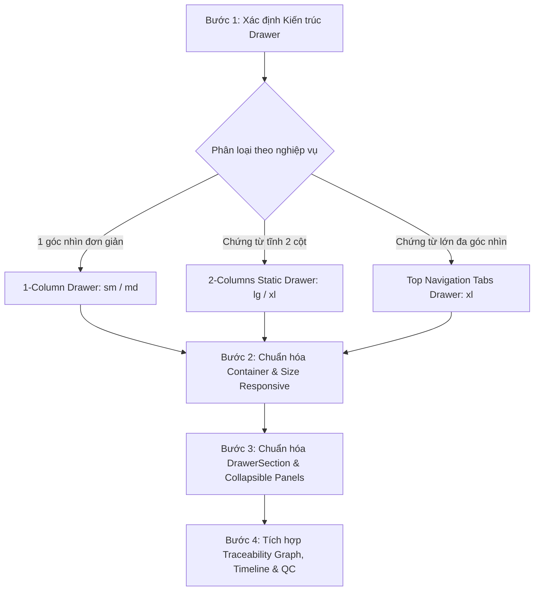

# 🗂️ Standardize Drawer Workflow (`/standardize-drawer`)

Workflow này hướng dẫn Agent và Developer quy trình chuẩn 4 bước khi **tạo mới**, **fix bug** hoặc **refactor** bất kỳ Drawer nào trong Liouni ERP, đảm bảo **100% tuân thủ StandardFormDrawer, Responsive `vw` Size Presets, Collapsible Sections, Collapsible Right Panel, Top Navigation Tabs, Traceability Graph và QC Verification**.

---

## ⚡ Fast-Track: Khi tạo mới Drawer

Nếu bạn đang tạo mới một Drawer cho phân hệ mới, **hãy ưu tiên chạy PlopJS Generator** để sinh ngay 100% code chuẩn trong 1 giây:
```bash
# Di chuyển vào erp-web
cd /home/dev/repos/erp/erp-web

# Chạy generator tạo full Drawer chuẩn (Form + Sections + Top Tabs + Locales)
bun plop drawer <moduleName> <componentName> <drawerType> <drawerSize> <hasStatus>
```
> *(Ví dụ: `bun plop drawer erp-invoices InvoiceInternalDrawer multi-tab xl true`)*

---

## 🧭 Quy trình 4 Bước Bắt Buộc



---

### 🔹 BƯỚC 1: Phân Loại Kiến Trúc Drawer Theo Ngữ Cảnh

Xác định đúng 1 trong 3 mô hình kiến trúc chuẩn:

1. **1-Column Drawer (`layout="1-column"`, `size="sm"` hoặc `"md"`)**:
   - Dành cho form ngắn, cập nhật 1 đối tượng đơn lẻ (User Profile, Đổi mật khẩu, Cấu hình danh mục, Đơn vị tính, Gán nhãn).
   - Toàn bộ nội dung truyền qua `leftPanel` (hoặc `children`). Không dùng `rightPanel`.
2. **2-Columns Static Drawer (`layout="2-columns"`, `size="lg"` hoặc `"xl"`)**:
   - Dành cho form chứng từ tĩnh không chia nhiều phân hệ con (Partner Info, Customer Profile, Simple Voucher).
   - Cột trái: Form nhập liệu / Bảng dòng hàng.
   - Cột phải: Thông tin chung, Metadata, Trạng thái.
3. **Multi-Facet Document Drawer với Top Navigation Tabs (`tabs: DrawerTopTabItem[]`, `size="xl"`)**:
   - **QUY CHUẨN BẮT BUỘC** cho tất cả các chứng từ và đối tượng nghiệp vụ lớn ($\ge 2$ góc nhìn):
     - **Hóa đơn ERP** (`ErpInvoiceInternalDrawer`)
     - **Phiếu kho NK/XK/KK** (`InventoryVoucherFormDrawer`)
     - **Đơn mua hàng PO** (`PurchaseOrderDrawer`)
     - **Đơn bán hàng SO** (`SoFormDrawer`)
     - **Lệnh sản xuất** (`ProductionOrderDrawer`)
     - **Sổ báo giá & Sửa chữa Garage** (`GarageCaseStandaloneDrawer`)
     - **Sao kê ngân hàng & Sổ quỹ** (`BankTransactionDetailDrawer`)

---

### 🔹 BƯỚC 2: Chuẩn Hóa Container Với `<StandardFormDrawer>`

Container Drawer **BẮT BUỘC** dùng `<StandardFormDrawer>` từ `@/shared/components/StandardFormDrawer` với đầy đủ các thuộc tính chuẩn:

```tsx
import React, { useMemo, useState } from "react";
import { useTranslation } from "react-i18next";
import {
  StandardFormDrawer,
  type DrawerTopTabItem,
} from "@/shared/components/StandardFormDrawer";
import { DrawerSection, DrawerRow, DrawerField } from "@/shared/components/DrawerModal";
import { Badge } from "@/shared/components/ui/badge";

export function StandardDocumentDrawer({
  open,
  onClose,
  mode,
  setMode,
  data,
  saving,
  handleSave,
}) {
  const { t } = useTranslation("moduleNamespace");

  return (
    <StandardFormDrawer
      open={open}
      mode={mode}
      onClose={onClose}
      onToggleEdit={() => setMode("edit")}
      title={`${t("documentTitle", "Chứng từ:")} ${data?.code || ""}`}
      titleExtra={
        data?.status && (
          <Badge variant={data.status === "POSTED" ? "default" : "secondary"}>
            {t(`status.${data.status}`, data.status)}
          </Badge>
        )
      }
      layout="2-columns"
      size="xl" // xl = 90vw fluidly responsive trên Desktop
      confirmOnClose={mode === "edit"}
      collapsibleRightPanel={true}
      actions={[
        {
          label: t("close", "Đóng"),
          onClick: onClose,
          variant: "secondary",
        },
        ...(mode === "edit"
          ? [
              {
                label: saving ? t("saving", "Đang lưu...") : t("save", "Lưu thay đổi"),
                onClick: handleSave,
                primary: true,
                loading: saving,
              },
            ]
          : []),
      ]}
      // ... tabs hoặc leftPanel & rightPanel
    />
  );
}
```

#### 📐 Bảng Ma Trận Kích Thước Responsive (`size`):
| Preset | Desktop Width ($\ge 1280px$) | Min Width | Max Width | Ngữ cảnh sử dụng |
| :--- | :--- | :--- | :--- | :--- |
| **`sm`** | `lg:w-[42vw] xl:w-[38vw] 2xl:w-[32vw]` | `420px` | `660px` | 1-col: Profile, Tags, Đổi mật khẩu |
| **`md`** | `lg:w-[60vw] xl:w-[54vw] 2xl:w-[48vw]` | `620px` | `980px` | 1-col trung bình: Master data, Danh mục kho |
| **`lg`** | `lg:w-[78vw] xl:w-[74vw] 2xl:w-[68vw]` | `840px` | `1380px` | 2-col vừa: Đối tác, Khách hàng Garage |
| **`xl`** | `lg:w-[93vw] xl:w-[90vw] 2xl:w-[88vw]` | `1020px` | `1780px` | 2-col Multi-facet (~90vw): Invoices, PO, SO, SX, Kho |
| **`full`** | `w-[calc(100vw-208px)]` | `1020px` | `calc(100vw-208px)` | Max Width không che Sidebar: Báo cáo, Traceability Graph |

---

### 🔹 BƯỚC 3: Chuẩn Hóa `<DrawerSection>` & Collapsible Right Panel

#### 1. Nguyên tắc Collapsible cho `<DrawerSection>`:
- Mọi khối nội dung trong Drawer **BẮT BUỘC** bọc trong `<DrawerSection title="...">`.
- Thuộc tính `collapsible={true}` được bật mặc định.
- **Xử lý co giãn chiều cao khi Collapsed**:
  - Khi `collapsed={true}`, thẻ section **tự động co về `h-auto`**, tuyệt đối không giữ chiều cao cố định (`h-full` hay `max-h-[calc(100vh-210px)]`) gây khoảng trắng thừa.
  - Khi bọc bảng dữ liệu với `fitViewportHeight`, truyền `fitViewportHeight={!isCollapsed}` và bọc ngoài với `className={cn("flex flex-col", !isCollapsed ? "h-[calc(100vh-210px)]" : "h-auto")}`.

#### 2. Kích hoạt Expand / Collapse cho Cột Phải (Right Panel):
- Mọi Drawer 2 cột hoặc Tab có Sidebar bên phải **BẮT BUỘC** hỗ trợ toggle Thu gọn / Mở rộng:
  - Sử dụng `collapsibleRightPanel={true}` trên `<StandardFormDrawer>`, hoặc state `isRightColumnCollapsed` kèm toggle button trên toolbar:
```tsx
<Button
  type="button"
  variant="ghost"
  size="icon-sm"
  onClick={() => setIsRightColumnCollapsed((prev) => !prev)}
  className="text-muted-foreground hover:text-foreground h-6 w-6"
  title={isRightColumnCollapsed ? t("expandRightPanel", "Mở rộng cột phải") : t("collapseRightPanel", "Thu gọn cột phải")}
>
  {isRightColumnCollapsed ? <ChevronLeft className="w-4 h-4" /> : <ChevronRight className="w-4 h-4" />}
</Button>
```
  - Khi cột phải thu gọn (`w-0 opacity-0 overflow-hidden lg:hidden`), cột trái tự động bung rộng 100% `w-full` với transition mượt mà `duration-300`.

---

### 🔹 BƯỚC 4: Tích Hợp Top Tabs, Mạng Lưới Graph & QC Checklist

#### 1. Cấu trúc Top Navigation Tabs (`tabs: DrawerTopTabItem[]`):
```tsx
const drawerTabs: DrawerTopTabItem[] = useMemo(() => [
  // Tab 1: Form / Sheet Preview Chính (Luôn là tab đầu tiên)
  {
    key: "details",
    label: t("tabDetails", "Chi tiết"),
    icon: <FileText className="w-3.5 h-3.5" />,
    content: <DocumentMainDetail data={data} />,
  },
  // Tab 2: Nghiệp vụ thực thi / Chi tiết đối tượng
  {
    key: "partner",
    label: t("tabObjectDetails", "Chi tiết theo đối tượng"),
    icon: <Building2 className="w-3.5 h-3.5" />,
    content: <DocumentPartnerDetail data={data} />,
  },
  // Tab 3: Tài chính, Dòng tiền & Cấn trừ
  {
    key: "financials",
    label: t("tabFinancials", "Tài chính"),
    icon: <Wallet className="w-3.5 h-3.5" />,
    badgeCount: data?.settlementsCount || 0,
    content: <DocumentFinancialTab data={data} />,
  },
  // Tab 4: Mạng lưới chứng từ liên kết (Traceability Graph - Full Width)
  {
    key: "linked_docs",
    label: t("tabTraceability", "Chứng từ liên kết"),
    icon: <Link2 className="w-3.5 h-3.5" />,
    badgeCount: data?.linkedDocsCount || 0,
    hideRightPanel: true, // Bung 100% full width để trực quan tối đa
    content: (
      <DrawerDocumentTraceability
        rootId={data.id}
        rootType="INVOICE"
        fetchGraph={(id) => api.getTraceabilityGraph(id)}
      />
    ),
  },
  // Tab 5: Lịch sử thao tác (Audit Timeline)
  {
    key: "history",
    label: t("tabHistory", "Lịch sử"),
    icon: <History className="w-3.5 h-3.5" />,
    badgeCount: data?.auditLogsCount || 0,
    content: (
      <div className="p-3 bg-surface/50 rounded-xl border border-border/70">
        <DrawerAuditTimeline items={data?.auditLogs || []} />
      </div>
    ),
  },
], [data, t]);
```

---

## 📋 Drawer Quality Checklist

| Hạng mục kiểm tra | Tiêu chuẩn bắt buộc | Trạng thái |
| :--- | :--- | :---: |
| **Component Core** | BẮT BUỘC sử dụng `<StandardFormDrawer>`, không tự viết Dialog hay Drawer thô. | [ ] |
| **Responsive `vw` Size** | Đặt `size="xl"` cho chứng từ lớn (~90vw trên desktop), `lg` cho 2-col vừa, `sm`/`md` cho 1-col. Không bao giờ vượt quá `calc(100vw - 208px)`. | [ ] |
| **Collapse Section Height** | Thẻ `<DrawerSection>` khi `collapsed={true}` phải tự co lại `h-auto`, không để lại khoảng trắng rỗng lớn. | [ ] |
| **Collapsible Right Panel** | Cột phải thông tin chung luôn có nút Thu gọn / Mở rộng (`ChevronRight`/`ChevronLeft`). Khi đóng, cột trái chiếm 100% full width. | [ ] |
| **Top Navigation Tabs** | Chứng từ $\ge 2$ góc nhìn BẮT BUỘC dùng prop `tabs`. Tab 1 luôn là Chi tiết chính. Mảng `tabs` bọc trong `useMemo`. | [ ] |
| **Traceability Graph Full Width** | Tab mạng lưới chứng từ liên kết phải set `hideRightPanel: true` để bung toàn bộ chiều ngang. | [ ] |
| **Status Badge & Edit Mode** | Record có trạng thái phải truyền `<Badge>` vào `titleExtra`. Cho phép chỉnh sửa phải truyền `onToggleEdit` và `confirmOnClose={mode === "edit"}`. | [ ] |
| **Timeline Trục Dọc** | Lịch sử / Audit Timeline dùng trục dọc spine liên tục (`w-[2px]`), node tròn (`w-7 h-7`), không lồng nhiều lớp border card. | [ ] |
| **0ms Input Debounce** | Text input / textarea dùng local buffer với 500ms debounce và nút `X` clear với `onMouseDown={(e) => { e.preventDefault(); handleClear(); }}`. | [ ] |
| **i18n 100%** | 100% text, tab labels, badge, placeholder và button được bọc trong `t(...)`. | [ ] |
| **QC Build & Typecheck** | Chạy `bun run type:check` (0 errors) và `bun run test` (100% tests pass). | [ ] |
