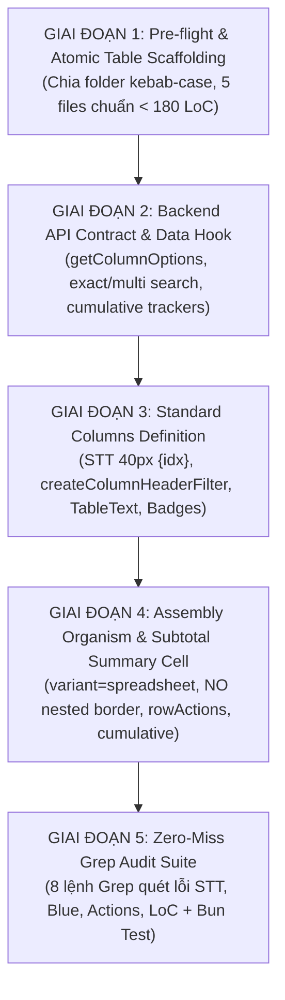

# 📊 Standardize Table & Atomic Workflow (`/standardize-table`)

Workflow này hướng dẫn quy trình chuẩn 5 giai đoạn khi **tạo mới**, **fix bug** hoặc **refactor** bất kỳ bảng dữ liệu nào trong ERP. Workflow này **kế thừa 100% triết lý UI Atomic từ [`/ui-atomic-refactor`](./ui-atomic-refactor.md)** và bổ sung toàn bộ chuẩn mực khắt khe của **DataTable**, tích hợp **Bộ 8 Lệnh Grep Audit Tự Động** để loại bỏ hoàn toàn các lỗi sai hoặc thiếu sót thường gặp.

---

## ⚡ Fast-Track: Khi tạo mới Module Bảng
Nếu bạn đang tạo mới một màn hình bảng dữ liệu, **hãy ưu tiên chạy PlopJS Generator** để sinh ngay 100% code chuẩn trong 1 giây:
```bash
bun plop table-page <moduleName> <componentName> "<pageTitle>" <tableId> <drawerType> <drawerSize> <hasDateColumn> <hasAmountColumn> <hasStatusColumn>
# Hoặc sinh bảng nhúng trong Drawer/Modal:
bun plop table-section <moduleName> <componentName> <rowTypeName>
```

---

## 🏛️ Triết Lý Kiến Trúc: Table Là Một Organism (Level 3)

Trong hệ thống Atomic Design 5 tầng:
- `<StandardTable>` / `<DataTable>` là **Organism Dùng Chung (`@/shared/components/organisms/`)**.
- Bảng của một phân hệ (ví dụ: `InvoiceTable`, `GarageCasesTable`, `InventoryStockTable`) là một **Module Organism (`src/modules/[module]/components/organisms/[name]-table/`)**.
- Các thành phần bên trong bảng:
  - **Molecules (L2)**: `<TableText>`, `<SubtotalSummaryCell>`, `<TableColumnHeaderFilter>`, `<FilterChips>`.
  - **Atoms (L1)**: `<TableDateCell>`, `<StatusBadge>`, `<RequiredIndicator>`, `<NeutralCountBadge>`, App Badges, Buttons.
  - **Templates (L4)**: `<SpreadsheetPageTemplate>`, `<DashboardTemplate>`.
  - **Pages (L5)**: `<InvoicesPage>`, `<GarageCasesPage>`.

---

## 🧭 Quy Trình 5 Giai Đoạn Chuẩn (5-Phase SOP)



---

### 🔹 GIAI ĐOẠN 1: Pre-flight & Khởi Tạo Thư Mục Atomic Table

> [!IMPORTANT]
> **QUY TẮC BẮT BUỘC: KHÔNG VIẾT TABLE NGUYÊN KHỐI (> 180 LoC)**.
> Bất kỳ Table Organism nào cũng phải nằm trong một thư mục `kebab-case/` riêng và bóc tách thành 5 file chuẩn:

```
src/modules/[module]/components/organisms/[name]-table/
├── [Name]Table.tsx               # View JSX chính, render StandardTable (< 150 LoC)
├── [Name]Table.columns.tsx       # Định nghĩa columns + headerFilter helper (< 180 LoC)
├── [Name]Table.hook.ts           # React Query + table/filter state + cumulative logic (< 180 LoC)
├── [Name]Table.type.ts           # Props, DTOs, FilterState interfaces (< 100 LoC)
├── [Name]Table.test.tsx          # Co-located Unit Test (render, headers, STT)
└── index.ts                      # Barrel export: export * from "./[Name]Table";
```

---

### 🔹 GIAI ĐOẠN 2: Backend API Contract & Data Hook (`.hook.ts`)

#### 1. Kiểm Tra Hợp Đồng API Backend:
- **API `getColumnOptions`**:
  - Endpoint: `GET /api/[module]/column-options?columnKey=...&search=...&page=1&pageSize=20&filters={...}`
  - Mapping `next` bắt buộc cho Infinite Scroll:
    ```typescript
    next: res.page < res.totalPages ? res.page + 1 : null
    ```
- **API `getList` (Tìm kiếm nâng cao & Lọc rỗng)**:
  - Exact search `""`: Khớp chính xác tuyệt đối từ khóa nằm trong cặp ngoặc kép.
  - Multi-search `;`: Phân tách dấu chấm phẩy và tìm kiếm theo logic `OR`.
  - Filter `__BLANK__`: Khi mảng lọc chứa `"__BLANK__"`, backend áp dụng `(field IS NULL OR field = '')`.

#### 2. Xây Dựng List Hook (`[Name]Table.hook.ts`):
- Sử dụng TanStack Query với enum **`ErpQueryKey`** (ví dụ: `ErpQueryKey.INVOICES_LIST`).
- Thời gian cache chuẩn **90s (`DEFAULT_STALE_TIME = 90_000`)**.
- Quản lý state lọc 2 cấp độ: `columnFilters`, `columnSearch`, `dateRanges`.
- Tính `activeFilterCount` và hàm `clearAllFilters`.
- **BẮT BUỘC TÍNH SỐ LŨY KẾ CHO MULTI-PAGE**: Tính `cumulativeAmount`, `cumulativeQty`, `cumulativeCount` từ trang 1 đến trang hiện tại.

```typescript
// Mẫu logic tính lũy kế trong hook (Client-side hoặc từ Server-side metadata):
const cumulativeStats = useMemo(() => {
  if (!items || items.length === 0) {
    return { cumulativeAmount: 0, cumulativeQty: 0, cumulativeCount: 0 };
  }
  // Nếu là client-side pagination:
  const cumulativeRows = allFilteredRows.slice(0, page * pageSize);
  return {
    cumulativeAmount: cumulativeRows.reduce((sum, r) => sum + (r.amount || 0), 0),
    cumulativeQty: cumulativeRows.reduce((sum, r) => sum + (r.quantity || 0), 0),
    cumulativeCount: cumulativeRows.length,
  };
}, [items, allFilteredRows, page, pageSize]);
```

---

### 🔹 GIAI ĐOẠN 3: Định Nghĩa Columns Chuẩn (`[Name]Table.columns.tsx`)

Sử dụng `createColumnHeaderFilter` từ `@/shared/components/DataTable`.

```tsx
import { useMemo } from "react";
import { useTranslation } from "react-i18next";
import {
  createColumnHeaderFilter,
  type DataTableColumn,
} from "@/shared/components/DataTable";
import { TableDateCell } from "@/shared/components/DataTable/TableDateCell";
import { TableText } from "@/shared/components/DataTable/TableText";
import { Badge } from "@/shared/components/ui/badge";
import { Tooltip } from "@/shared/components/ui/tooltip";
import type { ExampleRow, ExampleTableHookReturn } from "./ExampleTable.type";

export function useExampleColumns(
  tableHook: ExampleTableHookReturn,
  openDetail: (id: string, mode: "view" | "edit") => void,
) {
  const { t } = useTranslation("exampleModule");

  // 1. Helper builder Header Filter
  const headerFilter = useMemo(
    () =>
      createColumnHeaderFilter({
        listHook: tableHook,
        queryKeyPrefix: "example-column-options",
        fetchOptions: ({ columnKey, search, pageParam, filtersStr }) =>
          exampleApi.getColumnOptions(columnKey, search, pageParam, 20, filtersStr),
      }),
    [tableHook],
  );

  // 2. Ma trận cột chuẩn mực
  return useMemo<DataTableColumn<ExampleRow>[]>(() => [
    // CỘT STT: 40px, căn giữa cả Header lẫn Cell, dùng {idx} (CẤM idx + 1)
    {
      key: "index",
      header: <span className="w-full block text-center">#</span>,
      size: 40,
      enableResizing: false,
      headerClassName: "text-center w-[40px] min-w-[40px]",
      className: "text-center w-[40px] min-w-[40px]",
      cell: (_, idx) => <span className="w-full block text-center">{idx}</span>,
    },

    // CỘT MÃ / CODE: TableText + onDetailClick (mở View mode) + badge nháp/hủy cố định w-[50px]
    {
      key: "code",
      size: 200,
      enableResizing: true,
      header: headerFilter("code", t("code", "Mã phiếu")),
      cell: (row) => (
        <div className="flex items-center gap-1.5 w-full min-w-0">
          <TableText
            className="flex-1 min-w-0"
            text={row.code}
            enableCopy
            tooltip
            onDetailClick={() => openDetail(row.id, "view")}
          />
          {row.status === "DRAFT" && (
            <Tooltip content={t("draft", "Nháp")}>
              <Badge
                variant="secondary"
                className="text-[10px] px-1.5 py-0 h-4 flex-shrink-0 ml-auto w-[50px] inline-flex items-center justify-center truncate"
              >
                {t("draft", "Nháp")}
              </Badge>
            </Tooltip>
          )}
        </div>
      ),
    },

    // CỘT NGÀY: headerFilter.date (ẩn filter options) + TableDateCell căn phải
    {
      key: "createdAt",
      size: 150,
      enableResizing: true,
      className: "text-right",
      header: headerFilter.date("createdAt", t("createdAt", "Ngày tạo")),
      cell: (row) => <TableDateCell date={row.createdAt} className="justify-end w-full" />,
    },

    // CỘT SỐ TIỀN: headerFilter.amount + text-right tabular-nums font-semibold
    {
      key: "amount",
      size: 150,
      enableResizing: true,
      className: "text-right",
      header: headerFilter.amount("amount", t("amount", "Số tiền")),
      cell: (row) => (
        <span className="tabular-nums font-semibold">
          {(row.amount || 0).toLocaleString("vi-VN")} đ
        </span>
      ),
    },

    // CỘT TRẠNG THÁI: Badge cố định w-[80px] + Tooltip + truncate
    {
      key: "status",
      size: 140,
      enableResizing: true,
      className: "text-center",
      header: headerFilter("status", t("status", "Trạng thái")),
      cell: (row) => (
        <div className="w-full flex justify-center">
          <Tooltip content={t(row.status, row.status)}>
            <Badge
              variant={row.status === "COMPLETED" ? "default" : "secondary"}
              className="w-[80px] inline-flex items-center justify-center text-center truncate"
            >
              {t(row.status, row.status)}
            </Badge>
          </Tooltip>
        </div>
      ),
    },

    // CỘT NULLABLE: Bật showBlankOption để hỗ trợ lọc (blank) / (Trống)
    {
      key: "referenceNo",
      size: 160,
      enableResizing: true,
      header: headerFilter("referenceNo", t("referenceNo", "Tham chiếu"), { showBlankOption: true }),
      cell: (row) => <span className="text-muted-foreground">{row.referenceNo || "—"}</span>,
    },
  ], [headerFilter, t, openDetail]);
}
```

---

### 🔹 GIAI ĐOẠN 4: Lắp Ráp Table Organism & Subtotal Summary Cell (`[Name]Table.tsx`)

> [!CAUTION]
> **2 ĐIỀU TUYỆT ĐỐI CẤM KHI LẮP RÁP BẢNG**:
> 1. **TUYỆT ĐỐI KHÔNG bọc thêm thẻ `div border rounded-xl` xung quanh Table**: `<StandardTable>` và `<DataTable>` đã tự quản lý viền. Việc bọc thêm tạo ra lỗi lồng viền (nested border) rất xấu.
> 2. **TUYỆT ĐỐI KHÔNG tạo cột Action tĩnh `{ key: "actions" }`**: Thay thế 100% bằng prop `rowActions`.

#### 1. Cấu Trúc `rowActions` Chuẩn:
Bắt buộc có 2 Quick Actions đầu tiên mở View & Edit mode của Drawer:
- Nút 1: 👁️ Xem chi tiết (`openDetail(row.id, "view")`)
- Nút 2: ✏️ Chỉnh sửa (`openDetail(row.id, "edit")`)
- Nút 3: Ba chấm (`...`) mở dropdown các thao tác mở rộng.

#### 2. Dòng Tổng Cộng `summaryRow` & `<SubtotalSummaryCell>`:
Khi bảng có phân trang (`totalPages > 1`), **BẮT BUỘC TRUYỀN ĐỦ `cumulativeAmount`, `cumulativeQty`, `cumulativeCount`**:

```tsx
import { useMemo } from "react";
import { SubtotalSummaryCell } from "@/shared/components/DataTable/SubtotalSummaryCell";

const summaryRow = useMemo(() => {
  if (!items || items.length === 0) return undefined;

  return {
    code: (
      <SubtotalSummaryCell
        variantType="label"
        label={`${t("total", "Tổng cộng")}:`}
        page={page}
        totalPages={totalPages}
        totalCount={total}
        currentPageCount={items.length}
        cumulativeCount={cumulativeStats.cumulativeCount}
      />
    ),
    quantity: (
      <SubtotalSummaryCell
        variantType="qty"
        metricTitle={t("totalQty", "Tổng số lượng")}
        itemTitle={t("items", "Mặt hàng")}
        itemUnit="SKU"
        subtotalQty={subtotalQty}
        cumulativeQty={cumulativeStats.cumulativeQty}
        grandTotalQty={grandTotalQty}
        page={page}
        totalPages={totalPages}
        currentPageCount={items.length}
        cumulativeCount={cumulativeStats.cumulativeCount}
        totalCount={total}
      />
    ),
    amount: (
      <SubtotalSummaryCell
        variantType="amount"
        metricTitle={t("totalAmount", "Tổng thành tiền")}
        subtotalAmount={subtotalAmount}
        cumulativeAmount={cumulativeStats.cumulativeAmount}
        grandTotalAmount={grandTotalAmount}
        page={page}
        totalPages={totalPages}
        currentPageCount={items.length}
        cumulativeCount={cumulativeStats.cumulativeCount}
        totalCount={total}
      />
    ),
  };
}, [items, page, totalPages, total, subtotalQty, subtotalAmount, grandTotalQty, grandTotalAmount, cumulativeStats, t]);
```

---

### 🔹 GIAI ĐOẠN 5: Zero-Miss Grep Audit Suite (Bắt Buộc Chạy)

Trước khi nghiệm thu hoặc commit code bảng, Developer / Agent **BẮT BUỘC chạy bộ 8 lệnh Grep kiểm tra sau**:

```bash
# 1. QUÉT LỖI STT + 1: Phải trả về 0 kết quả (Chỉ dùng {idx})
grep -rn "idx + 1" src/modules/[module]/components/organisms/[name]-table/

# 2. QUÉT NO BLUE MANDATE: Phải trả về 0 kết quả (Cấm class blue-*)
grep -rn "blue-" src/modules/[module]/components/organisms/[name]-table/

# 3. QUÉT CỘT ACTION TĨNH: Phải trả về 0 kết quả (Dùng prop rowActions)
grep -rn 'key: "actions"' src/modules/[module]/components/organisms/[name]-table/

# 4. QUÉT GIỚI HẠN FILE < 180 LoC: Không file nào vượt quá 180 dòng
wc -l src/modules/[module]/components/organisms/[name]-table/*

# 5. QUÉT TRUYỀN LŨY KẾ SUB-TOTAL: Bắt buộc phải có cumulativeAmount
grep -rn "cumulativeAmount" src/modules/[module]/components/organisms/[name]-table/

# 6. QUÉT HARDCODE TEXT: Kiểm tra header labels có bọc t(...)
grep -rn 'header: "' src/modules/[module]/components/organisms/[name]-table/

# 7. QUÉT LỒNG VIỀN BẢNG (NESTED BORDER): Kiểm tra không có wrapper border quanh table
grep -rn 'className=".*border.*rounded.*"' src/modules/[module]/components/organisms/[name]-table/[Name]Table.tsx

# 8. TYPE CHECK VÀ UNIT TESTS PASS 100%
bun run type:check
bun test src/modules/[module]/components/organisms/[name]-table/
```

---

## 📋 Bảng Kiểm Duyệt Hoàn Thành (Table DoD Checklist)

| STT | Tiêu Chí Kiểm Tra | Yêu Cầu Kỹ Thuật Chi Tiết | Đạt |
| :---: | :--- | :--- | :---: |
| 1 | **Chuẩn Cột STT** | Căn giữa tuyệt đối Header & Cell, size `40px`, non-resizable, `cell: (_, idx) => <span className="w-full block text-center">{idx}</span>`. **TUYỆT ĐỐI KHÔNG CỘNG 1** (`idx + 1`). | [ ] |
| 2 | **Variant Spreadsheet** | `<StandardTable>` / `<DataTable>` bắt buộc dùng `variant="spreadsheet"`. | [ ] |
| 3 | **Cấm Nested Border** | Không bọc thêm `div border rounded-xl` bên ngoài table container. | [ ] |
| 4 | **No Blue Mandate** | 100% không còn class `blue-*` trong toàn bộ Table, Badges, Tabs, Popovers. | [ ] |
| 5 | **Row Actions & Context Menu** | Dùng `rowActions` với 2 Quick Actions đầu tiên: 👁️ Xem chi tiết (`openDetail(id, "view")`) và ✏️ Chỉnh sửa (`openDetail(id, "edit")`). Không dùng cột action tĩnh. | [ ] |
| 6 | **Header Filter Helper** | Dùng `createColumnHeaderFilter`, hỗ trợ exact `""`, multi `;`, lọc rỗng `(blank)`. | [ ] |
| 7 | **Cột Mã Code** | `<TableText enableCopy tooltip onDetailClick>`, badge trạng thái nháp/hủy cố định width `w-[50px]` align-right. | [ ] |
| 8 | **Cột Tiền & Số lượng** | `text-right tabular-nums font-semibold` kết hợp `headerFilter.amount(...)` hoặc `headerFilter.numeric(...)`. | [ ] |
| 9 | **Cột Trạng Thái** | Dùng `<Badge>` cố định width `w-[80px]` + Tooltip + `truncate`. | [ ] |
| 10 | **Subtotal Lũy Kế Trang 2+** | Dùng `<SubtotalSummaryCell>`, truyền đủ `cumulativeAmount`, `cumulativeQty`, `cumulativeCount` khi có phân trang. | [ ] |
| 11 | **Hai Cấp Độ Xóa Lọc** | Nút xóa lọc cục bộ trong Popover + Nút Clear All Filters tổng thể khi `activeFilterCount > 0`. | [ ] |
| 12 | **Giới Hạn File Atomic** | Chia 5 file chuẩn (`.tsx`, `.columns.tsx`, `.hook.ts`, `.type.ts`, `.test.tsx`), không file nào $> 180\text{ LoC}$. | [ ] |
| 13 | **i18n 100%** | Toàn bộ headers, tooltips, dialogs, empty states bọc trong `t(...)`. | [ ] |
| 14 | **Zero-Miss Audit Pass** | 8 lệnh Grep Audit CLI chạy thành công, 0 vi phạm. | [ ] |
| 15 | **Type Check & Test Pass** | `bun run type:check` 0 lỗi và unit test co-located pass 100%. | [ ] |
