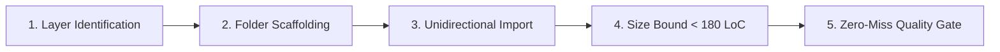

# ⚛️ UI Atomic Refactor & Architecture Workflow (`/ui-atomic-refactor`)

Workflow này hướng dẫn Developer và Agent quy trình chuẩn 5 giai đoạn khi **tạo mới**, **chia tách file lớn (> 180 LoC)** hoặc **refactor kiến trúc** bất kỳ thành phần giao diện nào trong `erp-web` theo đúng **5 Tầng Atomic Design (Brad Frost) kết hợp Domain-Driven Design (DDD)**.

---

## 🎯 4 Nguyên Tắc Sống Còn (Core Directives)



1. **Phân Tầng Tuyệt Đối**: Mọi UI component phải thuộc chính xác 1 trong 5 tầng (`Atoms`, `Molecules`, `Organisms`, `Templates`, `Pages`). Không có component "vô thừa nhận" hoặc dồn đống trong `shared`.
2. **Import Một Chiều (Top-Down)**: `Templates > Organisms > Molecules > Atoms`. Tầng cao import tầng thấp. **CẤM** import ngược dòng. **CẤM** import ngang hàng cùng cấp trong cùng một scope.
3. **Folder-per-Component (`kebab-case`)**: Mỗi component có 1 thư mục riêng, file chính `PascalCase.tsx`, các file vệ tinh chuẩn số ít (`.hook.ts`, `.state.ts`, `.type.ts`, `.schema.ts`, `.helper.ts`, `.test.tsx`, `index.ts`).
4. **Giới Hạn Cứng < 180 LoC & Co-located Test**: Không file nào vượt quá 180 dòng. Test nằm ngay bên cạnh component (co-located).

---

## 🧭 Quy Trình 5 Giai Đoạn Chuẩn (5-Phase SOP)

### 🔹 GIAI ĐOẠN 1: Xác Định Tầng Atomic (Layer Identification)

Trước khi viết bất kỳ dòng code nào, hãy đối chiếu component cần xây dựng/refactor với **Cây Quyết Định (Decision Tree)**:

```
Component của bạn thuộc nhóm nào?
├── 1. Pure UI Primitive, stateless, props-driven, 0% logic nghiệp vụ?
│   └── 👉 Level 1: ATOMS (@/shared/components/atoms hoặc modules/[mod]/components/atoms)
│       Ví dụ: Button, Badge, StatusDot, RequiredIndicator, NeutralCountBadge, TableDateCell, Icons.
│
├── 2. Cụm tương tác nhỏ, chỉ quản lý Local UI State (useState/useRef), 0% API, 0% Store?
│   └── 👉 Level 2: MOLECULES (@/shared/components/molecules hoặc modules/[mod]/components/molecules)
│       Ví dụ: PillTabs, Combobox, TableText, SubtotalSummaryCell, FilterChips, TableColumnHeaderFilter.
│
├── 3. Khối UI phức hợp hoàn chỉnh, có kết nối API, React Query, RBAC, Form validation?
│   └── 👉 Level 3: ORGANISMS (@/shared/components/organisms hoặc modules/[mod]/components/organisms)
│       Ví dụ: StandardTable, StandardFormDrawer, ConfirmModal, FilterPanel, [Module]Table, [Module]DetailDrawer.
│
├── 4. Khung xương bố cục trang/bảng/drawer mẫu chưa gắn dữ liệu nghiệp vụ cụ thể?
│   └── 👉 Level 4: TEMPLATES (@/shared/components/templates)
│       Ví dụ: SpreadsheetPageTemplate, DashboardTemplate, PageWithTabsLayout.
│
├── 5. Màn hình hoàn chỉnh gắn với URL route, tích hợp Template + Organisms?
│   └── 👉 Level 5: PAGES (@/modules/[mod]/pages hoặc @/pages)
│       Ví dụ: InvoicesPage, InventoryStockPage, GarageCasesPage.
│
└── 6. Không chứa JSX (Types, Constants, Shared Hooks, Utility Functions)?
    └── 👉 NON-UI FOUNDATIONS (@/shared/types, constants, hooks, utils hoặc module-level)
```

---

### 🔹 GIAI ĐOẠN 2: Khởi Tạo Thư Mục Chuẩn (`kebab-case/` Scaffolding)

Mỗi component **BẮT BUỘC** nằm trong một thư mục riêng biệt theo định dạng `kebab-case`. Bóc tách các file vệ tinh theo đúng quy ước số ít:

```
[component-name]/
├── [ComponentName].tsx            # Component TSX chính (< 150 LoC)
├── [ComponentName].hook.ts        # Hook xử lý logic (< 180 LoC)
├── [ComponentName].state.ts       # State khởi tạo, draft, reducer (nếu có, < 100 LoC)
├── [ComponentName].type.ts        # TypeScript props, interfaces (< 80 LoC)
├── [ComponentName].schema.ts      # Zod validation schema (nếu có form, < 80 LoC)
├── [ComponentName].helper.ts      # Parsers, formatters nội bộ (< 100 LoC)
├── [ComponentName].test.tsx       # Co-located Unit Test bắt buộc
└── index.ts                       # Public barrel export: export * from "./[ComponentName]";
```

#### 🧠 Ranh Giới Hook Theo Tầng:
- **Tại Atoms (L1) & Molecules (L2)**:
  - Chỉ được phép chứa **Pure UI Logic Hooks** (`useState`, `useRef`, keyboard navigation, popover toggle, animation).
  - **TUYỆT ĐỐI CẤM**: Không gọi API, không dùng `@tanstack/react-query`, không kết nối Global Zustand Store.
- **Tại Organisms (L3)**:
  - Được phép chia thành 2 hook riêng nếu phức tạp:
    - `[Name].ui.hook.ts`: UI toggles, active tabs, expand/collapse state.
    - `[Name].biz.hook.ts` hoặc `[Name].hook.ts`: React Query mutations, REST API calls, RBAC permission checks, form submit.

---

### 🔹 GIAI ĐOẠN 3: Kiểm Soát Chiều Import & Ràng Buộc Phụ Thuộc

> [!IMPORTANT]
> **QUY TẮC BẤT DI BẤT DỊCH: `TEMPLATES (L4) > ORGANISMS (L3) > MOLECULES (L2) > ATOMS (L1)`**

| Caller (Thành phần gọi) | Gọi Atom (`L1`) | Gọi Molecule (`L2`) | Gọi Organism (`L3`) | Gọi Template (`L4`) | Gọi Shared Non-UI | Gọi Ngang Cấp Cùng Scope | Gọi Ngang Cấp Sang Shared |
| :--- | :---: | :---: | :---: | :---: | :---: | :---: | :---: |
| **Page** (`L5`) | ✅ | ✅ | ✅ | ✅ | ✅ | ⚠️ Tránh | ✅ |
| **Template** (`L4`) | ✅ | ✅ | ✅ | ❌ CẤM | ✅ | ❌ CẤM | ✅ |
| **Organism (Shared)** (`L3`) | ✅ | ✅ | ❌ CẤM | ❌ CẤM | ✅ | ❌ CẤM | — |
| **Organism (Module)** (`L3`) | ✅ | ✅ | ❌ CẤM (Module) | ❌ CẤM | ✅ | ❌ CẤM (Module) | ✅ Cho phép (Shared Org) |
| **Molecule (Shared)** (`L2`) | ✅ | ❌ CẤM | ❌ CẤM | ❌ CẤM | ✅ | ❌ CẤM | — |
| **Molecule (Module)** (`L2`) | ✅ | ❌ CẤM (Module) | ❌ CẤM | ❌ CẤM | ✅ | ❌ CẤM (Module) | ✅ Cho phép (Shared Mol) |
| **Atom (Shared)** (`L1`) | ❌ CẤM | ❌ CẤM | ❌ CẤM | ❌ CẤM | ✅ Types/Utils | ❌ CẤM | — |
| **Atom (Module)** (`L1`) | ❌ CẤM | ❌ CẤM | ❌ CẤM | ❌ CẤM | ✅ Types/Utils | ❌ CẤM (Module) | ✅ Cho phép (Shared Atom) |

*Cách giải quyết khi 2 component cùng cấp cần dùng nhau:*
- Cần kết hợp 2 `Atoms` $\rightarrow$ Tạo 1 `Molecule` để compose.
- Cần kết hợp 2 `Molecules` $\rightarrow$ Tạo 1 `Organism` để compose.
- Cần dùng chung logic/state $\rightarrow$ Trích xuất ra `hooks/` hoặc `utils/` dùng chung.

---

### 🔹 GIAI ĐOẠN 4: Khống Chế Kích Thước File (< 180 LoC) & Phân Tách Non-UI

Khi một file component tiến gần mốc 150-180 dòng, thực hiện phân tách theo thứ tự ưu tiên:
1. **Bước 1 - Tách Type Contract**: Trích xuất toàn bộ `interface`, `type`, `Props` ra `[ComponentName].type.ts`.
2. **Bước 2 - Tách Hook Logic**: Đưa toàn bộ `useState`, `useEffect`, `useCallback`, `useQuery` ra `[ComponentName].hook.ts`.
3. **Bước 3 - Tách Helper / Formatting**: Đưa các hàm format ngày, số, mapping status ra `[ComponentName].helper.ts`.
4. **Bước 4 - Tách Sub-components**: Nếu bên trong có render các khối con phức tạp, tạo các sub-components riêng trong cùng folder hoặc đưa về đúng tầng Atomic (`Atoms` / `Molecules`).

---

### 🔹 GIAI ĐOẠN 5: Zero-Miss Quality Gate & Co-located Testing

Trước khi kết thúc task refactor hoặc code mới, Developer / Agent **BẮT BUỘC** thực hiện quy trình kiểm duyệt 2 bước:

#### 1. Viết Co-located Unit Test (`.test.tsx`):
- Nằm cùng cấp bên trong folder component: `[ComponentName].test.tsx`.
- Tối thiểu phải test được:
  - Component render không bị crash.
  - Hiển thị đúng props truyền vào.
  - Các tương tác cơ bản (click toggle, nhập input, hiển thị tooltip).

#### 2. Chạy Bộ Lệnh Grep Audit CLI Bắt Buộc:

```bash
# 1. Quét kiểm tra vi phạm No Blue Mandate (Phải trả về 0 kết quả)
grep -rn "blue-" src/modules/[target-module]/components/

# 2. Quét kiểm tra hardcode text không qua i18n
grep -rn 'title="[A-ZÀ-Ỹa-zà-ỹ]' src/modules/[target-module]/components/

# 3. Quét vi phạm giới hạn kích thước file > 180 LoC
wc -l src/modules/[target-module]/components/*/*/*

# 4. Quét vi phạm import ngược dòng (Organisms import Templates)
grep -rn "templates/" src/modules/[target-module]/components/organisms/

# 5. Chạy Type Check & Co-located Tests
bun run type:check
bun test src/modules/[target-module]/components/
```

---

## 📋 Checklist Kiểm Tra Hoàn Thành (Atomic DoD)

- [ ] **Đúng Tầng Atomic**: Xác định chuẩn xác component thuộc Level 1, 2, 3, 4 hay 5.
- [ ] **Mỗi Component 1 Folder**: Toàn bộ component nằm trong thư mục `kebab-case/` riêng có `index.ts`.
- [ ] **Đặt Tên Chuẩn Số Ít**: File chính `PascalCase.tsx`, các file đi kèm chuẩn số ít (`.hook.ts`, `.state.ts`, `.type.ts`, `.schema.ts`, `.helper.ts`, `.test.tsx`).
- [ ] **Ranh Giới Hook Chuẩn**: Atoms & Molecules CHỈ chứa Pure UI Hook (0% API/Store). Organisms chứa Business Logic Hooks.
- [ ] **Import Một Chiều**: Không có import ngược dòng (`Templates > Organisms > Molecules > Atoms`) và không import ngang hàng cùng cấp.
- [ ] **Giới Hạn File**: 100% các file đều $< 180\text{ LoC}$.
- [ ] **No Blue Mandate**: Tuyệt đối không còn class `blue-*` nào trong mã nguồn giao diện.
- [ ] **i18n 100%**: Tất cả user-facing text bọc trong `t(...)` có fallback tiếng Việt và đồng bộ VI/EN.
- [ ] **Co-located Test**: File `[ComponentName].test.tsx` nằm trực tiếp cùng cấp trong folder.
- [ ] **Type Check & Test Pass**: `bun run type:check` 0 lỗi và unit test pass 100%.
